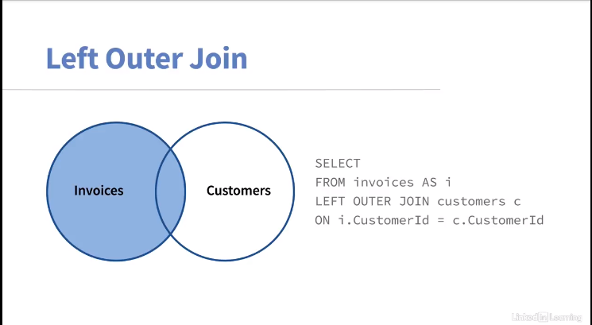

# SQL Essential Training
## [Course](https://www.linkedin.com/learning/sql-essential-training-20685933/) from Linkedin Learning with Walter Shields

The ubiquity of big data means that now, more than ever, there is a burning need to warehouse, access, and understand the contents of massive databases quickly and efficiently. Attaining proficiency in SQL is essential to prepare for our data-driven present and future. It is also crucial to furthering your skills as a data analyst or application developer. In this course, Walter Shields teaches you: the basic structure of databases—what they are, how they work, and how to successfully navigate them; how to use SQL to retrieve and understand data no matter the scale of a database; and how to master the most important SQL query syntax, along with how and when to use it best.
This course includes Code Challenges powered by CoderPad. Code Challenges are interactive coding exercises with real-time feedback, so you can get hands-on coding practice alongside the course content to advance your programming skills.

### Learning objectives
- Define and describe the function of relational databases, SQL, and DB Browser.
- Explain how to run DB Browser and write rudimentary queries.
- Illustrate how to use `WHERE` clauses to filter data.
- Explain how to use inner, left, and right `JOIN` clauses.
- Show how to organize results by group.
- Explain how to use aggregate queries.
- Demonstrate and explain the utility of views for data analysis.

## Content
- [SQL Essential Training](#sql-essential-training)
  - [Course from Linkedin Learning with Walter Shields](#course-from-linkedin-learning-with-walter-shields)
    - [Learning objectives](#learning-objectives)
  - [Content](#content)
  - [1. The Basics of Database Structures](#1-the-basics-of-database-structures)
    - [1.1 Relational database theory](#11-relational-database-theory)
    - [1.2 The SQLite database engine](#12-the-sqlite-database-engine)
  - [2. The SQL Stack](#2-the-sql-stack)
    - [2.1 WSDA Music (sample database)](#21-wsda-music-sample-database)
    - [2.2 The DB Browser software](#22-the-db-browser-software)
    - [2.3 How to install DB Browser](#23-how-to-install-db-browser)
    - [2.4 Learning tips](#24-learning-tips)
  - [3. The SQLite Database Environment](#3-the-sqlite-database-environment)
    - [3.1 How to access the DB Browser for SQLite software](#31-how-to-access-the-db-browser-for-sqlite-software)
    - [3.2 Load the sample database file](#32-load-the-sample-database-file)
    - [3.3 Getting familiar with a database](#33-getting-familiar-with-a-database)
    - [3.4 The browse data area](#34-the-browse-data-area)
    - [3.5 The query writing area](#35-the-query-writing-area)
  - [4. Composing Queries](#4-composing-queries)
    - [4.1 Queries](#41-queries)
    - [4.2 Query commenting](#42-query-commenting)
    - [4.3 Query composition](#43-query-composition)
    - [4.4 Query composition best practices](#44-query-composition-best-practices)
    - [4.4 Column custom names (Aliasing)](#44-column-custom-names-aliasing)
    - [4.5 Sorting query results](#45-sorting-query-results)
    - [4.6 Limiting query results](#46-limiting-query-results)
  - [5. Discovering Insights in Data](#5-discovering-insights-in-data)
    - [5.1 Types of SQL operators](#51-types-of-sql-operators)
    - [5.2 Filter and analyze numeric data](#52-filter-and-analyze-numeric-data)
    - [5.3 BETWEEN and IN operators](#53-between-and-in-operators)
    - [5.4 Filter and analyze text data](#54-filter-and-analyze-text-data)
    - [5.5 Search records without an exact match](#55-search-records-without-an-exact-match)
    - [5.6 Filter and analyze using dates](#56-filter-and-analyze-using-dates)
    - [5.7 Filter records based on more than one condition](#57-filter-records-based-on-more-than-one-condition)
    - [5.8 Logical operator OR](#58-logical-operator-or)
    - [5.9 Brackets and order](#59-brackets-and-order)
    - [5.10 IF THEN logic with CASE](#510-if-then-logic-with-case)
  - [6. Accessing Data from Multiple Tables](#6-accessing-data-from-multiple-tables)
    - [6.1 Joins explained](#61-joins-explained)
    - [6.2 How tables share a relationship, part 1](#62-how-tables-share-a-relationship-part-1)
    - [6.3 How tables share a relationship, part 2](#63-how-tables-share-a-relationship-part-2)
    - [6.4 Simplifying JOINs](#64-simplifying-joins)
    - [6.5 Types of JOINs](#65-types-of-joins)
    - [6.6 The INNER JOIN](#66-the-inner-join)
    - [6.7 The LEFT JOIN](#67-the-left-join)
    - [6.8 The RIGHT JOIN](#68-the-right-join)
    - [6.9 Tables and Entity Relationship diagrams](#69-tables-and-entity-relationship-diagrams)
    - [6.10 Joining many tables](#610-joining-many-tables)
  - [7. SQL Functions](#7-sql-functions)
    - [7.1 Calculating with functions](#71-calculating-with-functions)
    - [7.2 String, date, and aggregate function types](#72-string-date-and-aggregate-function-types)
    - [7.3 Connecting strings](#73-connecting-strings)
    - [7.4 Separating text](#74-separating-text)
    - [7.5 UPPER and LOWER string functions](#75-upper-and-lower-string-functions)
    - [7.6 Date Functions](#76-date-functions)
    - [7.7 Aggregate Functions](#77-aggregate-functions)
    - [7.8 Nesting Functions](#78-nesting-functions)
  - [8. Grouping](#8-grouping)
    - [8.1 Grouping Your Query Results](#81-grouping-your-query-results)
    - [8.2 Filtering with a Grouped Condition](#82-filtering-with-a-grouped-condition)
    - [8.3 Grouping with the WHERE Clause](#83-grouping-with-the-where-clause)
    - [8.4 Grouping with the HAVING Clause](#84-grouping-with-the-having-clause)
    - [8.5 Grouping with the WHERE and HAVING Clause](#85-grouping-with-the-where-and-having-clause)
    - [8.6 Grouping by Many Fields](#86-grouping-by-many-fields)
  - [9. Nesting Queries](#9-nesting-queries)
    - [9.1 Subqueries and Aggregate Functions](#91-subqueries-and-aggregate-functions)
    - [9.2 SELECT Clause Subquery](#92-select-clause-subquery)
    - [9.3 Aggregated Subqueries](#93-aggregated-subqueries)
    - [9.4 Non-aggregate Subqueries](#94-non-aggregate-subqueries)
    - [9.5 `IN` Clause Subquery](#95-in-clause-subquery)
    - [9.6 `DISTINCT` Clause Subquery](#96-distinct-clause-subquery)
  - [10. Stored Queries](#10-stored-queries)
    - [10.1 Introduction to View](#101-introduction-to-view)
    - [10.2 Creating a View in SQL](#102-creating-a-view-in-sql)
    - [10.3 Editing a View in SQL](#103-editing-a-view-in-sql)
    - [10.4 Joining Views in SQL](#104-joining-views-in-sql)
    - [10.5 Deleting Views in SQL](#105-deleting-views-in-sql)
  - [11. Adding, Modifying and Deleting Data](#11-adding-modifying-and-deleting-data)
    - [11. 1 ### Analysis and Administration in SQL](#11-1--analysis-and-administration-in-sql)
    - [11. 2 Inserting Data](#11-2-inserting-data)
    - [11.3 Updating Data](#113-updating-data)
    - [11. 4 Deleting Data](#11-4-deleting-data)
  - [14. Conclusion](#14-conclusion)

## 1. The Basics of Database Structures
### 1.1 Relational database theory
**Data** is the plural of the word **datum**, and a datum is defined as a piece of information. So data are pieces of information like text, images, or video etc.

A **database** is simply a collection of data. The data is usually organized in **tables**. In the world of SQL, tables are made up of rows and columns. **Rows** run left to right which represents a single piece of data called a record and **columns** up and down which represents a specific attribute of that data, such as name or address. 

In order to get the data, take a look at it, and analyze it, we use a special language called **SQL**, short for **Structured Query Language**. It includes many different commands or keywords. One of the most common is `SELECT`. The `SELECT` statement allows us to specify the columns we want to get from a table and include in our results.

### 1.2 The SQLite database engine
The software system that's used to compose SQL statements is called a **Relational Database Management System** or **RDBMS** for short. The singular function of RDBMS is to allow us an area to compose SQL statements. 

There are a number of different clauses in any given SQL statement. In this one, we have the `SELECT` clause, the `FROM` clause, and the `ORDER BY` clause. *Together, all three clauses comprise of a single SQL statement*. Now, within the `SELECT` clause, there can be one or more fields that are within this particular clause. In the `FROM` clause, you can have one or many tables inside of this particular clause. And lastly, the `ORDER BY` clause also houses one or more fields.

## 2. The SQL Stack
### 2.1 WSDA Music (sample database)
The course [exercise file](./Exercise%20Files/WSDA_Music.db) is a relational database that belongs to WSDA music, an online retail music company selling popular music. It contains product information like songs and albums, personal customer information, employee records, and sales data. Now, the company management wants to know if their database contains any useful information about sales, customer demographics, and any ways the company can improve or expand their services. You've been given the task of analyzing their data and presenting insights you discover to management.

### 2.2 The DB Browser software
**DB Browser** for **SQLite** is a high quality, visual open source tool that's used to create, design and edit database files compatible with SQLite. Now, here are some fun facts about this particular database software. It can be found on every Android device, every iPhone and iOS device, every Mac and every Windows machines. If you want to learn a bit more, navigate to [SQLite.org](https://www.sqlite.org/index.html).

### 2.3 How to install DB Browser
The first step to get DB browser is to navigate to the website [sqlitebrowser.org](https://sqlitebrowser.org/), and once you're there you want to navigate to the **download** option from the menu choices up top. For Windows, you want to navigate to where it says Windows on the download page and select the option *Standard installer for 64-bit Windows*. Then simply open that file and step through the options once you're presented with it.

### 2.4 Learning tips
- The first one is to **type everything out**, all of the SQL queries that you are going to have introduced to you throughout the course.
- Secondly, I'd like to point out the importance of **taking natural language questions and converting those into the equivalent SQL statement**.


## 3. The SQLite Database Environment
### 3.1 How to access the DB Browser for SQLite software
DB Browser for SQLite is a visual tool that's used to create, design and edit database files compatible with SQLite. We'll be using DB Browser for SQLite for this course. Again, because it's free, open source easy to install and easy to use.

### 3.2 Load the sample database file
- First we're going to take is firing up the DB Browser for SQLite software, which we installed earlier. 
- What we're going to do now is take the sample database which we [downloaded](./Exercise%20Files/WSDA_Music.db) and load it to this environment. To do so, we want to click on O*pen Database* from the options up top, and you simply navigate to your download folder and find that [*WSDA_Music.db*](./Exercise%20Files/WSDA_Music.db).

### 3.3 Getting familiar with a database
Starting with the *Database Structure* tab. This is one of the main areas that tells us and allows us to get a little more familiar with our database. When I enter a new environment and I'm trying to get familiar with a brand new database. I first look at the structure, I see how many tables, I look at the types of tables that are there and the types of content that's housed within each. And this gives me a very high-level overview and allows me to get a lot more familiar with the database. 

### 3.4 The browse data area
So in the *browse data* tab, what does it allow us to do? The browse data tab is allowing us to see what is within that structure. So we're actually seeing the data that's stored within there.

### 3.5 The query writing area
Now, let's take a look at the *Execute SQL* tab. This is where we compose our SQL statements and discover the results of those queries. Now, let me point out some main components that we should take a note of at the moment:
- Up here, we have two **play buttons**, and this allows us to execute, or run, the code that we will be writing within this area. 
- **Query pane** this is where we'll be composing our queries
-  The second box is called the **result pane**, and this is where we can observe the result of executing a query. 
- The last area here, is referred to as the **messages pane**. Very important, because it tells us if that query has run without error, and how long that query took to run, and a lot of other vital information that's going to be useful to us as SQL practitioners.


## 4. Composing Queries
### 4.1 Queries
Getting familiar with some of the SQL commands is one of the key components to getting the hang of working with databases. Whether you're searching for specific pieces of information, creating new tables, or adding new records, there are definitely more SQL commands than I can ever show you in this course or you should bother to retain. It's really more important to understand the principle behind finding and using the appropriate SQL command. 

### 4.2 Query commenting
Comments are a plain or natural language way of describing a query that we have written. And there are two main ways of writing comments.
- There is a **comment line** which is written by starting with two dashes, followed by a comment, like this.
  ```sql
  -- This is a line comment
  ```
- The other way to write a comment is a **comment block** by doing a front slash star, then going a couple lines down, then do star front slash. Whatever falls between here becomes a comment. 
    ```sql
    /*
    This is a 
    Block of comments
    */
    ```
The convention is that we would format a comment is as follows. 
```sql
/* 
CREATED BY: name of author
CREATE DATE: dd/mm/yyyy
DESCRIPTION: A short description would say what your query is intended to do?
*/
```
It's very helpful because often as a practitioner, you write several SQL statements and you may have found yourself forgetting what exactly any given one may do. You can have several hundreds of lines in terms of what's referred to as a **SQL script**, which can have one or many queries. And again, the comments is a really good way for you to clue yourself or others in as to what that query is doing. Some of the things that we might want to consider are the following: 
- What table within the database are we requesting data from?
- What fields within that table are we interested in?
- And do we want to exclude any data or filter or omit any range or time period?
- And last but not least, what does our query do?

### 4.3 Query composition
Now let's add the comment as convention and then go below the comment and start with the keyword `FROM` and specify from where. Now, we should start above that `FROM` clause with the keyword `SELECT`. Now under Select, we can now select the columns or the fields that we're interested in. Multiple fields are separated with a comma.
```sql
SELECT
    --some columns/fields,
    -- separated with commas
FROM 
    --some table
```
Well, let's say that we were tasked or asked by management of WSDA Music to give us a list of all the customers in the database, and they want to have their first names, their last names, and email addresses. How would we now compose a SQL statement that's going to give us this result? 
```sql
/*
CREATED BY: Aimal Khan
CREATE DATE: dd/mm/yyyy
DESCRIPTION: This querry display all customer's first and last name and email addresses.
*/
SELECT
	FirstName,
	LastName,
	Email
FROM 
	Customer
```
We can see that we have a few results down here in our Results pane after running the query. Down here in the messages pane, we see we have some important information as well. We can tell now that we have 60 rows or 60 customers that have been returned in our result. We can tell the time that it took for that result to be generated, which was 19 milliseconds.

### 4.4 Query composition best practices
So in the composition of our SQL statement, we've done a few particular things that I wanted to draw to your attention. 
- I started with the comment 
- The I started the query with the `FROM` clause and what this does is point me in the direction of where the data is. So `FROM` Customer effectively says, go to the Customer table. 
- And by putting `SELECT` up here and specifying the columns, it's effectively saying, well now that I'm at the Customer table, I'd like to see the first name, last name and email address displayed. 
- We have some indentation taking place and this way of formatting a SQL statement is what's considered part of that best practice. The same best practice that has us putting a comment before we start composing any SQL statement.


### 4.4 Column custom names (Aliasing)
Often the technical language of a database will differ from the common language of a business. If we look at our example here the way that our WSDA music database stores the first name in the customer table is not in the most readable way. In SQL, we have ways of improving the communication of our results to our business audience. And we do this via something called aliases. **Aliases** *allow us to rename our columns to names that are more appropriate to the business*. 

Well we introduce aliasing by way of the `AS` keyword we shall all place after the column name, and then the new name. For multi-word alias we enclose the name in square brackets or quotations. For single word we don't need any.
```sql
Name_1 AS [Some multi-word title],
Name_2 AS "Some multi-word title",
Name_3 AS title
```
Again, aliasing is very important because it is our responsibility as an SQL practitioner to understand and speak in the language of the business. So we take what our columns are originally stored as and translate that to a language that's more readable and understandable by the business from above example.
```sql
SELECT
	FirstName AS [Customer First Name],
	LastName AS 'Customer Last Name',
	Email AS EMAIL
FROM 
	Customer
```

### 4.5 Sorting query results
To sort the results our first step is to include a brand new clause which comes after the from clause called the `ORDER BY` clause and then specifying the *column* we want to sort. Now when it comes to sorting, we can go in one of two different ways. We can either sort **ascending** which is A to Z or **descending** order. The *ascending order sort is actually the default sort* in SQL. And just the same, I can include the keyword `ASC` after the field and that does the exact same thing, specifies that this column is now sorted in ascending order. Now a simple change of including the keyword `DESC` after the column cause it to be in descending order. 
```sql
ORDER BY
    column      --ascending order default

ORDER BY
    column ASC  --ascending order

ORDER BY
    column DESC --descending order

ORDER BY 
    column1 [ASC | DESC], column2 [ASC | DESC], ...
```

We also have the ability to sort not only by one column but by multiple columns. So what if we had a scenario where we wanted to sort by first name in ascending order, in addition to this, we want to also sort by last name. To do that, I'm going to include a comma, go to the next line and specify the last name which is to be sorted in descending order.
```sql
SELECT
	FirstName AS [Customer First Name],
	LastName AS 'Customer Last Name',
	Email AS EMAIL
FROM 
	Customer
ORDER BY
	FirstName,
	LastName DESC
```

### 4.6 Limiting query results
Often, management may be interested in not all the rows but maybe a subset. To do so, we introduce a new keyword called `LIMIT`, and that comes after the `ORDER BY` clause here in our instance. So if I now include LIMIT and I simply put the amount of rows I'd like to limit my results by. 
```sql
LIMIT number_of_rows 
```

For example limiting the above to top 10 customers only we have:
```sql
SELECT
	FirstName AS [Customer First Name],
	LastName AS 'Customer Last Name',
	Email AS EMAIL
FROM 
	Customer
ORDER BY
	FirstName,
	LastName DESC
LIMIT 10
```

## 5. Discovering Insights in Data
### 5.1 Types of SQL operators
What we're about to do next is enhance our ability to write queries by introducing a new clause called the `WHERE` clause. Before getting into the `where` clause, it's important that we take note of some of the common operators that will be used in conjunction with the `where` clause. So, there are three main operator types:
1. **Arithmetic operators**, are 
   - Add `+`
   - Subtract `-`
   - Multiply `*`
   - Divide `/`
   - Modulo `%`
 2. **Comparison operators** are 
    - Equal to `=`
    - Not equal to `<>`
    - Greater than `>`
    - Less than `<`
    - Greater than or equal to `>=`
    - Less than or equal to. `<=`
  3. **Logical operators** are 
     - AND
     - OR
     - IN
     - LIKE
     - BETWEEN

### 5.2 Filter and analyze numeric data
*How many customers purchased two songs at 99 cents each*? Now, two songs purchased at 99 cents each will total to $1.98. We can select all of the records from the invoice table, then sort by the total column, and simply manually count all of the records that are $1.98. With the inclusion of the `WHERE` clause, we're able to enhance our abilities and avoid counting manually to present the answer to management. Let's take a look at how we would go about doing this in SQL. Now let's include our new clause called the `WHERE` clause. The `WHERE` clause comes after the `FROM` and we're going to specify that we want to see records where the total is equal to $1.98. We can also include our `ORDER BY`, which comes after the `WHERE` clause.
```sql
WHERE 
  condition
```
```sql
SELECT
	InvoiceDate,
	BillingAddress,
	BillingCity,
	total
FROM
	Invoice
WHERE
	total = 1.98
ORDER by
	InvoiceDate DESC
```
[See the Query Here](./solutions/Equal-numeric.sql)

### 5.3 BETWEEN and IN operators
*How many invoices exist between $1.98 and $5*? By altering our WHERE clause to include the logical operator `BETWEEN` the other keyword `AND`, we're effectively responding to this question, how many invoices exist between $1.98 and $5. [See the Query Here](./solutions/BETWEEN.sql)
```sql
WHERE 
  column_name BETWEEN value1 AND value2
```

Now, *How many invoices do we have that are exactly $1.98 or $3.96*? Again, with the `WHERE` clause, let's update this to include a new logical operator `IN`. Then I'm going to open parenthesis and include $1.98 which is the first value then going to put a comma and put the second value, $3.96, which is the second value that we are interested in seeing. Then I'm closing my parenthesis. [See the Query Here](./solutions/IN-numeric.sql) 
```sql
WHERE 
  column_name IN (value1, value2, ...);
```

### 5.4 Filter and analyze text data
Thus far, we've filtered quite a bit of numeric data and in very much the same way, we can use operators to return specific text data. So *how many invoices were billed to the city of Brussels*? First, let's go down to our `WHERE` clause and take a look. We're now interested in filtering records to where the BillingCity is equal to Brussels. **Unlike numeric data, text data must be surrounded in quotes**. [See the Query Here](./solutions/Equal-text.sql)
```sql
WHERE
	BillingCity = 'Brussels'
```
Now *how many invoices were billed to Brussels, Orlando, or Paris*? Well, very much in the same way that we were able to employ the `IN` clause while we were searching for numeric data. We can do the same thing with text data. When we include the `IN` clause, you want to make sure and start with an open parenthesis. And because this is text data, we're surrounding one of the criteria that we're looking for, which is Brussels, in single/double quotes. Now, we want to include the other two criteria separated with commas that must be surrounded in quotes, and then end my IN clause with the closure of the parentheses. [See the Query Here](./solutions/IN-text.sql) 
```sql
WHERE
	BillingCity IN('Brussels', "Orlando", 'Paris')
```

### 5.5 Search records without an exact match
In SQL, it is possible to search for partial values. And when we're searching for partial values, we include a new operator called the `LIKE` operator. `LIKE` operator always works in conjunction with something that's referred to as the wild card character `%`. *How many invoices were billed in the cities that start with B*?
```sql
WHERE 
  column_name LIKE '%pattern%';
```
*How many invoices were billed in cities that start with B*? Let's remind ourselves. The `%`or the wild card character is effectively saying, "I don't care." So to respond to this current request, if we alter this current SQL statement and enter another wild card character before the B, we're effectively saying this, "I don't care what comes before the B, I don't care what comes after the B, I do care that there is a B somewhere in the BillingCity".
```sql
WHERE
	BillingCity LIKE '%B%'
```
You can see that by specifying your criteria with a capitalized B, it returns all the records whether or not it's capitalized. So it is case insensitive. [See the Query Here](./solutions/LIKE.sql) 

### 5.6 Filter and analyze using dates
We can perform analysis using a new data type, which is *date* data type. *How many invoices were billed on May 22, 2010*? Before we start diving into the equivalent SQL to achieve such a request, we need to familiarize ourselves with how dates are stored in this particular database. Dates particularly can be stored in a number of different formats. So this first step is important because when it comes to us responding in SQL, we need to format the date exactly like it is stored within our database. 
```sql
WHERE
  InvoiceDate = '2010-05-22 00:00:00'
```
Now, working with a date/time field can be quite cumbersome when you have to enter this many characters into your `WHERE` clause. We could include in our WHERE clause a date function called Date.
```sql
WHERE
  DATE(InvoiceDate) = '2010-05-22'
```
[See the Query Here](./solutions/Equal-date.sql) 

### 5.7 Filter records based on more than one condition
In SQL, it is possible for us to use the AND and the OR operators to specify criteria from multiple fields. *Get a list of all invoices that were billed after May 22nd, 2010 and have a total of less than $3*? Now, let's alter our SQL statement to satisfy this criteria. I'm going to switch out this equal sign for a greater than and that is because the first part of our request is asking for invoices that were billed after or greater than May 22nd, 2010. Added to this, we would also like to have invoices that are less than $3. So I'm going to include the `AND` operator and the total of less than $3. [See the Query Here](./solutions/AND.sql)
```sql
WHERE
	DATE(InvoiceDate) > '2010-05-22' AND total < 3
```

### 5.8 Logical operator OR
Now let's look at a scenario where we would have to employ the `OR` operator in our response to a request. *Get all invoices whose billing city starts with P or the billing city starts with D*? [See the Query Here](./solutions/AND.sql)
```sql
WHERE
	BillingCity LIKE 'P%' OR BillingCity LIKE 'D%'
```
### 5.9 Brackets and order
*Get a list of all invoices that are greater than $1.98 from any cities whose names start with P or D*? When it comes to multiple criteria, we should employ something that's referred to as **PEMDAS** or **BEMDAS**. This stands for **parenthesis** or **brackets**, **exponents**, **multiplication**, **division**, **addition**, and **subtraction**. This refers to the order of operation. The order in which a query is processed. [See the Query Here](./solutions/PEMDAS.sql)

```sql
WHERE
	total > 1.98 AND (BillingCity LIKE "P%" OR BillingCity LIKE "D%")
```
### 5.10 IF THEN logic with CASE
The managerial team now wants as many customers as possible to spend between 7 and $15 when purchasing music from their online store. As a result, they've created the following categories; 
- A baseline purchase, which is anything that falls between 99 cent and 1.99 
- A low purchase which falls between $2 and 6.99
- The target purchase, which is the sales goal of $7 and $15
- Top performer category which is anything that is above $15. 

Now, based on these categories, the WSDA Music Sales Department wants to see if there's any information that they can decipher or glean from the database concerning the sales in all of the listed categories. 

Now this is a great scenario to introduce the `CASE` statement which will help us perform this level of analysis. 
```sql
SELECT column_name(s),
       CASE
           WHEN condition1 THEN result1
           WHEN condition2 THEN result2
           ...
           ELSE else_result
       END AS alias_name
FROM table_name;
...
```
All right, we have our basic SQL statement in front of us and all this is doing is searching our invoice table and displaying these fields. Now, we would also like to include the CASE statement, which actually allows us to create a new temporary field in our database that serves as a label for the data based on user-specified conditions. And this is exactly a great case for these user-specified categories that WSDA management has laid out for us. So let's see how we would implement this using SQL. [See the Query Here](./solutions/CASE.sql)

```sql
CASE 
		WHEN total < 2 THEN "baseline purchase"
		WHEN total BETWEEN 2 AND 6.99 THEN "low purchase"
		WHEN total BETWEEN 7 AND 15 THEN "target purchase"
		ELSE "top performer"
	END AS purchaseCategory
```


## 6. Accessing Data from Multiple Tables
### 6.1 Joins explained
In relational databases, data is stored across multiple tables. Each table contains some, but not all of the information about our fictional company WSDA Music. This is a common scenario where knowing how to get data from multiple tables comes in handy. In this chapter, you'll become comfortable getting data from two or more tables with a single SQL query by using powerful tools called `JOIN`s. A `join` is a command that connects the fields from two or more tables of a relational database. `JOIN`s are fundamental for retrieving data from multiple tables in SQL databases, allowing for complex queries to be constructed to analyze and manipulate data effectively.

### 6.2 How tables share a relationship, part 1
**Join Definition**: A join in SQL combines fields from two or more tables in a relational database.
**Example Scenario**: Consider a database containing tables for invoices and customers.
**Objective**: The marketing department wants a list of customer names alongside their invoices.
**Challenge**: The invoice table lacks customer names, containing only customer IDs.
**Solution**: By joining the invoice and customer tables based on their common field (customer ID), we can obtain the desired information. [See the Query Here](./solutions/INNER-JOIN-1.sql)
**Primary Key**: Each table typically has a primary key, denoted by a unique identifier, like a customer ID in the customer table.
**Join Syntax**:
```sql
SELECT 
  <columns>
FROM 
  <table1>
INNER JOIN 
  <table2> 
ON 
  <table1.column> = <table2.column>;
```
**Generalization of SQL Syntax**:
- The `SELECT` statement retrieves specific columns from the involved tables.
- The `FROM` clause indicates the tables being queried.
- The `JOIN` keyword specifies the type of join (e.g., INNER, LEFT, RIGHT).
- The `ON` clause establishes the condition for joining tables, typically based on shared fields or keys.
**Notation**: When fields with the same name exist in multiple tables, it's crucial to specify the table name to avoid ambiguity.

### 6.3 How tables share a relationship, part 2
**Result Observation**:
- Upon joining the invoice and customer tables, it's evident that multiple invoices are linked to the same customer ID.
- Customer ID number one is responsible for generating multiple invoices, as evidenced by the first seven records in the results.

**Relationship Insight**:
- This scenario illustrates a one-to-many relationship between the customer and invoice tables.
- A single customer can generate multiple invoices by purchasing multiple songs, demonstrating the relational aspect of the database.

**Entity Relationship Diagram (ERD)**:
- An ERD visually represents the relationship between tables in a graphical format.
- The connection between the customer and invoice tables is depicted by a line in the ERD.
- Primary keys (e.g., customer ID in the customer table, invoice ID in the invoice table) and foreign keys (e.g., customer ID in the invoice table) are identified.


**Normalization**:
- Normalization is the process of distributing fields across related tables in a relational database.
- It helps maintain a small database size by reducing duplication and ensuring efficient data storage.
- Distributing data across multiple related tables aids in database efficiency, saving processing time and resources.
- Normalization becomes crucial in optimizing database performance, especially in handling large databases where every second matters.

### 6.4 Simplifying JOINs
**Join Syntax Clarification**:
- When dealing with `joins`, specifying field names requires including the table name followed by the column name to avoid ambiguity, especially when tables have identical field names.
- This syntax necessitates listing the table name first, followed by the column or field name.
**Aliases**:
- Aliases are often used with joins to streamline SQL statements and reduce typing.
- By assigning aliases to tables, the amount of typing required when building SQL statements with joins is minimized.
- In a real-world scenario, aliases are introduced to enhance query readability and efficiency.
- Tables can be aliased using keywords like `AS`, followed by the chosen alias name.
- The syntax after the `ON` keyword also reflects table aliases, simplifying references to fields.

**Selecting Specific Fields**:
- While the "*" symbol returns all records from all tables, in practice, it's more common to specify the fields of interest.
- In response to a specific request, relevant fields from both tables are selected to meet the query's requirements.

**Query Optimization**:
- By selecting only the necessary fields, query efficiency is improved, resulting in a cleaner and more focused output.

**Generalized Join Syntax**:
```sql
SELECT 
  <table1_alias.field>, 
  <table2_alias.field>,
  ...
FROM 
  <table1> AS <table1_alias>
INNER JOIN 
  <table2> AS <table2_alias> 
ON 
  <table1_alias.column> = <table2_alias.column>
WHERE 
  <conditions>;
```
**Explanation of Syntax**:
- The `SELECT` statement specifies the fields to retrieve from the involved tables, utilizing table aliases.
- The `FROM` clause indicates the tables being queried, with aliases assigned for clarity.
- The `INNER JOIN` keyword specifies the type of join, with the `ON` clause establishing the condition for joining tables based on their common fields.

[See the Query Here](./solutions/INNER-JOIN-2.sql)


### 6.5 Types of JOINs
**Introduction to Join Types**:
- Joins are used to access fields from multiple tables by linking them based on common keys.
- The primary key of the customer table is identified, along with a corresponding foreign key in the invoice table.
- Using the `ON` keyword, the tables are linked together under the assumption that the data matches up.

**Handling Data Discrepancies**:
- What happens if the data from the joined tables doesn't match completely?
- Discrepancies may occur, such as a customer being deleted from the customer table but still having records in the invoice table.
- It's essential to decide whether to include or exclude such data in our query.

**Types of Joins**:
- Different types of joins are utilized to handle discrepancies between tables.
- Understanding join types is crucial for effectively managing data inconsistencies.

### 6.6 The INNER JOIN
An inner join exclusively returns matching records, ignoring any unmatched data from either table. Join behavior is often depicted using Venn diagrams, where an inner join represents only the overlapping section. Only the overlapping data between the tables is included in the inner join output.


**Common Usage of Inner Join**:
- The inner join is the most commonly used type of join.
- Its primary purpose is to bring corresponding data together from different tables in a relational database.

[See the example here](./solutions/INNER-JOIN-2.sql)

### 6.7 The LEFT JOIN
A left outer join combines all records from the left table with any matching records from the right table. The designation of left and right tables depends on the order specified in the join statement. In the presented SQL statement, the invoices table is listed first, making it the left table, followed by the customer table.

**Venn Diagram Representation**:
- The Venn diagram illustrates the concept, showing that everything in the left table (invoices) will be displayed.
- Records from the right table (customer) that match those in the left table are included, while unmatched records from the right table are omitted.


**SQL Syntax and Output**:
- The SQL syntax for the left outer join closely resembles that of the inner join, with `LEFT OUTER JOIN` replacing `INNER JOIN`.
- The output of the left outer join shows the SQL browser adding null values where no matching data is found in the right table.

**Utility of Left Joins**: Left joins are beneficial for identifying discrepancies in data, such as customers without invoices or data removed from the right table but still present in the left table.

[See the example here](./solutions/LEFT-OUTER-JOIN.sql.sql)


### 6.8 The RIGHT JOIN
**Overview of Database Management Systems**:
- Different relational database management systems (RDBMS) exist, including SQL Light, Microsoft SQL Server, and Oracle.
- Syntax may vary slightly between RDBMS, typically with around a 5% difference.
- It's important to note these differences before diving into specific join types.

**Introduction to Right Outer Join**:
- Right outer joins are not supported in SQL Light but are common in other RDBMS.
- The right outer join returns the entire right table along with matching information from the left table.
- It functions similarly to a left join but in reverse, mirroring its behavior.


**Functionality and Syntax**:
- The right join takes all fields from the right table and matches them with corresponding data from the left table.
- In the simplified invoice and customer table, records not present in the right table are ignored, similar to the left join.
- The syntax for a right join closely resembles that of other join types, with `RIGHT OUTER JOIN` replacing `LEFT OUTER JOIN`.
- The right join typically returns more records than other joins, as it includes all records from the right table.
- Records from the left table that have no corresponding data in the right table receive null values.
- Records with corresponding data in both tables may appear multiple times in the output.

**Usage and Best Practices**:
- Right joins are less commonly used than left joins.
- For databases that don't support right joins like SQL Light, it's recommended to reverse the table order in the query to achieve the same result.

[See the example here](./solutions/RIGHT-OUTER-JOIN.sql.sql)

### 6.9 Tables and Entity Relationship diagrams
Joins can be used to combine more than just two tables, and adding additional tables using joins follows a straightforward pattern similar to inner joins. A helpful starting point when planning joins is the Entity Relationship Diagram (ERD) to understand table relationships. 

**Understanding Relationships in ERD**:
- In addition to the relationship between the invoice and customer tables, there's also a relationship between the support rep ID from the customer table and the employee ID from the employees table.
- Although these fields may have different names, they make sense in the context of their respective tables.
- For example, a support rep in the customer table is internally referred to as a support representative, whereas in the employee table, they are referred to as an employee.


**Operational Scenario**:
- Consider a scenario where the WSDA Music customer service department wants to reward employees responsible for the 10 highest individual sales by creating plaques listing the customers they've helped.
- To execute this scenario, fields needed in the query are identified using the ERD.

**Planning Query Fields**:
- When writing complex queries involving multiple tables, it's helpful to think through the required fields and their respective tables.
- Fields needed from the employee, customer, and invoice tables are identified for conceptual visualization.
- Fields from each table are preceded by the table alias followed by a dot, making it clear which table each field belongs to.
- The query will sort records by the highest invoice value and limit the output to the top 10 invoices.


### 6.10 Joining many tables
Joins can combine more than two tables straightforwardly, following the same pattern as inner joins. Entity Relationship Diagrams (ERDs) provide a valuable starting point for understanding table relationships. In addition to the invoice-customer relationship, other connections, like between support rep ID and employee ID, are illustrated in the ERD. 

**Generalized Syntax**:
```sql
SELECT 
  <table1_alias.field1>,
  <table1_alias.field2>, 
  ...
FROM 
  <table1> AS <table1_alias>
INNER JOIN 
  <table2> AS <table2_alias> 
ON 
  <table1_alias.column> = <table2_alias.column>
INNER JOIN 
  <table3> AS <table3_alias> 
ON 
  <table2_alias.column> = <table3_alias.column>
...
LEFT JOIN 
  <tableN> AS <tableN_alias> 
ON 
  <tableN-1_alias.column> = <tableN_alias.column>
WHERE 
  <conditions>
ORDER BY 
  <sorting_criteria>
LIMIT 
  <limit>;
```

**Explanation of Syntax**:
- The `SELECT` statement specifies the fields to retrieve from the involved tables, utilizing table aliases.
- Multiple `INNER JOIN` and `LEFT JOIN` clauses are used to join additional tables based on their common keys.
- The `WHERE` clause may include additional conditions to filter the results further.
- Results are sorted using the `ORDER BY` clause and limited using the `LIMIT` clause to the top N records.

[See solution here](./solutions/join-multipl-tables.sql)

## 7. SQL Functions
### 7.1 Calculating with functions
**Introduction to Functions**:
- Purpose: Make calculations easier.
- Functions in SQL: Very powerful.
- Capability: Perform complex calculations quickly.

**Types of Functions**:
1. Aggregate Functions
2. String Functions
3. Date Functions
4. Time Functions
   

### 7.2 String, date, and aggregate function types
**Introduction to Functions**:
- Functions make SQL tasks easier.
- Functions come with helpful pop-up information.
- Pop-ups detail function expectations and arguments.

**Exploring String Functions**:
- Example: **UPPER()** function.
  - Opens pop-up with function details.
  - Helps in understanding function usage and arguments.

### 7.3 Connecting strings
**Scenario: Personalized Postcards for Customers**
- Create a field with customer's full address.
- Fields required: First name, last name, address (street, city, state, zip code).
- [See Solution Here](./solutions/Concatination.sql)

**Concatenating Fields**
- Joining separate fields: Referred to as concatenation in SQL.
- Using the double pipe operator (`||`) in SQLite for concatenation.
  ```sql
    field1 || ", " || field2 ... || fieldN AS "New Field"
  ```

### 7.4 Separating text
**Concept of Truncating Strings**:
- Truncating or shortening text fields is the reverse of concatenation.
- Understanding text position in stored fields is crucial.

**Example Scenario**:
- WSDA Music management wants more precise postal codes.
- Current postal codes include unnecessary zip+4 codes.
- Goal: Remove the zip+4 codes from postal codes.
- [See Solution Here](./solutions/Truncation.sql)

**String Functions Used**:
1. **Length Function**:
  Determines the length of a string.
    ``` sql 
    LENGTH(field_name)
    ```
1. **Substring Function**:
  It takes a string and return a substring from start_position to length.
    ```sql
    SUBSTR(field_name, start_position, length)
    ```

### 7.5 UPPER and LOWER string functions
**UPPER Function**:
- Converts a string of text to uppercase.
  ```sql
  UPPER(field)
  ```

**LOWER Function**:
- Converts a string of text to lowercase.
  ```sql
  LOWER(field)
  ```
[See Example Here](./solutions/UPPER-LOWER.sql)

### 7.6 Date Functions
**Introduction**:
- Date functions manipulate data stored in various date and time formats.
- In the WSDA Music database, dates are stored in both date and time formats (year, month, day, hour, minute, second).

**Example Scenario**:
- Task: Calculate the ages of employees using their birth dates. [See Solution Here](./solutions/STRFTIME.sql)
- Function Used: `strftime()`. Converts date and time strings into another format (eg. `'%Y-%m-%d'`).
  ```sql
  strftime(format, time_string)
  ```
- In function we use `now` to return the current date.
  ```sql
  strftime(format, 'now')
  ```

### 7.7 Aggregate Functions
Aggregate functions turn a range of numbers into a single point of data based on mathematical operations.

**Example Scenario**: Task: Calculate the grand total of global sales for WSDA Music.

**Calculating Sum**: Query Structure:
  ```sql
  SELECT 
    SUM(field) AS fieldAlias
  FROM 
    table;
  ```

**Other Aggregate Functions**:
- **Average Function (AVG)**:
  - Calculates the average of a column.
  - Syntax: `AVG(field)`.

- **Maximum Function (MAX)**:
  - Finds the maximum value in a column.
  - Syntax: `MAX(field)`.

- **Minimum Function (MIN)**:
  - Finds the minimum value in a column.
  - Syntax: `MIN(field)`.

- **Count Function (COUNT)**:
  - Counts the number of rows in a table.
  - Syntax: `COUNT(*)`.
[See Example Here](./solutions/Aggregate-Functions.sql)

### 7.8 Nesting Functions
Nesting functions involves placing one function inside another function.

**Example Scenario**:
- Task: Clean up the result of the average sales calculation by rounding it to two decimal places.
- Utilizing the `ROUND` function to round the result of the `AVG` function.
  - Syntax: `ROUND(expression, decimals)`.

**Nesting Functions**:
- Approach: Nest the `AVG` function inside the `ROUND` function.
  - Syntax: `ROUND(AVG(total), 2)`.

[See Example Here](./solutions/Nesting-Functions.sql)


## 8. Grouping
### 8.1 Grouping Your Query Results
Importance of organizing query results for insightful analysis. Helps in strategic marketing budget planning and targeting advertising efforts effectively.

The `Group By` clause facilitates organizing data for analysis. Often used with aggregate functions like Count, Max, Min, and Average.

### 8.2 Filtering with a Grouped Condition
Aggregate functions can calculate subtotals or aggregates for different groups of data. Important feature for generating insights from grouped data.

**Scenario**:
- Task: Calculate the average invoice amount by BillingCity for WSDA Music Company management.
- Initial query didn't provide expected results due to missing `GROUP BY` clause.
- [See Solution Here](./solutions/GROUP-BY-1.sql)

**Understanding `GROUP BY`**:
- `GROUP BY` clause is essential for grouping data based on non-aggregated fields.
- Follows the `FROM` clause and applied to non-aggregated fields.
- Helps to produce separate results for each group.
  ```sql
  ...
  FROM
    <table>
  GROUP BY
    <Field/Column>
  ...
  ```
  
### 8.3 Grouping with the WHERE Clause
Adding criteria to grouped queries allows for more targeted analysis. `WHERE` clause filters data before applying grouping. Introduce a `WHERE` clause after the `FROM` clause and before the `GROUP BY` clause.
```sql
...
FROM
  <table>
WHERE
  <condition>
GROUP BY
  <Field/Column>
...
```

**Scenario**:
- Request: Calculate average invoice totals by city for cities starting with "L".
- Utilizing the `WHERE` clause to refine the query based on specified criteria.
- [See Solution Here](./solutions/GROUP-BY-2.sql)

  
### 8.4 Grouping with the HAVING Clause
The `HAVING` clause allows filtering based on aggregate functions in SQL queries. Useful for applying criteria to aggregated fields after grouping.

**Scenario**:
- Updated request: Find average invoice totals greater than $5.
- Attempt to apply filter directly with the `WHERE` clause results in error due to misuse of aggregate function.
- [See Solution Here](./solutions/HAVING.sql)

**Using the `HAVING` Clause**:
- Introduce the `HAVING` clause after the `GROUP BY` clause.
- Specify the condition based on the aggregate function (average invoice amount > $5).
- Ensure the `HAVING` clause follows the `GROUP BY` clause and precedes the `ORDER BY` clause.
  ```sql
  ...
  FROM
    <table>
  GROUP BY
    <field/column>
  HAVING
    <condition>
  ORDER BY
    <field> [ASC | DESC]
  ...
  ```

### 8.5 Grouping with the WHERE and HAVING Clause
**Understanding the Difference**:
- **`WHERE` Clause**: Filters non-aggregated data based on specific conditions.
- **`HAVING` Clause**: Filters aggregated data based on specific conditions.
- When both `WHERE` and `HAVING` clauses are used:
  - **`WHERE`**: Filters data from the table before any aggregation.
  - **`HAVING`**: Acts as a further filter for the aggregated data.
- Include the `WHERE` clause after the `FROM` and before the `GROUP BY`, tje `HAVING` after `GROUP BY` and before `ORDER BY`
  ```sql
  ...
  FROM
    <table>
  WHERE
    <condition>
  GROUP BY
    <field/column>
  HAVING
    <condition>
  ORDER BY
    <field> [ASC | DESC]
  ...
  ```

**Scenario**:
- Request: Find average invoice totals greater than $5 for cities starting with B.
- [See Solution Here](./solutions/WHERE+HAVING.sql)

### 8.6 Grouping by Many Fields
It's possible to group data by more than one field simultaneously, allowing for a more detailed breakdown of aggregated data. Include as many fields as you want separated by commas in the `GROUP BY` clause. By grouping data by multiple fields, a deeper level of analysis is achieved. Provides management with detailed insights for informed decision-making and research.
```sql
...
GROUP BY
  <field1>,
  <field2>,
  ...
  <fieldN>
...
```

**Scenario**:
- Responding to a request from WSDA Music management: Determine average invoice totals by billing country and city.
- [See Solution Here](./solutions/GROUP-BY-3.sql)


## 9. Nesting Queries
### 9.1 Subqueries and Aggregate Functions
A subquery is a query nested within another query, also known as a "Nested query." It involves one query "hugging" another, wrapped within open and closed parenthesis or brackets.

Subqueries are beneficial in scenarios requiring multiple operations, such as obtaining both global and city-specific average sales. Instead of executing separate queries for each operation, a subquery combines both tasks into one.

**Scenario**:
- Responding to a request from WSDA management: Analyze individual city performance against the global average sales.
- Requires displaying both the global average sales amount and the average sales per city simultaneously.


**Application with Aggregate Functions**:
- Subqueries can be utilized effectively with aggregate functions to perform complex analyses in a single query.
- Enables the calculation of aggregate values within nested queries for comprehensive insights.
- Subqueries enhance query efficiency and simplify complex analyses by combining multiple operations into a single nested query.
- Facilitates data comparison and decision-making by providing comprehensive insights into global and individual city performance.

### 9.2 SELECT Clause Subquery
Subqueries enable the insertion of one query within another, enhancing SQL's capability to handle complex data retrieval tasks.

**Problem Statement**:
- Tasked by WSDA Music Management to identify invoices with totals below the average across all invoices.
- [See solution here](./solutions/SELECT-subquery.sql)

**Implementing Subquery**:
- A subquery overcomes the direct comparison issue in the `WHERE` clause by embedding the necessary aggregate function within it.
- The approach involves inserting the subquery within parentheses to calculate the average total directly in the `WHERE` clause.

**Generalized Example Query**:
```sql
SELECT 
  column1, column2, ..., columnN
FROM 
  table_name
WHERE 
  some_column < 
  (SELECT 
    AVG(some_column) 
  FROM 
    table_name
  )
```
- This generalized syntax filters records where `some_column` values are less than the average of `some_column`, showcasing the flexibility and power of subqueries in SQL.

**Subquery Components**:
- **Inner Query**: The segment within parentheses that performs a specific calculation or retrieval operation, in this case, calculating an average.
- **Outer Query**: The main query that leverages the inner query's result to filter its output based on the specified condition.
  


### 9.3 Aggregated Subqueries
To compare the performance of individual entities (e.g., cities) against a global benchmark in terms of average sales or any other metric.

The goal is achieved by constructing a SQL query that calculates and displays the average metric for each entity alongside the global average metric. This is facilitated by incorporating an aggregated subquery within the `SELECT` clause to compute the global average.

**Generalized SQL Syntax**:
```sql
SELECT
    entity_identifier,
    AVG(metric) AS entity_average,
    (SELECT AVG(metric) FROM source_table) AS global_average
FROM
    source_table
GROUP BY
    entity_identifier
ORDER BY
    entity_identifier;
```

- `entity_identifier`: The column by which data is grouped (e.g., city, department), used to identify each entity in the comparison.
- `AVG(metric) AS entity_average`: Calculates the average value of the specified metric (e.g., sales, total) for each group.
- `(SELECT AVG(metric) FROM source_table) AS global_average`: An aggregated subquery that computes the global average across all entities. [See Example](./solutions/aggregated-subquery.sql)


### 9.4 Non-aggregate Subqueries
Subqueries are versatile and not limited to aggregate functions. They can also be used for direct comparisons or to filter data based on specific conditions.

**Problem Statement**: The objective is to identify invoices received after a specified date, demonstrating the use of subqueries for direct value comparison.

**Solution Approach**: Create a subquery that identifies a specific transaction date and then use this date in the outer query to filter invoices received after this date. [See Solution Here](./solutions/non-aggregated-subquery.sql)

**Generalized Query Construction**:
1. **Subquery as a Condition**: The subquery, placed within parentheses, specifies the condition (e.g., a specific date) for comparison.
   ```sql
   (SELECT column_name FROM table_name WHERE condition)
   ```
2. **Outer Query with WHERE Clause**: The outer query utilizes the result of the subquery to apply a filter based on the specified condition.
   ```sql
   SELECT column1, column2, column3
   FROM table_name
   WHERE column_date > (SUBQUERY)
   ```


### 9.5 `IN` Clause Subquery
Subqueries can return multiple values, making them suitable for operations that involve filtering based on a set of values, such as the `IN` clause. This approach demonstrates the versatility of subqueries, particularly in scenarios requiring comparison against a list of values, enhancing data retrieval precision and flexibility.

**Problem Statement**: WSDA Music Management is interested in identifying invoices that correspond to three specific invoice dates.

**Solution Approach**: Utilize an `IN` clause with a subquery to select invoices matching the specified dates, demonstrating the subquery's ability to handle multiple returned records. [See Solution Here](./solutions/IN-subquery.sql)

**Generalized Query Construction**:
1. **Subquery Returning Multiple Records**: Formulate a subquery that identifies a set of values, wrapped in parentheses.
   ```sql
   (SELECT column_name FROM table_name WHERE condition)
   ```
2. **Outer Query with IN Clause**: Use the IN clause in the outer query's WHERE condition to filter records based on the subquery's results.
   ```sql
   SELECT column1, column2, column3
   FROM table_name
   WHERE condition IN (SUBQUERY)
   ```

### 9.6 `DISTINCT` Clause Subquery
Subqueries are powerful tools for filtering data, especially when combined with the DISTINCT clause to eliminate redundancy and focus on unique values.

**Problem Statement**: WSDA Music Management seeks to identify music tracks that have not been sold, utilizing data from the invoice line table which may contain duplicate entries for track IDs.

**Solution Approach**: Employ a subquery to select unique track IDs from the invoice line table using the `DISTINCT` keyword, and then identify tracks not present in this list by comparing against the tracks table. [See Solution Here](./solutions/DISTINCT.sql)

**Generalized Query Construction**:
1. **Use of DISTINCT**: Implement the `DISTINCT` keyword to filter unique values from a potentially redundant dataset.
   ```sql
   SELECT 
    DISTINCT column_name
   FROM 
    table_name
   ```
2. **Subquery for Unique Values**: Craft a subquery that lists unique values, serving as a reference for further filtering.
   ```sql
   (SELECT 
      DISTINCT column_name 
    FROM 
      table_name)
   ```
3. **Outer Query to Identify Missing Values**: Utilize the NOT IN clause in the outer query to find records that do not match the subquery's results.
   ```sql
   SELECT column1, column2, column3
   FROM table_name
   WHERE column1 NOT IN (SUBQUERY)
   ```


## 10. Stored Queries
### 10.1 Introduction to View
In scenarios requiring frequent execution of complex queries, SQL views offer an efficient and reusable solution. Views act as stored queries that can be executed on demand or used within other queries, streamlining repetitive tasks. A view in SQL is essentially a saved query. It allows for the encapsulation of complex query logic, making it accessible through a simple, reusable interface. Views can significantly reduce the complexity and redundancy of frequently executed queries.

**Benefits of Using Views**:
1. **Simplification**: Converts complex queries into simpler, easily manageable statements.
2. **Reusability**: Once created, views can be used repeatedly without the need to rewrite the query.
3. **Consistency**: Ensures that the same logic is applied consistently across different reports or analyses.
4. **Security**: Can provide a level of abstraction and security by exposing only the necessary data, hiding the underlying table structures and access permissions.

### 10.2 Creating a View in SQL
A view in SQL is essentially a virtual table created from a SQL query. It allows for the reuse of complex or frequently used queries, acting as a saved query that can be referred to and executed just like a table.

**Creating a View**:
1. **Definition**: A view is created with a SQL statement, encapsulating the query logic within a virtual table.
2. **Syntax**:
   ```sql
   CREATE VIEW V_viewName AS
   SELECT columns
   FROM table
   WHERE condition;
   ```
3. **Best Practices**: It's common to prefix the view name with 'V_' to indicate it's a view and to choose a descriptive name that reflects its purpose. 

[See Example Here](./solutions/CREATE-VIEW.sql)

**Verifying View Creation**:
- After creation, the view doesn't display results immediately like a regular query. Instead, a confirmation message indicates successful creation.
- You can verify the existence of the view in the database structure, under the "Views" section.

**Modifying and Managing Views**:
- Created views appear in the database structure, where they can be browsed, modified, or deleted.
- Right-clicking on the view in the database structure provides options to interact with the view, including modifying its definition or deleting it if necessary.

### 10.3 Editing a View in SQL
Modifying a view in SQL can vary slightly across different Relational Database Management Systems (RDBMS). In SQLite, for example, you cannot directly modify an existing view. Instead, you must delete (`DROP`) the existing view and then recreate it with the desired changes.

**Steps to Modify a View in SQLite**:
1. **Drop the Existing View**: The first step in modifying a view is to delete the current version. This is done using the `DROP VIEW` statement.
   ```sql
   DROP VIEW if EXISTS view_name;
   ```
2. **Recreate the View with Changes**: After dropping the view, you recreate it with the new query that reflects the changes you want to make.
   ```sql
   CREATE VIEW view_name AS
   SELECT new_selection
   FROM table_name
   WHERE new_condition;
   ```
[See Example Here](./solutions/DROP-VIEW.sql)

**Executing the Modification**:
- After adjusting the SQL statements for dropping and recreating the view with modifications, you execute them in your SQL environment. This effectively updates the view to reflect the new logic.


### 10.4 Joining Views in SQL
Views in SQL are designed to save time and simplify complex queries, especially when dealing with multiple tables and joins. By creating views that encapsulate complex join operations, SQL users can efficiently access and analyze data without needing to reconstruct intricate queries repeatedly. Views enhance productivity by offering a simplified and reusable approach to querying databases, especially when dealing with interconnected tables and datasets.

**Scenario Overview**: In a previous chapter on subqueries, we explored linking the `invoice_line` table to the `tracks` table to identify tracks that have never been ordered. This involved a complex join operation.

**Creating a View for Joined Tables**:
1. **Formulate the Query**: Begin by constructing the SQL query that performs the necessary joins and retrieves the desired data.

2. **Create the View**: Utilize the `CREATE VIEW` statement followed by a meaningful name for the view, typically starting with a prefix like 'V_'.
   ```sql
   CREATE VIEW V_Name AS
   SELECT columns
   FROM table1
   JOIN table2 
   ON join_condition;
   ```
[See Example Here](./solutions/JOIN-VIEW.sql)

**Execution and Verification**:
1. **Execute the Query**: Run the SQL query to create the view and ensure it executes without errors.
2. **Verify Creation**: Check the database structure to confirm the successful creation of the view. Additionally, browse the view's contents to ensure it captures the desired data accurately.

### 10.5 Deleting Views in SQL
After creating and modifying views in SQL, it's important to understand how to delete them when they're no longer needed. Removing views does not affect the underlying data in tables; it simply removes the view definition. This allows users to manage their database objects efficiently and declutter their database environment when views are no longer needed. There are two primary methods to accomplish this: using the database management interface and executing SQL syntax.

**Deleting Views via Database Management Interface:**
1. **Access the Database Structure**: Navigate to the database management interface and locate the view you wish to delete.
2. **Right-Click on the View**: Right-click on the view name to access the context menu.
3. **Select "Delete View"**: Choose the "Delete View" option from the menu.
4. **Confirm Deletion**: Confirm the deletion when prompted by the interface.

**Deleting Views via SQL Syntax:**
1. **Access the Execute SQL Tab**: Go to the Execute SQL tab within the database management interface.
2. **Use the DROP VIEW Statement**: Write a SQL statement using the `DROP VIEW` statement followed by the name of the view to be deleted.
   ```sql
   DROP VIEW view_name;
   ```
3. **Execute the Statement**: Run the SQL statement to delete the view.
4. **Verify Deletion**: Check the database structure to confirm that the view has been deleted successfully.
 

## 11. Adding, Modifying and Deleting Data
### 11. 1 ### Analysis and Administration in SQL
In SQL, apart from querying data, there are tasks related to data manipulation and database administration that are essential for maintaining and managing databases effectively.

**Data Manipulation Language (DML)**:
- DML comprises a set of SQL statements used to change or manipulate data stored in database tables.
- These statements are crucial for database developers and administrators to oversee the growth, improvement, and management of the company's database.

**Common DML Statements**:
1. **INSERT Statement**: Adds new records or rows of data into a table.
  
2. **UPDATE Statement**: Modifies existing records in a table.

3. **DELETE Statement**: Removes existing records from a table.

Mastering DML statements is crucial for database professionals to effectively manage and manipulate data within databases. These statements allow for efficient data modification, ensuring data integrity and accuracy.

### 11. 2 Inserting Data
1. **Identify the Table and Columns**: Determine the table you want to insert data into and the specific columns you want to populate.

2. **Compose the SQL Statement**:
   - Start with the `INSERT INTO` keywords followed by the table name.
   - Specify the columns in parentheses after the table name.
   - Use the `VALUES` keyword followed by the actual values you want to insert, also enclosed in parentheses.

3. **Provide Values**:
   - Ensure that the values provided match the data types of the corresponding columns in the table.
   - Use single quotes for text values.

4. **Execute the SQL Statement**:
   - Run the SQL statement to execute the insertion operation.
  ```sql
  INSERT INTO 
    table_name (column1, column2, ..., columnN) 
  VALUES 
    (value1, value2, ..., valueN);
  ```

Here's an example of how to insert a new artist named "Bob Marley" into the `Artist` table. [See Solution Here](./solutions/INSERT-INTO.sql)


After executing this SQL statement, the new artist "Bob Marley" will be added to the `Artist` table. You can verify the insertion by browsing the data in the `Artist` table to ensure that the new record is present.

### 11.3 Updating Data
The `UPDATE` statement is used to modify existing data in a table. It is important to use the `WHERE` clause to specify the particular rows of data that you want to update. Without the `WHERE` clause, the `UPDATE` statement will update every single row in the table. The `WHERE` clause helps prevent unintended updates to all rows in the table. The `UPDATE` statement is typically used in conjunction with the `SET` keyword to specify the columns to be updated and their new values.

**Generalized Syntax**:
```sql
UPDATE 
  table_name
SET 
  column1 = value1, column2 = value2, ..., columnN = valueN
WHERE 
  condition;
```
- `table_name`: The name of the table where you want to update data.
- `SET column1 = value1, column2 = value2, ..., columnN = valueN`: Specifies the columns you want to update and the new values for each column.
- `WHERE condition`: Optional clause to specify which rows to update. If omitted, all rows in the table will be updated. Use the `WHERE` clause to specify the conditions that must be met for the update to occur.

Here's an example of how to update the artist named "Bob Marley" to "Jackson Marley" in the `Artist` table. [See Solution Here](./solutions/UPDATE.sql)

### 11. 4 Deleting Data
The `DELETE` statement is used to remove existing records from a table. Just like the `UPDATE` statement, the `DELETE` statement is usually used with the `WHERE` clause. Without the `WHERE` clause, using a `DELETE` statement will delete every single record from the table. It is extremely important to include the `WHERE` clause when using a `DELETE` statement to avoid unintentionally deleting all records from the table.

**Generalized Syntax**:
```sql
DELETE FROM 
  table_name
WHERE 
  condition;
```

- `table_name`: The name of the table from which you want to delete data.
- `WHERE condition`: Optional clause to specify which rows to delete. If omitted, all rows in the table will be deleted. Use the `WHERE` clause to specify the conditions that must be met for the deletion to occur.

Here's an example of how to remove the artist named "Jackson Marley" in the `Artist` table. [See Solution Here](./solutions/DELETE.sql)

## 14. Conclusion
- [Completion Certificate](./pdfs/CertificateOfCompletion_SQL%20Essential%20Training.pdf)

<p align='center'>The End.<p>