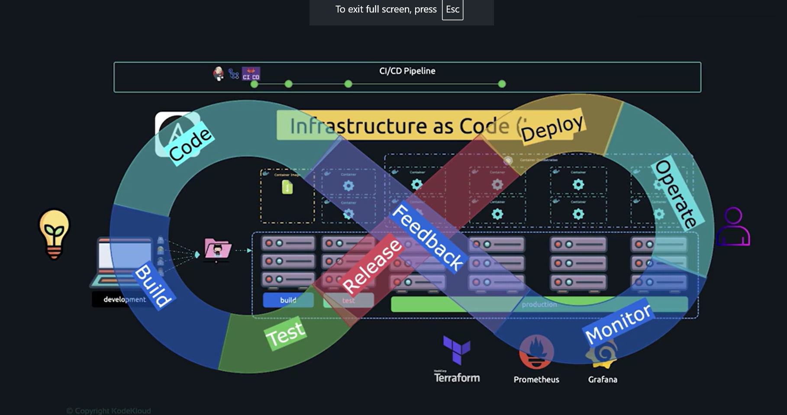

# DevOps Prerequisite Course:

The **DevOps Prerequisite Course** is the first course in the DevOps Mastery Specialization, designed to provide foundational skills essential for a successful DevOps journey. Led by [Mumshad Mannambeth](https://www.coursera.org/instructor/~93669146), this beginner-level course spans approximately 14 hours and has received a rating of 4.6 out of 5 from 31 reviews.

The course covers:

-   **Linux Basics:** Learn essential Linux commands, the VI editor, package management, and managing system services.

-   **Networking:** Understand fundamental networking principles and the Domain Name System (DNS).

-   **Application Basics:** Get introduced to popular programming languages—Java, Node.js, and Python—and their essential concepts.

Through hands-on labs and practical assignments, participants gain proficiency in these areas, preparing them for more advanced DevOps topics.

For more details and enrollment information, visit the course page: [DevOps Prerequisite Course](https://www.coursera.org/learn/devops-prerequisite-course).

### Content

- [DevOps Prerequisite Course:](#devops-prerequisite-course)
    - [Content](#content)
  - [Module 1: Introduction](#module-1-introduction)
    - [1.1 Introduction](#11-introduction)
      - [Why This Course?](#why-this-course)
      - [What You’ll Learn:](#what-youll-learn)
      - [Course Format](#course-format)
      - [Who is This For?](#who-is-this-for)
    - [1.2 Understanding DevOps Tools and How It Works](#12-understanding-devops-tools-and-how-it-works)
      - [**Overview**](#overview)
      - [**From Idea to Deployment**](#from-idea-to-deployment)
      - [**The Development Workflow**](#the-development-workflow)
      - [**Challenges and Solutions**](#challenges-and-solutions)
      - [**Scaling Applications**](#scaling-applications)
      - [**Monitoring and Maintenance**](#monitoring-and-maintenance)
      - [**What is DevOps?**](#what-is-devops)
  - [Module 2: Linux Basics](#module-2-linux-basics)
    - [2.1 Working Your Way Through the CLI](#21-working-your-way-through-the-cli)
      - [**Overview**](#overview-1)
      - [**What is the Linux Shell?**](#what-is-the-linux-shell)
      - [**Basic Linux Commands**](#basic-linux-commands)
      - [**Working with Files**](#working-with-files)
      - [**Special Notes**](#special-notes)
      - [**Additional Resources**](#additional-resources)
      - [**Next Steps**](#next-steps)
    - [2.2 Hands-on Lab: Navigating the Linux Command Line Interface](#22-hands-on-lab-navigating-the-linux-command-line-interface)
    - [2.3 Mastering the VI Editor](#23-mastering-the-vi-editor)
      - [**Overview**](#overview-2)
      - [**Opening a File in VI**](#opening-a-file-in-vi)
      - [**Modes in VI**](#modes-in-vi)
      - [**Basic Commands in VI**](#basic-commands-in-vi)
      - [**Saving and Exiting**](#saving-and-exiting)
      - [**Finding Text**](#finding-text)
      - [**Resources**](#resources)
      - [**Next Steps**](#next-steps-1)
    - [2.4 More Linux Commands](#24-more-linux-commands)
      - [**Overview**](#overview-3)
      - [**User Account Commands**](#user-account-commands)
      - [**Root and Sudo Privileges**](#root-and-sudo-privileges)
      - [**Downloading Files**](#downloading-files)
      - [**Checking the Operating System**](#checking-the-operating-system)
      - [**Resources**](#resources-1)
      - [**Next Steps**](#next-steps-2)
    - [2.5 Hands-on Lab: Linux Commands](#25-hands-on-lab-linux-commands)
    - [2.6 Understanding Package Management in Linux](#26-understanding-package-management-in-linux)
      - [**Overview**](#overview-4)
      - [**RPM (Red Hat Package Manager)**](#rpm-red-hat-package-manager)
      - [**YUM (Yellowdog Updater, Modified)**](#yum-yellowdog-updater-modified)
      - [**Configuring Repositories**](#configuring-repositories)
      - [**Practical Use Cases**](#practical-use-cases)
      - [**Key Points**](#key-points)
      - [**Resources**](#resources-2)
    - [2.7 Hands-on Lab: Package Management](#27-hands-on-lab-package-management)
    - [2.8 Managing System Services in Linux](#28-managing-system-services-in-linux)
      - [**Overview**](#overview-5)
      - [**Key Commands for Managing Services**](#key-commands-for-managing-services)
      - [**Configuring a Program as a Service**](#configuring-a-program-as-a-service)
      - [**Enhancements in Unit Files**](#enhancements-in-unit-files)
      - [**Example: Docker as a Service**](#example-docker-as-a-service)
      - [**Key Points**](#key-points-1)
      - [**Resources**](#resources-3)
    - [2.9 Hands-on Lab: Services](#29-hands-on-lab-services)
    - [2.10 Graded Assessment: Linux Basics](#210-graded-assessment-linux-basics)
      - [**Question 1**](#question-1)
      - [**Question 2**](#question-2)
      - [**Question 3**](#question-3)
      - [**Question 4**](#question-4)
      - [**Question 5**](#question-5)
      - [**Question 6**](#question-6)
      - [**Question 7**](#question-7)
      - [**Question 8**](#question-8)
      - [**Question 9**](#question-9)
      - [**Question 10**](#question-10)
  - [Module 3: Networking](#module-3-networking)
    - [3.1 Essential Networking Principles](#31-essential-networking-principles)
      - [**Networking Basics**](#networking-basics)
      - [**Routing**](#routing)
      - [**Key Concepts**](#key-concepts)
      - [**Linux Host as a Router**](#linux-host-as-a-router)
      - [**Commands Recap**](#commands-recap)
      - [**Troubleshooting Tips**](#troubleshooting-tips)
    - [3.2 Exploring the Domain Name System (DNS)](#32-exploring-the-domain-name-system-dns)
      - [**What is DNS?**](#what-is-dns)
      - [**Basic Concepts**](#basic-concepts)
      - [**Configuration Files**](#configuration-files)
      - [**DNS Tools**](#dns-tools)
      - [**Record Types in DNS**](#record-types-in-dns)
      - [**DNS Workflow**](#dns-workflow)
      - [**Practical Examples**](#practical-examples)
    - [3.3 Hands-on Lab: Exploring the Domain Name System](#33-hands-on-lab-exploring-the-domain-name-system)
    - [3.4 Graded Assessment: Networking](#34-graded-assessment-networking)
      - [**Question 1**:](#question-1-1)
      - [**Question 2**:](#question-2-1)
      - [**Question 3**:](#question-3-1)
      - [**Question 4**:](#question-4-1)
  - [Module 4: Application Basics](#module-4-application-basics)
    - [4.1 **Introduction**](#41-introduction)
      - [**What will you learn in this section?**](#what-will-you-learn-in-this-section)
      - [**Why is this important?**](#why-is-this-important)
      - [**Types of Programming Languages**](#types-of-programming-languages)
      - [**What is Bytecode?**](#what-is-bytecode)
      - [**What are Virtual Machines?**](#what-are-virtual-machines)
      - [**What are Packages and Dependencies?**](#what-are-packages-and-dependencies)
      - [**Why Learn This?**](#why-learn-this)
    - [4.2 **Java - Introduction**](#42-java---introduction)
      - [**Java Versions**](#java-versions)
      - [**Installing Java**](#installing-java)
      - [**What is JDK?**](#what-is-jdk)
      - [**Components of JDK**](#components-of-jdk)
      - [**JDK and JRE in the Past vs Now**](#jdk-and-jre-in-the-past-vs-now)
    - [4.3 Hands-on Lab: Java Introduction](#43-hands-on-lab-java-introduction)
    - [4.4 **Java - Build \& Packaging**](#44-java---build--packaging)
      - [**Building a Java Application**](#building-a-java-application)
      - [**Java Bytecode \& JVM**](#java-bytecode--jvm)
      - [**Packaging Java Applications**](#packaging-java-applications)
      - [**Running a JAR File**](#running-a-jar-file)
      - [**JavaDoc (Documentation Tool)**](#javadoc-documentation-tool)
      - [**Build Automation with Tools**](#build-automation-with-tools)
      - [**Example with ANT**](#example-with-ant)
      - [**Other Build Tools**](#other-build-tools)
    - [4.5 Hands-on Lab: Java - JARs](#45-hands-on-lab-java---jars)
    - [4.6 Hands-on Lab: Java - Build \& Packaging](#46-hands-on-lab-java---build--packaging)
    - [4.7 **NodeJS - Introduction**](#47-nodejs---introduction)
      - [**What is JavaScript?**](#what-is-javascript)
      - [**Client-Side Frameworks**](#client-side-frameworks)
      - [**What is NodeJS?**](#what-is-nodejs)
      - [**NodeJS Features**](#nodejs-features)
      - [**Installing NodeJS (Example for CentOS)**](#installing-nodejs-example-for-centos)
      - [**Running a NodeJS Application**](#running-a-nodejs-application)
      - [**Purpose in DevOps**](#purpose-in-devops)
    - [4.8 Hands-on Lab: NodeJS - Introduction](#48-hands-on-lab-nodejs---introduction)
    - [4.9 **NodeJS - NPM**](#49-nodejs---npm)
      - [**Why is NPM Important?**](#why-is-npm-important)
      - [**Using NPM**](#using-npm)
      - [**Where Are Packages Stored?**](#where-are-packages-stored)
      - [**Using Packages in Applications**](#using-packages-in-applications)
      - [**How Node Looks for Packages**](#how-node-looks-for-packages)
      - [**Types of Modules**](#types-of-modules)
      - [**Understanding `package.json`**](#understanding-packagejson)
      - [**Dependency Management**](#dependency-management)
    - [4.10 Hands-on Lab: Node JS - NPM](#410-hands-on-lab-node-js---npm)
    - [4.11 **Python - Introduction**](#411-python---introduction)
      - [**Python Versions**](#python-versions)
      - [**Installing Python**](#installing-python)
      - [**Checking Python Installation**](#checking-python-installation)
      - [**Using the Python Interpreter**](#using-the-python-interpreter)
      - [**Running a Python Program**](#running-a-python-program)
    - [4.12 Hands-on Lab: Python - Introduction](#412-hands-on-lab-python---introduction)
    - [4.13 **Python - PIP**](#413-python---pip)
      - [**Multiple Versions of PIP**](#multiple-versions-of-pip)
      - [**Installing Python Packages**](#installing-python-packages)
      - [**Python Package Installation Paths**](#python-package-installation-paths)
      - [**Importing Python Packages**](#importing-python-packages)
      - [**Handling Large Application Dependencies**](#handling-large-application-dependencies)
      - [**Upgrading and Uninstalling Packages**](#upgrading-and-uninstalling-packages)
      - [**Other Package Formats**](#other-package-formats)
    - [4.14 Hands-on Lab: Python - PIP](#414-hands-on-lab-python---pip)
  - [**Certificate of Completion**](#certificate-of-completion)
  - [**Next Steps After This Course**](#next-steps-after-this-course)
    - [**1. Linux Basics**](#1-linux-basics)
    - [**2. Networking Essentials**](#2-networking-essentials)
    - [**3. Applications and Programming**](#3-applications-and-programming)
        - [**a. Python**](#a-python)
        - [**b. Java**](#b-java)
        - [**c. Node.js**](#c-nodejs)
        - [**d. C/C++**](#d-cc)
        - [**e. C#**](#e-c)
    - [**4. DevOps Tools and Practices**](#4-devops-tools-and-practices)
        - [**a. Version Control**](#a-version-control)
        - [**b. CI/CD Pipelines**](#b-cicd-pipelines)
        - [**c. Containerization**](#c-containerization)
        - [**d. Configuration Management**](#d-configuration-management)

## Module 1: Introduction

### 1.1 Introduction

-   **Instructor**: Mumshad Mannambeth
-   DevOps and cloud computing are popular IT topics today.
-   KodeKloud offers learning paths on:
    -   DevOps (Docker, Kubernetes, OpenShift)
    -   Automation (Ansible, Terraform)
    -   Cloud platforms (AWS, GCP, Azure).

#### Why This Course?

-   Beginners often face issues like:
    -   Lab setup (local vs. cloud)
    -   Basics of Linux, networking, or YAML/JSON
    -   Understanding programming languages, servers, and databases.
-   This course focuses on these **foundational concepts** to help you in advanced DevOps/cloud courses.

#### What You’ll Learn:

1. **Linux Basics**

    - Linux distributions and devices.
    - Setting up labs with VirtualBox.
    - Fix common issues: networking and VM connections.

2. **Networking Basics**

    - What are IP addresses, ports, and gateways?
    - Learn how to configure these in virtual machines.

3. **Data Formats**

    - Learn to read/write **JSON** and **YAML** (common in DevOps tools).
    - Hands-on exercises make this easy and practical.

4. **Applications and Servers**

    - Install programming languages like Java, Python, Node.js.
    - Deploy apps on web servers like Apache, Nginx, and GUnicorn.

5. **Databases**
    - Understand **SQL vs. NoSQL** databases.
    - Learn installation and configuration of MySQL, MongoDB.

#### Course Format

-   **Videos:** Explain concepts simply using visuals and animations.
-   **Hands-on Labs:**
    -   Real environments accessed via your browser.
    -   Tasks are validated, with hints and community support.

#### Who is This For?

-   Beginners without a computer science background.
-   Anyone struggling with foundational topics in DevOps or cloud computing.

### 1.2 Understanding DevOps Tools and How It Works

#### **Overview**

-   DevOps involves tools like Docker, Kubernetes, Git, Jenkins, Terraform, and Prometheus, which can seem overwhelming.
-   This video explains how these tools fit together, using a story of building and scaling a project.

#### **From Idea to Deployment**

1. **The Beginning**

    - Start coding your idea on a local machine.
    - Problem: The app runs only on your laptop (e.g., `http://localhost:8080`).

2. **Hosting the Application**
    - Move the app to a **server** (physical or virtual) to keep it always accessible.
    - Install required software like Python, Java, or libraries for the app to run.
    - Production setup includes:
        - Hosting the app
        - Mapping a domain name to the server for easy access

#### **The Development Workflow**

1. **Development Phase**

    - Write code on local environments using editors like VS Code or PyCharm.
    - Convert code into an **executable format** using tools like Maven or Gradle (this is the **build** process).

2. **Deployment**

    - Transfer the built app to the production server (this is the **deploy** phase).

3. **Collaboration Issues**
    - Multiple developers = conflicts while working on the same codebase
    - **Solution:** Use **Git** for version control
    - Centralize the code on **GitHub** for collaboration and project management

#### **Challenges and Solutions**

1. **Manual Workflows**

    - Copying code, building, testing, and deploying manually is slow and error-prone
    - **Solution:** Use **CI/CD tools** like Jenkins or GitHub Actions for automation:
        - Automatically build, test, and deploy code after pushing to GitHub

2. **Dependency Issues**
    - Apps require specific dependencies and versions
    - **Solution:** Use **Docker** to package apps and their dependencies into portable **containers**

#### **Scaling Applications**

1. **Container Orchestration**

    - **Kubernetes** manages containers:
        - Automatically scale containers based on load
        - Restart failed containers

2. **Infrastructure Challenges**
    - Provisioning new servers manually is time-consuming and error-prone
    - **Solution:**
        - Use **Terraform** for automated server provisioning (infrastructure as code)
        - Use **Ansible** for post-provisioning tasks (e.g., installing software)

#### **Monitoring and Maintenance**

1. **Monitoring Tools**
    - Use **Prometheus** to collect metrics (CPU, memory usage)
    - Visualize data with **Grafana** using charts and graphs

#### **What is DevOps?**

-   A combination of **people**, **processes**, and **tools**
-   Helps move from an idea to delivery:
    -   Build → Test → Deploy → Monitor → Improve
    -   Automates workflows to release faster and consistently
    -   
        This story shows how DevOps tools work together to build scalable, efficient, and high-quality software solutions.

---

## Module 2: Linux Basics

### 2.1 Working Your Way Through the CLI

#### **Overview**

-   This section introduces basic Linux commands and working with the **Command Line Interface (CLI)**.
-   Linux is essential for DevOps because most tools (e.g., Docker, Kubernetes, Ansible) are Linux-first.
-   The course uses **CentOS** to cover Linux basics. CentOS is the free version of Red Hat Enterprise Linux (RHEL).

#### **What is the Linux Shell?**

-   The **shell** is the text-based CLI interface to interact with the OS.
-   Types of shells:
    -   **Bourne Shell (sh):** Basic functionality.
    -   **Bash (Bourne Again Shell):** Enhanced features like scripting, conditionals, and arrays.
    -   Use `echo $SHELL` to check your current shell.

#### **Basic Linux Commands**

1. **Echo Command**

    - Prints text or environment variables to the screen.
    - Example:
        ```bash
        echo "Hello, World!"
        echo $SHELL
        ```
    - **Docs:** [Linux Echo Command](https://linux.die.net/man/1/echo)

2. **List Directory Contents (ls)**

    - Lists files and directories in the current folder.
    - Example:
        ```bash
        ls
        ls -l
        ```
    - **Docs:** [Linux ls Command](https://linux.die.net/man/1/ls)

3. **Change Directory (cd)**

    - Navigates to another directory.
    - Example:
        ```bash
        cd my_dir
        ```
    - **Docs:** [Linux cd Command](https://linux.die.net/man/1/cd)

4. **Print Working Directory (pwd)**

    - Displays the current directory.
    - Example:
        ```bash
        pwd
        ```
    - **Docs:** [Linux pwd Command](https://linux.die.net/man/1/pwd)

5. **Make Directory (mkdir)**

    - Creates a new directory.
    - Example:
        ```bash
        mkdir new_dir
        mkdir -p /tmp/Asia/India/Bangalore
        ```
    - **Docs:** [Linux mkdir Command](https://linux.die.net/man/1/mkdir)

6. **Remove Directory (rm -r)**

    - Deletes a directory and its contents.
    - Example:
        ```bash
        rm -r my_dir
        ```
    - **Docs:** [Linux rm Command](https://linux.die.net/man/1/rm)

7. **Copy Directory (cp -r)**
    - Copies a directory and its contents to a new location.
    - Example:
        ```bash
        cp -r source_dir target_dir
        ```
    - **Docs:** [Linux cp Command](https://linux.die.net/man/1/cp)

#### **Working with Files**

1. **Create a File (touch)**

    - Creates an empty file.
    - Example:
        ```bash
        touch new_file.txt
        ```
    - **Docs:** [Linux touch Command](https://linux.die.net/man/1/touch)

2. **Write to a File (cat and redirection)**

    - Add text to a file using the redirection operator (`>`).
    - Example:
        ```bash
        cat > file.txt
        ```
    - To view file contents:
        ```bash
        cat file.txt
        ```
    - **Docs:** [Linux cat Command](https://linux.die.net/man/1/cat)

3. **Copy Files (cp)**

    - Copies a file to a new location.
    - Example:
        ```bash
        cp source.txt target.txt
        ```
    - **Docs:** [Linux cp Command](https://linux.die.net/man/1/cp)

4. **Move/Rename a File (mv)**

    - Moves a file to a new location or renames it.
    - Example:
        ```bash
        mv old_name.txt new_name.txt
        ```
    - **Docs:** [Linux mv Command](https://linux.die.net/man/1/mv)

5. **Delete a File (rm)**
    - Removes a file.
    - Example:
        ```bash
        rm file.txt
        ```
    - **Docs:** [Linux rm Command](https://linux.die.net/man/1/rm)

#### **Special Notes**

-   **Multiple Commands:** Use `;` to run multiple commands in one line.  
    Example:
    ```bash
    cd new_dir; mkdir www; pwd
    ```
-   **Tree Directory Creation:** Use `mkdir -p` to create nested directories in one command.

#### **Additional Resources**

-   **Linux Basics Course by KodeKloud:** A full-fledged course with labs in a story/comic format.
-   **Linux Documentation:**
    -   [GNU Bash Manual](https://www.gnu.org/software/bash/manual/bash.html)
    -   [CentOS Official Documentation](https://wiki.centos.org/Documentation)
    -   [Red Hat Enterprise Linux Documentation](https://access.redhat.com/documentation/en-us/red_hat_enterprise_linux/)

#### **Next Steps**

-   Use the [labs](https://kodekloud.com/pages/free-labs/devops/working-your-way-through-the-cli) to practice the commands above.
-   Later, deploy your own Linux VM to apply what you’ve learned in a real environment.

### 2.2 Hands-on Lab: Navigating the Linux Command Line Interface

Use the link provided to access the lab and delve into the hands-on practice of the topic you just learned. [Lab 2.2](https://kodekloud.com/pages/free-labs/devops/working-your-way-through-the-cli)

### 2.3 Mastering the VI Editor

#### **Overview**

-   **VI Editor**: A powerful console-based text editor in Linux.
-   Essential for editing files, especially when working remotely on Linux servers.
-   Alternatives: **Vim** (an improved version of VI) and **Nano**, but VI is widely used and often pre-installed.

#### **Opening a File in VI**

-   Run the command:
    ```bash
    vi filename
    ```
-   If the file doesn’t exist, this creates a new one.

#### **Modes in VI**

1. **Command Mode** (default)

    - For navigation and commands (copy, paste, delete, etc.).
    - Cannot edit the file directly in this mode.

2. **Insert Mode**
    - For editing the file contents.
    - Enter insert mode: Press `i`.
    - Exit to command mode: Press `Esc`.

#### **Basic Commands in VI**

-   **Navigation**:
    -   `k` or `↑`: Move up
    -   `j` or `↓`: Move down
    -   `h` or `←`: Move left
    -   `l` or `→`: Move right
-   **Delete**:
    -   `x`: Delete a character
    -   `dd`: Delete the current line
-   **Copy and Paste**:
    -   `yy`: Copy the current line
    -   `p`: Paste after the current line
-   **Scrolling**:
    -   `Ctrl + u`: Scroll up
    -   `Ctrl + d`: Scroll down

#### **Saving and Exiting**

-   `:w` → Save the file (write to disk)
-   `:q` → Quit without saving (only if no changes were made)
-   `:wq` → Save and quit
-   `:q!` → Quit without saving, even if changes were made

#### **Finding Text**

-   Search for a word:
    ```bash
    /word
    ```
    -   Highlights all occurrences and moves the cursor to the first match.
    -   Press `n` to jump to the next occurrence.

#### **Resources**

-   **VI Editor Documentation**: [GNU Vi Manual](https://www.gnu.org/software/ed/manual/vi.html)
-   **Vim Documentation** (advanced version): [Vim Docs](https://www.vim.org/docs.php)

#### **Next Steps**

-   Practice using the **VI Editor** in the labs to get familiar with its commands.
-   Learn advanced features in future lessons, such as using macros and editing large configuration files.

### 2.4 More Linux Commands

#### **Overview**

This section introduces additional Linux commands to work with user accounts, privileges, downloading files, and identifying the operating system. Key focus: Learn commands relevant for tasks encountered during the course.

#### **User Account Commands**

1. **Check Current User**

    - Command:
        ```bash
        whoami
        ```
    - Shows the username of the logged-in user.

2. **Get User Details**

    - Command:
        ```bash
        id
        ```
    - Displays user ID, group ID, and group memberships.

3. **Switch Users**

    - Command:
        ```bash
        su username
        ```
    - Switch to another user. Requires the target user's password.
    - **Docs:** [Linux su Command](https://linux.die.net/man/1/su)

4. **Log in to Another System via SSH**
    - Command:
        ```bash
        ssh username@hostname
        ```
    - Use this format to specify a different user when connecting to a remote system.
    - **Docs:** [Linux SSH Command](https://linux.die.net/man/1/ssh)

#### **Root and Sudo Privileges**

-   **Root User**: Has unrestricted access to the system. Direct root access is usually restricted in production environments.
-   **Granting Sudo Privileges**: Add the user to the `sudoers` file (requires root privileges).
-   **Elevating Privileges**: Prefix a command with `sudo` to execute it with elevated permissions.
    -   Example:
        ```bash
        sudo apt update
        ```
    -   If permission denied errors occur, remember to use `sudo`.
    -   **Docs:** [Linux sudo Command](https://linux.die.net/man/8/sudo)

#### **Downloading Files**

1. **Using `curl`**

    - Command:
        ```bash
        curl -O <URL>
        ```
    - Downloads a file from the internet to the current directory. Without `-O`, the content is displayed on the screen.
    - **Docs:** [Linux curl Command](https://curl.se/docs/manpage.html)

2. **Using `wget`**
    - Command:
        ```bash
        wget -O <filename> <URL>
        ```
    - Downloads a file and saves it with a specified name.
    - **Docs:** [Linux wget Command](https://www.gnu.org/software/wget/manual/wget.html)

#### **Checking the Operating System**

1. **Inspect OS Details**
    - Command:
        ```bash
        cat /etc/*release
        ls /etc/*release*
        ```
    - Views release details of the current operating system.
    - Example Output: `CentOS version 7`

#### **Resources**

-   **Official Documentation:**
    -   [Linux User Commands](https://tldp.org/LDP/GNU-Linux-Tools-Summary/html/x11655.htm)
    -   [Sudo Manual](https://linux.die.net/man/8/sudo)
    -   [Curl Command Guide](https://curl.se/docs/manual.html)

#### **Next Steps**

Practice these commands in the labs to familiarize yourself with user management, privileges, and downloading files. Remember to use `sudo` for system-level changes and tasks.

### 2.5 Hands-on Lab: Linux Commands

Use the link provided to access the lab and delve into the hands-on practice of the topic you just learned. [Lab 2.5](https://kodekloud.com/pages/free-labs/devops/more-linux-commands)

### 2.6 Understanding Package Management in Linux

#### **Overview**

Package managers are essential tools for installing and managing software on Linux systems. This section explains how package management works in CentOS using **RPM** and **YUM**.

#### **RPM (Red Hat Package Manager)**

-   **Purpose**: Handles software packaged in `.rpm` files.
-   **Key Commands**:
    -   Install a package:
        ```bash
        rpm -i package-name.rpm
        ```
    -   Uninstall a package:
        ```bash
        rpm -e package-name
        ```
    -   Query details about an installed package:
        ```bash
        rpm -q package-name
        ```
-   **Limitation**: RPM does not automatically resolve or install dependencies.

#### **YUM (Yellowdog Updater, Modified)**

-   **Purpose**: A high-level package manager built on top of RPM that handles dependencies automatically.
-   **Repositories**:
    -   YUM searches for software in **repositories**, which can be local or remote.
    -   Repositories are configured in `/etc/yum.repos.d/`.
    -   Default repositories often suffice, but custom repositories may be added for newer or less common software.
-   **Key Commands**:
    -   Install a package (with dependencies):
        ```bash
        yum install package-name
        ```
    -   View list of repositories:
        ```bash
        yum repolist
        ```
    -   List installed or available packages:
        ```bash
        yum list package-name
        ```
    -   Remove a package:
        ```bash
        yum remove package-name
        ```
    -   Show available versions of a package:
        ```bash
        yum list --showduplicates package-name
        ```
    -   Install a specific version of a package:
        ```bash
        yum install package-name-version
        ```
-   **Example**:
    -   To add a repository for the latest version of Ansible, follow the instructions in the [Ansible Documentation](https://docs.ansible.com/).

#### **Configuring Repositories**

-   **Repository Configuration Files**:
    -   Located in `/etc/yum.repos.d/`.
    -   Contain URLs pointing to repositories where packages are stored.
-   **Custom Repositories**:
    -   Required when default repositories lack the needed software or versions.
    -   Example: Adding a repository for a newer version of Ansible.

#### **Practical Use Cases**

1. **Installing Software**:
    - Install a package and its dependencies:
        ```bash
        yum install httpd
        ```
2. **Upgrading Software**:
    - Update all packages:
        ```bash
        yum update
        ```
3. **Inspecting Repositories**:
    - Check repository details:
        ```bash
        yum repolist
        ```

#### **Key Points**

-   YUM automates dependency resolution, unlike RPM, which requires manual installation of dependencies.
-   Repositories can be managed and configured to access additional software or newer versions.

#### **Resources**

-   [CentOS RPM Documentation](https://rpm.org/documentation.html)
-   [YUM Command Documentation](https://linux.die.net/man/8/yum)
-   [Ansible Repository Setup Guide](https://docs.ansible.com/)

### 2.7 Hands-on Lab: Package Management

Use the link provided to access the lab and delve into the hands-on practice of the topic you just learned. [Lab 2.7](https://kodekloud.com/pages/free-labs/devops/package-management)

### 2.8 Managing System Services in Linux

#### **Overview**

Services in Linux allow software to run in the background and ensure it starts automatically when the system boots. This is essential for tools like web servers, database servers, and other applications that need to stay running.

#### **Key Commands for Managing Services**

1. **Start a Service**
    ```bash
    systemctl start service_name
    ```
    Example:
    ```bash
    systemctl start httpd
    ```
2. **Stop a Service**

    ```bash
    systemctl stop service_name
    ```

3. **Check Service Status**

    ```bash
    systemctl status service_name
    ```

4. **Enable a Service to Start on Boot**

    ```bash
    systemctl enable service_name
    ```

5. **Disable a Service on Boot**
    ```bash
    systemctl disable service_name
    ```

#### **Configuring a Program as a Service**

1. **Creating a Unit File**

    - Unit files define how a program runs as a service.
    - Create a file in `/etc/systemd/system/` named `<service_name>.service`.  
      Example for a Python app:

    ```bash
    /etc/systemd/system/my_app.service
    ```

2. **Defining the Unit File**
   Example Content:

    ```ini
    [Unit]
    Description=My Python App Service

    [Service]
    ExecStart=/usr/bin/python3 /opt/code/my_app.py
    Restart=always

    [Install]
    WantedBy=multi-user.target
    ```

3. **Activating the Service**

    - Reload systemd to recognize the new service:
        ```bash
        systemctl daemon-reload
        ```
    - Start the service:
        ```bash
        systemctl start my_app
        ```
    - Enable it to start on boot:
        ```bash
        systemctl enable my_app
        ```

4. **Check Service Status**

    - Use the `systemctl status my_app` command to confirm the service is active and running.

5. **Test the Service**
    - Use `curl` to interact with the running service:
        ```bash
        curl http://localhost:5000
        ```

#### **Enhancements in Unit Files**

1. **Adding Metadata**

    - Use the `[Unit]` section to provide a description and dependencies:
        ```ini
        [Unit]
        Description=My Python App Service
        After=network.target
        ```

2. **Restart on Failure**

    - Use the `Restart` directive in the `[Service]` section:
        ```ini
        Restart=always
        ```

3. **Pre- and Post-Start Commands**
    - Specify commands to run before or after starting the service:
        ```ini
        ExecStartPre=/path/to/pre-start-script.sh
        ExecStartPost=/path/to/post-start-script.sh
        ```

#### **Example: Docker as a Service**

-   Docker’s service is defined in `/lib/systemd/system/docker.service`.
-   Key sections in its unit file:
    -   **Unit**: Describes the service and dependencies.
    -   **Service**: Specifies the command to start the Docker daemon.
    -   **Install**: Configures the service to start after specific targets like `multi-user.target`.

#### **Key Points**

-   **Unit Files**: Essential for configuring services in Linux.
-   **Systemctl Commands**: Simplify service management tasks.
-   **Service Configuration**: Allows automation and ensures reliability of critical applications.

#### **Resources**

-   [systemd Documentation](https://www.freedesktop.org/wiki/Software/systemd/)
-   [Linux Services Documentation](https://linux.die.net/man/1/systemctl)
-   [Python Official Documentation](https://docs.python.org/)

### 2.9 Hands-on Lab: Services

Use the link provided to access the lab and delve into the hands-on practice of the topic you just learned. [Lab 2.9](https://kodekloud.com/pages/free-labs/devops/services)

### 2.10 Graded Assessment: Linux Basics

#### **Question 1**

**Which popular open-source tool is commonly used for containerization in DevOps?**

-   **Options:**  
    a. ansible  
    b. docker  
    c. kubernetes  
    d. terraform
-   **Answer:**  
    b. docker

#### **Question 2**

**Which of the following are benefits of adopting a DevOps culture?**

-   **Options:**  
    a. Reduced complexity in the code base  
    b. Increased time to market  
    c. Improved system reliability  
    d. Improved collaboration between teams  
    e. Increased deployment frequency
-   **Answer:**  
    c. Improved system reliability  
    d. Improved collaboration between teams  
    e. Increased deployment frequency

#### **Question 3**

**What is a common tool used for configuration management in DevOps?**

-   **Options:**  
    a. terraform  
    b. ansible  
    c. docker  
    d. git
-   **Answer:**  
    b. ansible

#### **Question 4**

**What is the primary goal of DevOps?**

-   **Options:**  
    a. To improve collaboration between development and operations teams  
    b. To reduce the cost of software development  
    c. To speed up software development  
    d. To ensure high quality of software
-   **Answer:**  
    a. To improve collaboration between development and operations teams

#### **Question 5**

**Which of the following are benefits of implementing a DevOps methodology?**

-   **Options:**  
    a. Greater communication barriers  
    b. Increased downtime  
    c. Increased deployment frequency  
    d. Faster time to market
-   **Answer:**  
    c. Increased deployment frequency  
    d. Faster time to market

#### **Question 6**

**Which of the following are benefits of using Docker in a DevOps environment?**

-   **Options:**  
    a. Faster software delivery  
    b. Scalability  
    c. Increased security risk  
    d. Platform independence
-   **Answer:**  
    a. Faster software delivery  
    b. Scalability  
    d. Platform independence

#### **Question 7**

**What is the term used to denote the system that tracks all changes to the code in a software project?**

-   **Options:**  
    a. version control system (vcs)  
    b. container orchestration  
    c. continuous integration  
    d. build automation
-   **Answer:**  
    a. version control system (vcs)

#### **Question 8**

**Which of the following are considered as best practices in Continuous Integration?**

-   **Options:**  
    a. Waiting for a large number of changes before integration  
    b. Keeping the build fast  
    c. Frequent code check-ins  
    d. Automated build and test process
-   **Answer:**  
    b. Keeping the build fast  
    c. Frequent code check-ins  
    d. Automated build and test process

#### **Question 9**

**Which of the following best describes the relationship between Agile and DevOps?**

-   **Options:**  
    a. DevOps is a subset of Agile  
    b. DevOps and Agile are independent methodologies  
    c. DevOps enhances Agile by bringing in operations  
    d. Agile is a subset of DevOps
-   **Answer:**  
    c. DevOps enhances Agile by bringing in operations

#### **Question 10**

**In the context of DevOps, what is the practice of managing the servers and their configurations using code?**

-   **Options:**  
    a. Continuous integration  
    b. Infrastructure as code (iac)  
    c. Continuous deployment  
    d. Configuration as a service
-   **Answer:**  
    b. Infrastructure as code (iac)

---

## Module 3: Networking

### 3.1 Essential Networking Principles

#### **Networking Basics**

-   A **network** connects systems (e.g., laptops, desktops, VMs) for communication.
-   **Switches** create networks for connected systems and enable intra-network communication.
    -   Command to view interfaces: `ip link`.
    -   Command to assign IP addresses: `ip addr`.
-   Systems within the same network communicate directly using their IP addresses.

#### **Routing**

-   **Router**: Connects multiple networks and enables inter-network communication.
    -   Assigns IP addresses to its interfaces, e.g., `192.168.1.1` and `192.168.2.1`.
-   **Gateway**: A device or IP that acts as the "door" to other networks.
    -   Command to view routing table: `route`.
    -   Command to add a route: `ip route add <network> via <gateway>`.

#### **Key Concepts**

-   **Default Gateway**: Routes traffic to networks not explicitly defined in the routing table.
    -   Example: `0.0.0.0` indicates any destination not matching other routes.
-   For multiple routers (e.g., for the Internet and internal networks), define specific routing table entries for each.

#### **Linux Host as a Router**

-   Hosts with interfaces in two networks can act as routers.
    -   Enable **IP forwarding**:
        -   Check: `cat /proc/sys/net/ipv4/ip_forward`.
        -   Enable: `echo 1 > /proc/sys/net/ipv4/ip_forward`.
    -   Persist changes across reboots: Modify `/etc/sysctl.conf`.
-   Add routing table entries for all hosts to enable communication across networks.

#### **Commands Recap**

1. **Interface Management**:

    - `ip link`: List/modify interfaces.
    - `ip addr`: View assigned IP addresses.
    - `ip addr add`: Assign IP addresses to interfaces.

2. **Routing**:

    - `route` or `ip route`: View routing table.
    - `ip route add`: Add routes to the table.

3. **IP Forwarding**:

    - Check: `cat /proc/sys/net/ipv4/ip_forward`.
    - Enable: `echo 1 > /proc/sys/net/ipv4/ip_forward`.

4. **Persist Configuration**:
    - Modify `/etc/network/interfaces` for IP and routing persistence.
    - Edit `/etc/sysctl.conf` to persist IP forwarding settings.

#### **Troubleshooting Tips**

-   If unable to reach the Internet, verify routing table and default gateway settings.
-   Ensure IP forwarding is enabled for inter-network communication via the host acting as a router.

### 3.2 Exploring the Domain Name System (DNS)

#### **What is DNS?**

-   DNS translates hostnames (e.g., `www.google.com`) to IP addresses, simplifying network communication.
-   DNS facilitates name resolution, enabling systems to communicate without relying on memorized IPs.

#### **Basic Concepts**

1. **Name Resolution via `/etc/hosts`:**

    - The `/etc/hosts` file maps IP addresses to hostnames locally.
    - Example of entry:
        ```
        192.168.1.11 db
        ```
    - Commands to verify:
        ```bash
        ping db
        ```
    - **Important Notes**:
        - Entries in `/etc/hosts` take precedence over DNS.
        - `/etc/hosts` does not validate the hostname (e.g., you can map `192.168.1.11` to `google.com`).

2. **Name Resolution via DNS Server:**
    - Centralized system for managing hostnames and IPs across networks.
    - Configured in `/etc/resolv.conf`.
    - Example:
        ```
        nameserver 192.168.1.100
        ```
    - Commands to verify:
        ```bash
        nslookup db
        dig db
        ```

#### **Configuration Files**

1. **`/etc/hosts`:**

    - Local name resolution file.
    - Format:
        ```
        <IP Address> <Hostname> [Alias...]
        ```
    - Example:
        ```
        192.168.1.11 db
        192.168.1.11 google
        ```

2. **`/etc/resolv.conf`:**

    - DNS configuration file for specifying nameservers.
    - Key directives:
        - `nameserver <IP>`: Specifies the DNS server IP.
        - `search <domain>`: Appends domain names for unqualified hostnames.
    - Example:
        ```
        nameserver 192.168.1.100
        search mycompany.com
        ```

3. **`/etc/nsswitch.conf`:**
    - Defines the order of name resolution.
    - Example entry:
        ```
        hosts: files dns
        ```
    - **Order Explanation**:
        - `files`: Check `/etc/hosts` first.
        - `dns`: Query DNS server if not found in `/etc/hosts`.

#### **DNS Tools**

1. **`ping`**: Tests name resolution and network connectivity.

    ```bash
    ping <hostname>
    ```

    Example:

    ```bash
    ping db
    ```

2. **`nslookup`**: Queries DNS server directly.

    ```bash
    nslookup <hostname>
    ```

    Example:

    ```bash
    nslookup google.com
    ```

3. **`dig`**: Detailed DNS queries.
    ```bash
    dig <hostname>
    ```
    Example:
    ```bash
    dig google.com
    ```

#### **Record Types in DNS**

1. **A Record**: Maps IPv4 addresses to hostnames.
2. **AAAA Record**: Maps IPv6 addresses to hostnames.
3. **CNAME Record**: Maps one hostname to another (alias).
    - Example:
        ```
        Alias: eat.mycompany.com -> Original: food.mycompany.com
        ```

#### **DNS Workflow**

1. **Local Resolution:**

    - System first checks `/etc/hosts` for mappings.

2. **DNS Resolution:**

    - If not found locally, system queries DNS server specified in `/etc/resolv.conf`.

3. **Search Domains:**

    - For unqualified hostnames (e.g., `web`), DNS appends the `search` domain (e.g., `web.mycompany.com`).

4. **Fallback to Public DNS:**
    - If internal DNS server fails to resolve, external nameservers like `8.8.8.8` (Google Public DNS) can be used.

#### **Practical Examples**

1. **Map Hostname in `/etc/hosts`:**

    ```bash
    echo "192.168.1.11 db" >> /etc/hosts
    ping db
    ```

2. **Configure DNS in `/etc/resolv.conf`:**

    ```bash
    echo -e "nameserver 192.168.1.100\nsearch mycompany.com" > /etc/resolv.conf
    ```

3. **Change Resolution Order in `/etc/nsswitch.conf`:**

    ```bash
    sed -i 's/hosts:.*/hosts: files dns/' /etc/nsswitch.conf
    ```

4. **Query Using `nslookup`:**

    ```bash
    nslookup db
    ```

5. **Test CNAME with `dig`:**
    ```bash
    dig eat.mycompany.com
    ```

### 3.3 Hands-on Lab: Exploring the Domain Name System

Use the link provided to access the lab and delve into the hands-on practice of the topic you just learned. [Lab 3.3](https://kodekloud.com/pages/free-labs/devops/dns)

### 3.4 Graded Assessment: Networking

#### **Question 1**:

_What is the function of a router in a network?_

-   **A)** To enable communication within the same network
-   **B)** To connect two separate networks together
-   **C)** To provide access to the Internet
-   **D)** To manage network switches

**Answer**: **B)** To connect two separate networks together

#### **Question 2**:

_How can a system in one network reach a system in another network?_

-   **A)** By directly communicating through a switch
-   **B)** By increasing the bandwidth of the network
-   **C)** By configuring a gateway or route to the other network
-   **D)** By adding more IP addresses to the system

**Answer**: **C)** By configuring a gateway or route to the other network

#### **Question 3**:

_How can you enable hostname resolution on a Linux system without using DNS?_

-   **A)** By configuring the /etc/resolve.conf file
-   **B)** By installing a third-party hostname resolution tool
-   **C)** By assigning static IP addresses to all hosts
-   **D)** By adding entries to the /etc/hosts file

**Answer**: **D)** By adding entries to the /etc/hosts file

#### **Question 4**:

_What is the role of a DNS server in a network environment?_

-   **A)** To assign IP addresses to hosts
-   **B)** To configure firewall rules for network security
-   **C)** To provide centralized hostname-to-IP address resolution
-   **D)** To manage network switches

**Answer**: **C)** To provide centralized hostname-to-IP address resolution

---

## Module 4: Application Basics
### 4.1 **Introduction**  

#### **What will you learn in this section?**  
- Basics of **application development** for DevOps engineers.  
- Focus on understanding, not advanced coding.  
- Learn how to **deploy, build, and troubleshoot** applications.  
- Ideal for people from **non-development backgrounds**.

#### **Why is this important?**  
- To understand programming languages like **JavaScript (Node.js)**, **Python**, and **Java**.  
- To relate concepts when deploying or containerizing applications.  

#### **Types of Programming Languages**  
1. **Compiled Languages**  
   - Examples: **Java, C, C++**.  
   - Steps: Write code → Compile → Execute.  
   - Platform-specific: Runs only on the system it was compiled for.  
   - Example in Java:  
     ```java
     // Save code as MyClass.java
     javac MyClass.java // Compiles to MyClass.class
     java MyClass       // Runs the compiled file
     ```

2. **Interpreted Languages**  
   - Example: **Python**.  
   - Steps: Write code → Run directly with an interpreter.  
   - Converts code to **bytecode** and runs it on a **virtual machine (VM)**.  
   - Example in Python:  
     ```python
     # Save code as script.py
     python script.py  # Runs the script
     ```

#### **What is Bytecode?**  
- Intermediate form of the program, between human-readable code and machine code.  
- Helps programs run on different systems without changes.  

#### **What are Virtual Machines?**  
- Environment to run **bytecode** (not the same as infrastructure VMs).  
- Example: Python Virtual Machine.  

#### **What are Packages and Dependencies?**  
- **Packages**: Reusable code created by developers.  
- Examples:  
  - `npm` for Node.js.  
  - `pip` for Python.  
- Applications need these **dependencies** to work.  

#### **Why Learn This?**  
- To understand how applications are built, tested, and deployed.  
- Helps with troubleshooting errors in dependencies.  

### 4.2 **Java - Introduction**
- A popular programming language for **desktop, mobile, and web applications**.  
- **Free, open-source**, and supported by a large community.  

#### **Java Versions**  
- Current version: **13** (as per the lecture).  
- Many organizations still use **Java 8** due to compatibility and licensing issues.  
- Java version naming:  
  - Before Java 9: **1.x** (e.g., Java 1.8 for Java 8).  
  - From Java 9 onwards: **9, 10, 11, etc.**  

#### **Installing Java**  
1. **Download** from the Oracle website.  
2. For **Linux (e.g., CentOS)**:  
   - Use `wget` to download.  
   - Extract the build and find binaries in the `bin` folder.  
3. **Check Java Version**:  
   ```bash
   java -version
   ```

#### **What is JDK?**  
- **Java Development Kit (JDK)** is a collection of tools for:  
  - **Developing** applications.  
  - **Building** and **compiling** code.  
  - **Running** Java programs.  

#### **Components of JDK**  
1. **Development tools**:  
   - **Debugger** (`jdb`): Debugs Java applications.  
   - **JavaDoc** (`javadoc`): Documents source code.  
2. **Build tools**:  
   - **JavaC** (`javac`): Compiles source code.  
   - **Jar** (`jar`): Archives code and libraries into `.jar` files.  
3. **Java Runtime Environment (JRE)**:  
   - Required to **run Java applications** on any system.  
   - Includes the **Java command-line tool**.  

#### **JDK and JRE in the Past vs Now**  
- **Before Java 9**:  
  - JDK and JRE were **separate components**.  
  - You could install JRE alone to run Java apps.  
- **From Java 9**:  
  - Both are packaged together in a single JDK package.

### 4.3 Hands-on Lab: Java Introduction
Use the link provided to access the lab and delve into the hands-on practice of the topic you just learned.  [Lab 4.3](https://kodekloud.com/pages/free-labs/devops/java-introduction)

### 4.4 **Java - Build & Packaging**

#### **Building a Java Application**
- **Build Process Steps**:
  1. Develop source code.
  2. Compile code into bytecode using the `javac` command.
  3. Run the application using the `java` command.  

- **Basic Commands**:
  - Compile:
    ```bash
    javac MyClass.java
    ```
  - Run:
    ```bash
    java MyClass
    ```

#### **Java Bytecode & JVM**
- **Bytecode**: Intermediate code generated by the Java compiler.  
- **JVM (Java Virtual Machine)**:
  - Executes bytecode.
  - Enables Java applications to run on any platform with a JVM.

#### **Packaging Java Applications**
- Use **JAR (Java Archive)** to package applications.  
- **WAR (Web Archive)**: Used for web applications.  
- **Creating a JAR File**:
  ```bash
  jar cf MyApp.jar MyClass.class Service1.class Service2.class
  ```
- **Manifest File**:
  - Located at: `META-INF/MANIFEST.MF`.  
  - Specifies application metadata, including the **Main-Class** (entry point).  

#### **Running a JAR File**
- Command:
  ```bash
  java -jar MyApp.jar
  ```

#### **JavaDoc (Documentation Tool)**
- Generates HTML documentation for Java code.  
- Command:
  ```bash
  javadoc MyClass.java
  ```

#### **Build Automation with Tools**
- Popular tools: **Maven**, **Gradle**, **ANT**.  
- Automate tasks like:
  - Compilation.
  - Documentation.
  - Packaging (JAR files).

#### **Example with ANT**
- **ANT Configuration File** (`build.xml`):  
  - Written in XML.  
  - Defines build steps (targets) like:
    - Compile source code.
    - Generate documentation.
    - Create deployable JAR files.

- **Running ANT**:
  - Execute all steps:
    ```bash
    ant
    ```
  - Execute specific targets:
    ```bash
    ant compile jar
    ```

#### **Other Build Tools**
1. **Maven**:
   - Configuration: `pom.xml`.  
   - Example Command:
     ```bash
     mvn clean install
     ```
2. **Gradle**:
   - Configuration: `build.gradle`.  
   - Example Command:
     ```bash
     gradle build
     ```

### 4.5 Hands-on Lab: Java - JARs
Use the link provided to access the lab and delve into the hands-on practice of the topic you just learned. [Lab 4.5](https://kodekloud.com/pages/free-labs/devops/java-jars)

### 4.6 Hands-on Lab: Java - Build & Packaging
Use the link provided to access the lab and delve into the hands-on practice of the topic you just learned. [Lab 4.6](https://kodekloud.com/pages/free-labs/devops/java-build-packaging)

### 4.7 **NodeJS - Introduction**
#### **What is JavaScript?**
- **JavaScript** transformed plain-text websites into **interactive and dynamic** ones.  
- Enabled features like:
  - Animations.
  - Games.
  - Graphs and predictions.

#### **Client-Side Frameworks**  
- JavaScript powers modern frameworks like:
  - **jQuery**, **AngularJS**, **ReactJS**, **VueJS**, **EmberJS**, etc.  
- These frameworks run on **users' systems (browsers)** and handle the front-end.

#### **What is NodeJS?**  
- NodeJS is a **server-side JavaScript environment**.  
- Enables the use of **JavaScript on the backend** for tasks like building **web servers**.  
- Key feature: **Non-blocking I/O model**:
  - Handles many concurrent connections efficiently.  

#### **NodeJS Features**  
- **Open-source** and **free**.  
- Cross-platform: Works on **Windows**, **Linux**, **macOS**, etc.  
- **Latest version** (as of this recording): **13**.  

#### **Installing NodeJS (Example for CentOS)**  
1. Add the NodeSource repository:  
   ```bash
   curl -sL https://rpm.nodesource.com/setup_13.x | sudo bash -
   ```
2. Install NodeJS using `yum`:  
   ```bash
   sudo yum install -y nodejs
   ```
3. Verify installation:  
   ```bash
   node -v
   ```

#### **Running a NodeJS Application**
- Example of a NodeJS file:
  ```javascript
  console.log("Hello, NodeJS!");
  ```
- To execute:  
  ```bash
  node filename.js
  ```

#### **Purpose in DevOps**  
- **Focus**: Deploying and running NodeJS applications, not coding them.  
- NodeJS knowledge helps handle backend JavaScript applications in **deployment pipelines**.

### 4.8 Hands-on Lab: NodeJS - Introduction
Use the link provided to access the lab and delve into the hands-on practice of the topic you just learned. [Lab 4.7](https://kodekloud.com/pages/free-labs/devops/nodejs-introduction)

### 4.9 **NodeJS - NPM**
- **NPM**: Node Package Manager, used for managing libraries and dependencies in Node.js.
- Provides access to a vast repository of packages at **npmjs.com**.
- Automatically installed with Node.js.

#### **Why is NPM Important?**
- Handles **dependencies** required by applications.
- Resolves issues like missing libraries or mismatching versions.
- Enables sharing and using reusable packages across projects.

#### **Using NPM**
- Check NPM version:
  ```bash
  npm -v
  ```
- Search for a package:
  ```bash
  npm search <package_name>
  ```
- Install a package locally (for the current project):
  ```bash
  npm install <package_name>
  ```
- Install a package globally (available system-wide):
  ```bash
  npm install -g <package_name>
  ```

#### **Where Are Packages Stored?**
- Installed packages are stored in a directory named `node_modules` in the working directory.
- Each package includes files like:
  - **License file**.
  - **README file**.
  - **package.json**: Contains metadata (e.g., name, version, author, dependencies).

#### **Using Packages in Applications**
- Import packages into your application using:
  ```javascript
  const packageName = require('<package_name>');
  ```

#### **How Node Looks for Packages**
- Node first checks the local `node_modules` directory.
- If not found, it looks in global paths.  
- View module search paths:
  ```bash
  node -p "module.paths"
  ```

#### **Types of Modules**
1. **Built-in Modules**:
   - Pre-installed with Node.js.
   - Examples:
     - `fs`: Handles file systems.
     - `http`: Hosts HTTP servers.
     - `os`: Works with operating systems.
   - Located at `/usr/lib/node_modules` (Linux).

2. **External Modules**:
   - Installed using NPM.
   - Examples:
     - `express`: Web framework for backend applications.
     - `react`: Frontend user interface library.
     - `debug`: Debugging tool.

#### **Understanding `package.json`**
- **package.json** is created at the root of a Node.js project.
- Contains:
  - **Metadata**: Name, version, author, etc.
  - **Dependencies**: Required packages with their versions.
  - **Scripts**: Commands to automate tasks.
- Example:
  ```json
  {
    "name": "my-app",
    "version": "1.0.0",
    "dependencies": {
      "express": "^4.17.1",
      "debug": "^4.3.4"
    }
  }
  ```

#### **Dependency Management**
- Application dependencies are listed in its `package.json`.
- Each dependency may have its own `package.json` with sub-dependencies.
- Ensure versions are compatible to avoid errors.

### 4.10 Hands-on Lab: Node JS - NPM
Use the link provided to access the lab and delve into the hands-on practice of the topic you just learned. [Lab 4.10](https://kodekloud.com/pages/free-labs/devops/node-js-npm)

### 4.11 **Python - Introduction**
- Python is a **free and open-source**, cross-platform programming language.
- Requires the **Python interpreter** to run applications.
- Commonly used for **machine learning**, **data science**, **artificial intelligence**, and general-purpose programming.

#### **Python Versions**
1. **Python 2**:
   - Released in 2000.
   - Development ended in 2010.
   - No backward compatibility with Python 3.
   - Applications developed in Python 2 must run on a Python 2 interpreter.

2. **Python 3**:
   - Released in 2008 and actively developed.
   - Introduced new features to support **modern technologies**.
   - Applications developed in Python 3 must run on a Python 3 interpreter.

#### **Installing Python**
- Download the Python installer for your OS from [python.org/downloads](https://python.org/downloads).
- On Linux (CentOS), install Python using:
  - Python 2:
    ```bash
    sudo yum install python2
    ```
  - Python 3.6:
    ```bash
    sudo yum install python36
    ```
- You can install both versions simultaneously on the same system.

#### **Checking Python Installation**
- Verify installation:
  ```bash
  python2 -V
  python3 -V
  ```
- Alternatively:
  ```bash
  python -V
  ```
  - This defaults to the version that was installed first (could be Python 2 or Python 3).

#### **Using the Python Interpreter**
- Invoke Python 2 interpreter:
  ```bash
  python2
  ```
- Invoke Python 3 interpreter:
  ```bash
  python3
  ```
- Exit the interpreter:
  ```bash
  exit()
  ```

#### **Running a Python Program**
- Write a simple program (`hello.py`):
  ```python
  print("Hello, Python!")
  ```
- Run the program:
  ```bash
  python3 hello.py
  ```

### 4.12 Hands-on Lab: Python - Introduction
Use the link provided to access the lab and delve into the hands-on practice of the topic you just learned. [Lab 4.12](https://kodekloud.com/pages/free-labs/devops/python-introduction)


### 4.13 **Python - PIP**
- **PIP** stands for **Python Package Installer**.
- It is used to install and manage **Python packages**.
- Installed automatically with Python.

#### **Multiple Versions of PIP**
- For Python 2: `pip2`
- For Python 3: `pip3`
- Run the following command to verify PIP and its associated Python version:
  ```bash
  pip -V
  ```
- If only `pip` is available, use `pip -V` to check which Python version it corresponds to.

#### **Installing Python Packages**
- To install a package:
  ```bash
  pip install <package_name>
  ```
  Example: Installing Flask:
  ```bash
  pip install flask
  ```

#### **Python Package Installation Paths**
- Installed packages are placed in:
  - **For Python 2**: `/usr/lib/python2.7/site-packages/`
  - **For Python 3**: `/usr/lib/python3.6/site-packages/`
- To locate a specific package:
  ```bash
  pip show <package_name>
  ```

#### **Importing Python Packages**
- Use the `import` statement in your code:
  ```python
  import flask
  ```

- Python looks for packages in directories listed in the `sys.path`. Use the following command to display these directories:
  ```python
  import sys
  print(sys.path)
  ```

#### **Handling Large Application Dependencies**
1. **Using `requirements.txt`:**
   - Create a `requirements.txt` file listing all packages and their versions:
     ```
     flask==2.0.3
     numpy==1.21.2
     pandas==1.3.3
     ```
   - Install all packages at once:
     ```bash
     pip install -r requirements.txt
     ```

2. **Best Practices:**
   - Always specify package versions to avoid compatibility issues.
   - Update the `requirements.txt` file whenever new dependencies are added.

#### **Upgrading and Uninstalling Packages**
- **Upgrade a package:**
  ```bash
  pip install --upgrade <package_name>
  ```
- **Uninstall a package:**
  ```bash
  pip uninstall <package_name>
  ```

#### **Other Package Formats**
1. **EGGs:**
   - A legacy format for packaging Python code.
   - Managed using `easy_install`.
   - EGG files can be placed in a directory where Python looks for packages.

2. **Wheels (WHL):**
   - A modern packaging format.
   - Must be unpacked before installing.
   - Install a wheel package:
     ```bash
     pip install <package_name>.whl
     ```

### 4.14 Hands-on Lab: Python - PIP
Use the link provided to access the lab and delve into the hands-on practice of the topic you just learned.  [Lab 4.14](https://kodekloud.com/pages/free-labs/devops/python-pip)

## **Certificate of Completion**
To access my certificate, follow this link to my Coursera account:
[My Certificate on Coursera](https://coursera.org/share/9078bde39634f2c24f3c997635c4d7ba)


## **Next Steps After This Course**

### **1. Linux Basics**
- **Goal**: Strengthen your Linux skills as it's the backbone of most DevOps and cloud tools.
- **Next Topics to Cover**:
  - Advanced Linux commands (`grep`, `awk`, `sed`).
  - Shell scripting for automation.
  - File system management (permissions, file operations).
  - Managing services with `systemctl`.

**Resources**:
- [Linux Command Line Basics (Coursera)](https://www.coursera.org)
- [KodeKloud's Linux Basics Course](https://kodekloud.com)
- [Official Documentation](https://www.gnu.org/software/bash/manual/bash.html)

### **2. Networking Essentials**
- **Goal**: Build foundational knowledge of networking concepts crucial for DevOps environments.
- **Next Topics to Cover**:
  - Advanced IP addressing (subnetting, CIDR).
  - Protocols (HTTP, HTTPS, DNS, TCP/IP, SSH).
  - Network troubleshooting tools (`ping`, `traceroute`, `netstat`, `tcpdump`).
  - Configuring DNS servers and routing tables.

**Resources**:
- [Computer Networking: Principles, Protocols, and Practice](https://inl.info.ucl.ac.be/CNP3)
- [Networking for DevOps by KodeKloud](https://kodekloud.com/pages/free-labs/devops/networking-labs)
- [Official TCP/IP Documentation](https://www.ietf.org/standards/rfcs/)

### **3. Applications and Programming**
- **Goal**: Learn to work with different programming environments and applications.
  
##### **a. Python**
- Advanced Python scripting (file handling, APIs, automation).
- Package management with PIP.

**Resources**:
- [Automate the Boring Stuff with Python](https://automatetheboringstuff.com)
- [Official Python Docs](https://docs.python.org/3/)
- [Python Crash Course (Udemy)](https://www.udemy.com/course/python-crash-course/)

##### **b. Java**
- Building and running Java applications.
- Package management with Maven and Gradle.

**Resources**:
- [Java Programming Masterclass (Udemy)](https://www.udemy.com/course/java-the-complete-java-developer-course/)
- [Official Java Docs](https://docs.oracle.com/en/java/)

##### **c. Node.js**
- Building and deploying Node.js applications.
- Dependency management with NPM.

**Resources**:
- [Node.js and Express.js Crash Course](https://www.freecodecamp.org)
- [Official Node.js Docs](https://nodejs.org/en/docs/)

##### **d. C/C++**
- Understand compiled languages and the role of `gcc` and `g++`.
- Debugging with `gdb`.

**Resources**:
- [C Programming for Beginners](https://www.udemy.com/course/c-programming-for-beginners/)
- [Official C Standard Library Docs](https://en.cppreference.com/w/)
- [Learn C++ Programming](https://www.learncpp.com/)

##### **e. C#**
- Basics of .NET framework and Visual Studio.
- Building desktop and web applications with C#.

**Resources**:
- [C# Fundamentals for Beginners (Udemy)](https://www.udemy.com/course/csharp-tutorial-for-beginners/)
- [Official C# Documentation](https://learn.microsoft.com/en-us/dotnet/csharp/)

### **4. DevOps Tools and Practices**
- **Goal**: Dive deeper into DevOps tools for automation, CI/CD, and containerization.

##### **a. Version Control**
- Learn Git and GitHub for version control.
- Collaborate on projects with branching, merging, and pull requests.

**Resources**:
- [Git Complete (Udemy)](https://www.udemy.com/course/git-complete/)
- [Official Git Docs](https://git-scm.com/doc)

##### **b. CI/CD Pipelines**
- Build pipelines with Jenkins, GitLab CI/CD, and GitHub Actions.

**Resources**:
- [Jenkins Fundamentals (Udemy)](https://www.udemy.com/course/jenkins-fundamentals-for-devops-and-developers/)
- [Official Jenkins Docs](https://www.jenkins.io/doc/)

##### **c. Containerization**
- Learn Docker and Kubernetes for containerization and orchestration.

**Resources**:
- [Docker for DevOps (Udemy)](https://www.udemy.com/course/docker-mastery/)
- [Official Docker Docs](https://docs.docker.com/)
- [Official Kubernetes Docs](https://kubernetes.io/docs/home/)

##### **d. Configuration Management**
- Tools like Ansible and Terraform for infrastructure as code.

**Resources**:
- [Ansible for Beginners (KodeKloud)](https://kodekloud.com)
- [Official Terraform Docs](https://developer.hashicorp.com/terraform/docs)