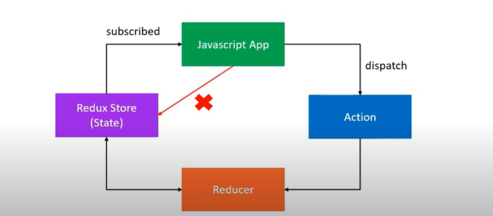

# React Redux Tutorial Notes

## Course Details
- **Channel**: Codevolution
- **Number of Videos**: 30

## Contents
- [React Redux Tutorial Notes](#react-redux-tutorial-notes)
  - [Course Details](#course-details)
  - [Contents](#contents)
  - [Video 1: Introduction to React, Redux, and React-Redux](#video-1-introduction-to-react-redux-and-react-redux)
    - [React](#react)
    - [Redux](#redux)
    - [React-Redux](#react-redux)
    - [Lifting State Up](#lifting-state-up)
    - [`useContext` and `useReducer`](#usecontext-and-usereducer)
  - [Video 3: Redux Concepts through a Cake Shop Example](#video-3-redux-concepts-through-a-cake-shop-example)
    - [Cake Shop Analogy](#cake-shop-analogy)
    - [Components of Redux Explained in the Cake Shop Context](#components-of-redux-explained-in-the-cake-shop-context)
    - [Explanation of Components](#explanation-of-components)
    - [Summary of the Example](#summary-of-the-example)
  - [Video 4: Three Core Principles of Redux](#video-4-three-core-principles-of-redux)
    - [First Principle: Single Source of Truth](#first-principle-single-source-of-truth)
      - [Explanation](#explanation)
      - [Cake Shop Example](#cake-shop-example)
    - [Second Principle: State is Read-Only](#second-principle-state-is-read-only)
      - [Explanation](#explanation-1)
      - [Cake Shop Example](#cake-shop-example-1)
    - [Third Principle: Changes are Made with Pure Functions](#third-principle-changes-are-made-with-pure-functions)
      - [Explanation](#explanation-2)
      - [Cake Shop Example](#cake-shop-example-2)
    - [Redux Flow Diagram](#redux-flow-diagram)
  - [Video 5: Understanding Redux Actions](#video-5-understanding-redux-actions)
    - [What are Actions?](#what-are-actions)
    - [Representation in JavaScript](#representation-in-javascript)
      - [Example of an Action](#example-of-an-action)
    - [Best Practices for Actions](#best-practices-for-actions)
    - [Action Creators](#action-creators)
      - [Example of an Action Creator](#example-of-an-action-creator)
      - [Usage](#usage)
    - [Summary](#summary)
  - [Video 6: Understanding Redux Reducers](#video-6-understanding-redux-reducers)
    - [What are Reducers?](#what-are-reducers)
    - [Characteristics of Reducers](#characteristics-of-reducers)
    - [Formula of a Reducer](#formula-of-a-reducer)
    - [How State Changes in Response to Actions](#how-state-changes-in-response-to-actions)
      - [Example of a Reducer](#example-of-a-reducer)
    - [Key Points](#key-points)
    - [Summary](#summary-1)
  - [Video 7: Understanding the Redux Store](#video-7-understanding-the-redux-store)
    - [What is the Redux Store?](#what-is-the-redux-store)
    - [Responsibilities of the Redux Store](#responsibilities-of-the-redux-store)
      - [Example of Creating a Redux Store](#example-of-creating-a-redux-store)
      - [Example of Using Store Methods](#example-of-using-store-methods)
    - [Summary](#summary-2)
  - [Video 8: Managing Multiple Reducers for Cakes and Ice Creams](#video-8-managing-multiple-reducers-for-cakes-and-ice-creams)
    - [Scenario Overview](#scenario-overview)
    - [Using Multiple Reducers](#using-multiple-reducers)
      - [Example of Separate Reducers](#example-of-separate-reducers)
    - [Advantages of Using Multiple Reducers](#advantages-of-using-multiple-reducers)
    - [Disadvantages of Using Multiple Reducers](#disadvantages-of-using-multiple-reducers)
    - [Summary](#summary-3)
  - [Video 9: Managing Multiple Reducers for a Todo Application](#video-9-managing-multiple-reducers-for-a-todo-application)
    - [Single Reducer Setup](#single-reducer-setup)
      - [Initial State and Reducer](#initial-state-and-reducer)
    - [Splitting into Multiple Reducers](#splitting-into-multiple-reducers)
      - [Redefined Initial States and Reducers](#redefined-initial-states-and-reducers)
  - [Video 10: Combining Reducers in Redux](#video-10-combining-reducers-in-redux)
    - [Combining Reducers](#combining-reducers)
      - [Example of Combining Reducers](#example-of-combining-reducers)
    - [Dispatching Actions and Accessing State](#dispatching-actions-and-accessing-state)
      - [Accessing the Combined State](#accessing-the-combined-state)
    - [Summary](#summary-4)
  - [Video 11: Understanding and Implementing Redux Middleware](#video-11-understanding-and-implementing-redux-middleware)
    - [What is Middleware?](#what-is-middleware)
    - [Functions of Middleware](#functions-of-middleware)
    - [Redux Logger](#redux-logger)
      - [Installation](#installation)
      - [Usage](#usage-1)
    - [Applying Multiple Middleware](#applying-multiple-middleware)
    - [How Middleware Functions](#how-middleware-functions)
      - [Custom Middleware Example](#custom-middleware-example)
    - [Summary](#summary-5)
  - [Video 12: Handling Asynchronous Actions in Redux](#video-12-handling-asynchronous-actions-in-redux)
    - [Overview](#overview)
    - [Asynchronous Action Flow](#asynchronous-action-flow)
    - [Example Code](#example-code)
    - [Summary](#summary-6)
  - [Video 13: Installing and Using Axios with Redux Thunk for Asynchronous Actions](#video-13-installing-and-using-axios-with-redux-thunk-for-asynchronous-actions)
    - [Introduction](#introduction)
    - [Installation](#installation-1)
    - [Setting Up Axios with Redux Thunk](#setting-up-axios-with-redux-thunk)
    - [Creating an Asynchronous Action Creator](#creating-an-asynchronous-action-creator)
      - [Example Code](#example-code-1)
    - [Summary](#summary-7)
  - [Video 14 to 18: React Redux Setup](#video-14-to-18-react-redux-setup)
    - [Folder Structure](#folder-structure)
    - [Setup and Code Explanation](#setup-and-code-explanation)
      - [1. **Redux Actions (`todoActions.js`)**](#1-redux-actions-todoactionsjs)
      - [2. **Redux Reducers (`todoReducer.js` and `index.js`)**](#2-redux-reducers-todoreducerjs-and-indexjs)
      - [3. **Redux Store (`store.js`)**](#3-redux-store-storejs)
      - [4. **React Component Setup (`App.js`, `TodoList.js`)**](#4-react-component-setup-appjs-todolistjs)
      - [5. **Entry Point (`index.js` in `src/` folder)**](#5-entry-point-indexjs-in-src-folder)
    - [Summary](#summary-8)
  - [Video 19: React Redux Hooks - Benefits and Uses](#video-19-react-redux-hooks---benefits-and-uses)
      - [Overview of React Redux Hooks](#overview-of-react-redux-hooks)
      - [Benefits of React Redux Hooks](#benefits-of-react-redux-hooks)
      - [Common Uses](#common-uses)
  - [Video 20: The `useSelector` Hook - Functionality and Usage](#video-20-the-useselector-hook---functionality-and-usage)
      - [What is `useSelector`?](#what-is-useselector)
      - [How does `useSelector` work?](#how-does-useselector-work)
      - [Example Usage of `useSelector`](#example-usage-of-useselector)
  - [Video 21: The `useDispatch` Hook - Functionality and Usage Warnings](#video-21-the-usedispatch-hook---functionality-and-usage-warnings)
      - [What is `useDispatch`?](#what-is-usedispatch)
      - [How to Use `useDispatch`](#how-to-use-usedispatch)
      - [Usage Warnings](#usage-warnings)
    - [Summary](#summary-9)
- [Introduction to @redux/toolkit and RTK query](#introduction-to-reduxtoolkit-and-rtk-query)
  - [@redux/toolkit](#reduxtoolkit)
    - [Why Use @redux/toolkit?](#why-use-reduxtoolkit)
    - [Key Features of @redux/toolkit](#key-features-of-reduxtoolkit)
    - [Project Structure with @redux/toolkit](#project-structure-with-reduxtoolkit)
    - [Explanation of Project Structure](#explanation-of-project-structure)
    - [Setting Up a Project with @redux/toolkit](#setting-up-a-project-with-reduxtoolkit)
      - [1. **Install @redux/toolkit and React-Redux**](#1-install-reduxtoolkit-and-react-redux)
      - [2. **Configure the Store (`store.js`)**](#2-configure-the-store-storejs)
      - [3. **Create a Slice (`todosSlice.js`)**](#3-create-a-slice-todosslicejs)
      - [4. **Use the store in a Component**](#4-use-the-store-in-a-component)
    - [Summary](#summary-10)
  - [Redux Toolkit Query (RTK Query)](#redux-toolkit-query-rtk-query)
    - [What is RTK Query and Why Use It?](#what-is-rtk-query-and-why-use-it)
    - [Project Setup and Structure](#project-setup-and-structure)
      - [Recommended Folder Structure](#recommended-folder-structure)
    - [Setting Up RTK Query](#setting-up-rtk-query)
    - [Using RTK Query in Components](#using-rtk-query-in-components)
    - [Summary](#summary-11)

## Video 1: Introduction to React, Redux, and React-Redux

In this introductory video, we cover the basics of React, Redux, and React-Redux, focusing on key concepts and how they integrate to manage state in a scalable and predictable manner.

### React
- **React** is a library for building user interfaces, focusing on a component-based architecture.
- Components can manage their state internally, but for complex applications, state management might require external solutions like Redux.

### Redux
- **Redux** provides a central store for state that can be accessed by any component within an application, promoting a single source of truth and consistent behavior across the app.
- It uses actions and reducers to update the state, ensuring predictability and maintainability of the application's state.

### React-Redux
- **React-Redux** binds React and Redux, providing the `Provider` component to wrap the application and make the Redux store available to all components.
- It also offers the `connect` function to read data from the store and dispatch actions in a more readable and efficient way.

### Lifting State Up
- Lifting state up is often necessary in React to share state between multiple components. This is where Redux can be beneficial by managing shared state at the application level rather than lifting state through multiple component layers.

### `useContext` and `useReducer`
- **`useContext`** is a hook that lets you subscribe to React context without introducing nesting in your component tree. It's useful for passing down data through the component tree without having to pass props manually at every level.
- **`useReducer`** is a hook that is used for state management in React. It's similar to reducers in Redux; it allows you to manage local component state with a reducer when the `useState` hook is insufficient.

This video sets the stage for understanding how we can efficiently manage state in React applications, especially when the application complexity grows and managing state locally within components becomes cumbersome.


## Video 3: Redux Concepts through a Cake Shop Example

This video uses a relatable example of a cake shop to explain the fundamental concepts of Redux: store, action, and reducer. It helps in understanding how Redux manages state in an application through a real-world scenario.

### Cake Shop Analogy
- **Scenario**: Imagine a cake shop with a shopkeeper and customers. The shop's ledger (which records the number of cakes available) represents the "state" in Redux.

### Components of Redux Explained in the Cake Shop Context
| Cake Shop Scenario | Redux Component | Purpose |
| ------------------ | --------------- | ------- |
| Shop               | Store           | Holds the state of your application. |
| Intention to BUY_CAKE | Action       | Describes what happened. |
| Shopkeeper         | Reducer         | Ties the store and actions together; manages state transitions based on actions. |

### Explanation of Components
1. **Store**
   - The **store** in Redux holds the entire state of the application, similar to the cake shop's ledger that tracks the number of cakes available.
   - In our analogy, the store is the central place where the state (cakes available) is stored and managed.

2. **Action**
   - An **action** is a plain object that describes what happened. In the cake shop, an action might be a customer ordering a cake.
   - Example: `{ type: 'ORDER_CAKE' }` tells the store that a cake has been ordered.
   - Actions are the only way to send data to the store.

3. **Reducer**
   - A **reducer** is a function that takes the current state and an action, and returns the new state.
   - In the cake shop, the reducer is like the shopkeeper who updates the ledger based on the actions. If a customer orders a cake, the shopkeeper (reducer) will update the ledger (state) to reduce the number of cakes by one.
   - Example function:
     ```javascript
     const reducer = (state, action) => {
       if (action.type === 'ORDER_CAKE') {
         return {
           ...state,
           numOfCakes: state.numOfCakes - 1
         };
       }
       return state;
     };
     ```

### Summary of the Example
- The cake shop example simplifies the understanding of Redux's flow:
  1. Actions describe what happened (a cake was ordered).
  2. The reducer handles the logic of updating the state based on the action received (reduces the count of cakes).
  3. The store holds and updates the state as actions are processed through reducers.

This analogy helps clarify how Redux manages state changes in a predictable manner, centralizing state management and making it more transparent and easier to debug.


## Video 4: Three Core Principles of Redux

In this video, we explore the three fundamental principles that underpin Redux, providing a structured and predictable way of managing state within applications. We continue to use the cake shop analogy to illustrate these principles.

### First Principle: Single Source of Truth
"The state of your whole application is stored in an object tree within a single store."

#### Explanation
- Redux uses a single store to manage the entire state of the application. This makes it easier to track state changes and maintain consistency across the application.

#### Cake Shop Example
- The number of cakes in the shop is tracked in a single state object.
```javascript
const initialState = {
  numberOfCakes: 10
};
```

### Second Principle: State is Read-Only
"The only way to change the state is to emit an action, an object describing what happened."

#### Explanation
- To change the state in the Redux store, you must dispatch an action. This ensures that neither the views nor the network callbacks will ever write directly to the state.

#### Cake Shop Example
- An action is dispatched when a customer wants to buy a cake.
```javascript
const buyCakeAction = {
  type: 'BUY_CAKE'
};
```

### Third Principle: Changes are Made with Pure Functions
"To specify how the state tree is transformed by actions, you write pure reducers."

#### Explanation
- Reducers are pure functions that take the previous state and an action, and return the new state. They should be pure without any side effects.

#### Cake Shop Example
- The reducer handles the BUY_CAKE action by reducing the numberOfCakes by one.
```javascript
function cakeReducer(state = initialState, action) {
  switch (action.type) {
    case 'BUY_CAKE':
      return {
        ...state,
        numberOfCakes: state.numberOfCakes - 1
      };
    default:
      return state;
  }
}
```

### Redux Flow Diagram
- This diagram visualizes how a Redux application manages state:
  
  - **JavaScript App** is your component or application that interacts with the Redux store.
  - **Redux Store** holds the application's state.
  - **Action** is dispatched to signify desired changes.
  - **Reducer** processes the action and updates the state accordingly.

This clear separation and structure facilitate understanding and maintaining an application's state, especially as the application grows in complexity.

## Video 5: Understanding Redux Actions

In this video, we delve deeper into the concept of actions in Redux, exploring their structure, usage, and best practices, including action creators.

### What are Actions?
- **Actions** are the only way your application can interact with the store in Redux.
- They are payloads of information that send data from your application to the Redux store.

### Representation in JavaScript
- Actions are plain JavaScript objects.
- Each action has a `type` property that indicates the type of action being performed. This `type` property is essential for the reducer to understand how to process the action.
- The `type` property is typically defined as string constants to avoid errors and make the actions easily identifiable.

#### Example of an Action
```javascript
{
  type: 'ADD_TODO',
  payload: 'Learn Redux'
}
```

### Best Practices for Actions
1. **Define Action Types as Constants**: To avoid typos and improve consistency, define action types as constants in a separate file and import them where needed.
2. **Use Descriptive Names**: Action types should be clear and descriptive to immediately convey the action's purpose.
3. **Keep Actions Small**: Actions should carry only the minimum amount of data necessary to describe what's happening and what needs to change in the state.

### Action Creators
- **Action Creators** are functions that create actions. Using action creators helps in encapsulating the action creation details and makes testing easier.
- They are particularly useful when an action needs to be dispatched in multiple places in the application or when the action creation logic is complex.

#### Example of an Action Creator
```javascript
const addTodo = (content) => ({
  type: 'ADD_TODO',
  payload: content
});
```

#### Usage
- Action creators can be called anywhere in your app, such as in event handlers or lifecycle methods, to create and return an action object.
- They can also be dispatched directly using Redux's `dispatch` function.

```javascript
dispatch(addTodo('Learn Redux'));
```

### Summary
Actions are a critical part of Redux as they are the primary method of communicating with the store and triggering state changes. Understanding how to define and use actions and action creators effectively is key to managing state in a Redux application efficiently.

## Video 6: Understanding Redux Reducers

This video provides a detailed overview of reducers in Redux, explaining how they function as the mechanism for determining how the application's state changes in response to actions.

### What are Reducers?
- **Reducers** are pure functions in Redux that specify how the application's state changes in response to actions sent to the store.
- They are responsible for taking the previous state and an action, and returning the next state of the application.

### Characteristics of Reducers
- Reducers must be pure functions—meaning they should not produce side effects or modify their inputs. Instead, they return a new object if the state changes.
- They take two parameters: the previous state (`prevState`) and an action, and return the new state (`newState`).

### Formula of a Reducer
```javascript
(previousState, action) => newState
```

### How State Changes in Response to Actions
- A reducer determines how the state should change based on the action's type and payload (if any). It checks the action type and updates the state accordingly.
- Reducers often use a `switch` statement to decide how to process each action type.

#### Example of a Reducer
```javascript
function todoReducer(state = [], action) {
  switch (action.type) {
    case 'ADD_TODO':
      return [
        ...state,
        {
          id: action.id,
          text: action.text,
          completed: false
        }
      ];
    case 'TOGGLE_TODO':
      return state.map(todo =>
        (todo.id === action.id) 
          ? {...todo, completed: !todo.completed} 
          : todo
      );
    default:
      return state;
  }
}
```

### Key Points
1. **Default State**: Reducers specify a default state value, used when the reducer is called for the first time.
2. **Immutability**: Reducers must treat the state object as immutable. Instead of modifying the existing state, they should return a new object or state array.
3. **Handling Unknown Actions**: Reducers should return the current state for any unknown action types, ensuring that the state only changes in response to recognized actions.

### Summary
Reducers are central to Redux's architecture, acting as the logic that determines how each action transforms the state of the application. Understanding how to properly construct and use reducers is crucial for effectively managing state within Redux applications.


## Video 7: Understanding the Redux Store

This video focuses on the Redux Store, the central component that holds the application's state and orchestrates the flow of data through actions and reducers.

### What is the Redux Store?
- The **Redux Store** is the object where the complete state of the application is stored.
- It is created using the Redux library's `createStore()` method, which takes a reducer as its first argument to handle the state changes based on actions.

### Responsibilities of the Redux Store
1. **Holds Application State**
   - The store is the single source of truth for the state of your application, containing the entire state tree.

2. **Access to State**
   - `getState()`: A method used to access the current state held in the Redux store.

3. **Updating State**
   - `dispatch(action)`: This method is used to update the state. It accepts an action which is then sent to the reducer to compute the new state.

4. **Registering Listeners**
   - `subscribe(listener)`: This method allows you to register a listener that will be called every time an action is dispatched and the state tree is potentially updated. It is essential for reacting to state changes.

5. **Unregistering Listeners**
   - When `subscribe(listener)` is called, it returns a function to unregister the listener. This is useful for cleaning up listeners when they are no longer needed to prevent memory leaks.

#### Example of Creating a Redux Store
```javascript
import { createStore } from 'redux';
import rootReducer from './reducers';

const store = createStore(rootReducer);
```

#### Example of Using Store Methods
```javascript
// Accessing the state
console.log(store.getState());

// Dispatching an action
store.dispatch({
  type: 'ADD_TODO',
  text: 'Learn Redux'
});

// Registering a listener
const unsubscribe = store.subscribe(() =>
  console.log('State after dispatch: ', store.getState())
);

// Unregistering a listener
unsubscribe();
```

### Summary
The Redux Store is fundamental in managing the state of a Redux application. It ensures that all state changes happen according to the actions dispatched and handled by reducers, providing a predictable state management environment. Understanding how to create and interact with the Redux store is crucial for effectively using Redux in your projects.


## Video 8: Managing Multiple Reducers for Cakes and Ice Creams

This video extends the cake shop analogy to include ice creams, illustrating how Redux handles multiple reducers for different actions and how it simplifies adding new actions or products.

### Scenario Overview
- **Cake Shop**
  - Cakes are stored on the shelf.
  - A shopkeeper (reducer) handles the `BUY_CAKE` action from customers.

- **Ice Cream Sales**
  - Ice creams are stored in the freezer.
  - A new shopkeeper (reducer) is designated to handle the `BUY_ICECREAM` action from customers.

### Using Multiple Reducers
The concept of using separate reducers for handling different types of actions (such as buying cakes versus buying ice creams) demonstrates how Redux can manage multiple areas of state independently.

#### Example of Separate Reducers
```javascript
function cakeReducer(state = { numOfCakes: 10 }, action) {
  switch (action.type) {
    case 'BUY_CAKE':
      return {
        ...state,
        numOfCakes: state.numOfCakes - 1
      };
    default:
      return state;
  }
}

function iceCreamReducer(state = { numOfIceCreams: 20 }, action) {
  switch (action.type) {
    case 'BUY_ICECREAM':
      return {
        ...state,
        numOfIceCreams: state.numOfIceCreams - 1
      };
    default:
      return state;
  }
}
```

### Advantages of Using Multiple Reducers
1. **Modularity**: Each reducer is responsible for managing its part of the state tree, making the codebase more modular and easier to manage.
2. **Scalability**: Easier to scale the application by adding new reducers for new types of actions without disturbing existing state management logic.
3. **Maintainability**: Improves maintainability as each reducer is simpler and manages fewer state transitions.

### Disadvantages of Using Multiple Reducers
1. **Complexity in Setup**: Initially, setting up multiple reducers and combining them can add complexity to the application architecture.
2. **Potential for Redundant Code**: There is a risk of duplicating logic across different reducers if they handle similar types of actions.
3. **Debugging**: Debugging can become more challenging as the number of reducers increases, especially if the state transitions depend on interactions between different reducers.

### Summary
Using multiple reducers in Redux is a powerful way to manage state changes for different parts of an application independently. This approach enhances modularity and maintainability but requires careful design to avoid increasing complexity and potential issues with redundant code or debugging challenges.


## Video 9: Managing Multiple Reducers for a Todo Application

This video illustrates how to refactor a Redux setup for a todo application from a single reducer to multiple reducers, each managing a different part of the state.

### Single Reducer Setup
Initially, the todo application might have a single reducer managing all aspects of the todos.

#### Initial State and Reducer
```javascript
const initialState = {
  todos: [],
  visibilityFilter: 'SHOW_ALL'
};

function todoApp(state = initialState, action) {
  switch (action.type) {
    case 'ADD_TODO':
      return {
        ...state,
        todos: [...state.todos, {id: action.id, text: action.text, completed: false}]
      };
    case 'TOGGLE_TODO':
      return {
        ...state,
        todos: state.todos.map(todo =>
          todo.id === action.id ? {...todo, completed: !todo.completed} : todo
        )
      };
    case 'SET_VISIBILITY_FILTER':
      return {
        ...state,
        visibilityFilter: action.filter
      };
    default:
      return state;
  }
}
```

### Splitting into Multiple Reducers
As the application grows, it makes sense to split the reducer into two: one for managing todos and another for managing the visibility filter.

#### Redefined Initial States and Reducers
```javascript
const initialTodosState = {
  todos: []
};

function todosReducer(state = initialTodosState, action) {
  switch (action.type) {
    case 'ADD_TODO':
      return {...state, todos: [...state.todos, {id: action.id, text: action.text, completed: false}]};
    case 'TOGGLE_TODO':
      return {...state, todos: state.todos.map(todo =>
        todo.id === action.id ? {...todo, completed: !todo.completed} : todo
      )};
    default:
      return state;
  }
}

const initialVisibilityState = {
  visibilityFilter: 'SHOW_ALL'
};

function visibilityReducer(state = initialVisibilityState, action) {
  if (action.type === 'SET_VISIBILITY_FILTER') {
    return {...state, visibilityFilter: action.filter};
  }
  return state;
}
```

## Video 10: Combining Reducers in Redux

This video explains how to use Redux's `combineReducers` utility to combine multiple reducers into a single reducer function that manages the overall state object.

### Combining Reducers
`combineReducers` is a function provided by Redux that merges multiple reducing functions into a single reducing function you can pass to `createStore`.

#### Example of Combining Reducers
```javascript
import { combineReducers } from 'redux';

const rootReducer = combineReducers({
  todos: todosReducer,
  visibilityFilter: visibilityReducer
});

const store = createStore(rootReducer);
```

### Dispatching Actions and Accessing State
- When an action is dispatched, Redux automatically passes the relevant slice of state to each reducer based on the keys defined in `combineReducers`.
- Each reducer manages its part of the state independently but contributes to a single cohesive state object.

#### Accessing the Combined State
```javascript
console.log(store.getState());
// Output might look like this:
// {
//   todos: {todos: [...]},
//   visibilityFilter: {visibilityFilter: 'SHOW_ALL'}
// }
```

### Summary
Using `combineReducers` simplifies managing complex state structures by dividing responsibilities among multiple reducers. It ensures that each reducer only handles the part of the state it is concerned with, while still allowing for centralized state management and straightforward interaction with the Redux store.


## Video 11: Understanding and Implementing Redux Middleware

This video provides an in-depth look at Redux middleware, explaining what middleware is, how it functions within the Redux ecosystem, and how to implement it, particularly focusing on the Redux Logger as an example.

### What is Middleware?
- **Middleware** in Redux is a way to enhance the dispatch process, allowing you to run code, modify actions, or even delay them before they reach the reducer.
- It is typically used for logging actions, performing asynchronous tasks, or transforming actions before they are handled by reducers.

### Functions of Middleware
- **Intercepts Actions**: Middleware functions can intercept actions before they reach the reducer, providing a chance to log actions, report errors, or modify the actions.
- **Chainable**: Multiple middleware can be used together, forming a pipeline where each middleware can pass the action to the next after processing it.

### Redux Logger
- **Redux Logger** is a popular middleware that logs every action and the resulting new state to the console, which is incredibly useful for debugging.

#### Installation
To install Redux Logger, you can use npm or yarn:
```bash
npm install redux-logger
# or
yarn add redux-logger
```

#### Usage
To use Redux Logger, you need to import it and apply it to the Redux store through the middleware.

```javascript
import { createStore, applyMiddleware } from 'redux';
import reduxLogger from 'redux-logger';
import rootReducer from './reducers';

const logger = reduxLogger.createLogger();
const store = createStore(
  rootReducer,
  applyMiddleware(logger)
);
```

### Applying Multiple Middleware
If you want to use multiple middleware, you simply pass them as additional arguments to `applyMiddleware`. They are executed in the order they are provided.

```javascript
import { createStore, applyMiddleware } from 'redux';
import thunk from 'redux-thunk'; // for async operations
import reduxLogger from 'redux-logger';
import rootReducer from './reducers';

const logger = reduxLogger.createLogger();
const store = createStore(
  rootReducer,
  applyMiddleware(thunk, logger)
);
```

### How Middleware Functions
- **Middleware Signature**: Each middleware has a specific signature `store => next => action`. Here's what each part means:
  - **store**: The Redux store instance.
  - **next**: The next middleware function in the chain, or the dispatch method if it's the last one in the chain.
  - **action**: The action being dispatched.
- **Process**: The middleware can perform its operations and then call `next(action)` to pass the action to the next middleware or reducer.

#### Custom Middleware Example
Creating a simple custom middleware to log actions:
```javascript
const myLogger = store => next => action => {
  console.log('Dispatching:', action);
  let result = next(action);
  console.log('Next State:', store.getState());
  return result;
};
```

### Summary
Middleware in Redux is a powerful tool for extending Redux's capabilities, allowing for more complex operations like asynchronous data fetching, logging, or custom transformation of dispatched actions. Understanding how to implement and chain middleware is crucial for building robust Redux applications.


## Video 12: Handling Asynchronous Actions in Redux

### Overview
Asynchronous actions are crucial for performing API calls and other asynchronous operations within Redux. These actions are typically handled using middleware like Redux Thunk, which allows action creators to return functions instead of actions.

### Asynchronous Action Flow
1. **Dispatch an asynchronous action**: Initiates an API call.
2. **Perform API Call**: The action creator performs the asynchronous API call.
3. **Dispatch further actions**: Depending on the outcome of the API call, dispatch either a success action with the data or a failure action with the error.

### Example Code
```javascript
// Asynchronous Action Creator using Redux Thunk
const fetchUsers = () => {
  return function(dispatch) {
    dispatch(fetchUsersRequest());
    fetch('https://jsonplaceholder.typicode.com/users')
      .then(response => response.json())
      .then(users => {
        dispatch(fetchUsersSuccess(users));
      })
      .catch(error => {
        dispatch(fetchUsersFailure(error.message));
      });
  };
};
```

### Summary
Using Redux Thunk for asynchronous actions allows developers to handle complex state changes that depend on asynchronous data fetching. This method helps maintain clean and easy-to-manage state transitions in Redux applications.


## Video 13: Installing and Using Axios with Redux Thunk for Asynchronous Actions

### Introduction
Axios is a popular HTTP client for making requests to external resources. In conjunction with Redux Thunk, it provides a powerful solution for handling asynchronous operations in Redux applications.

### Installation
Install Axios and Redux Thunk via npm or yarn:
```bash
npm install axios redux-thunk
# or
yarn add axios redux-thunk
```

### Setting Up Axios with Redux Thunk
Axios simplifies making HTTP requests and handling responses. Redux Thunk allows these requests to be made within action creators.

### Creating an Asynchronous Action Creator
Asynchronous action creators with Axios and Redux Thunk typically return a function that takes `dispatch` as a parameter. This function performs the HTTP request and dispatches actions based on the response.

#### Example Code
```javascript
import axios from 'axios';

// Action Types
const FETCH_DATA_REQUEST = 'FETCH_DATA_REQUEST';
const FETCH_DATA_SUCCESS = 'FETCH_DATA_SUCCESS';
const FETCH_DATA_FAILURE = 'FETCH_DATA_FAILURE';

// Action Creators
const fetchDataRequest = () => ({
  type: FETCH_DATA_REQUEST
});

const fetchDataSuccess = data => ({
  type: FETCH_DATA_SUCCESS,
  payload: data
});

const fetchDataFailure = error => ({
  type: FETCH_DATA_FAILURE,
  payload: error
});

// Asynchronous Action Creator
const fetchData = () => {
  return dispatch => {
    dispatch(fetchDataRequest());
    axios.get('https://api.example.com/data')
      .then(response => {
        // response.data is the data you want
        dispatch(fetchDataSuccess(response.data));
      })
      .catch(error => {
        // error.message is the error message
        dispatch(fetchDataFailure(error.message));
      });
  };
};
```

### Summary
Axios and Redux Thunk together streamline handling asynchronous operations by encapsulating HTTP requests within Redux action creators. This setup allows for efficient handling of API calls, state updates based on API responses, and robust error management. You can view the full code [here](./asyncActions.js)

## Video 14 to 18: React Redux Setup
To cover Videos 14 to 18, I'll outline a typical React-Redux project setup, focusing on a simple "todo" application. This will include the project's folder structure, setting up Redux with actions, reducers, the store, and integrating everything into the React component using the `Provider` and `connect` from `react-redux`.

### Folder Structure

A common folder structure for a React-Redux project looks like this:
```txt
my-app/
├── public/
│   └── index.html             # Public HTML file for your app
├── src/
│   ├── app/
│   │   ├── store.js           # Redux store configuration
│   │   └── hooks.js           # Optional: Redux hooks for more concise imports
│   |   ├── features/
│   |   │   ├── featureA/
│   |   │   │   ├── FeatureA.js    # React component for Feature A
│   |   │   │   ├── featureASlice.js # Redux slice for Feature A
│   |   │   │   └── FeatureA.test.js  # Tests for Feature A components or slices
│   |   │   └── featureB/
│   |   │       ├── FeatureB.js
│   |   │       ├── featureBSlice.js
│   |   │       └── FeatureB.test.js
│   |   ├── services/
│   |   │   ├── apiService.js      # RTK Query API service setup
│   |   │   └── anotherService.js  # Other abstracted service logic
│   ├── components/
│   │   ├── CommonComponent.js # Reusable components across features
│   │   └── AnotherComponent.js
│   ├── app.css                # Global styles
│   └── index.js               # Entry point that renders the React tree
├── .gitignore
├── package.json
├── README.md
└── yarn.lock or package-lock.json
```

### Setup and Code Explanation

#### 1. **Redux Actions (`todoActions.js`)**
Here, we define actions related to todos, like adding and toggling todos.

```javascript
// Action Types
export const ADD_TODO = 'ADD_TODO';
export const TOGGLE_TODO = 'TOGGLE_TODO';

// Action Creators
export function addTodo(text) {
  return {
    type: ADD_TODO,
    payload: text
  };
}

export function toggleTodo(id) {
  return {
    type: TOGGLE_TODO,
    payload: id
  };
}
```

#### 2. **Redux Reducers (`todoReducer.js` and `index.js`)**
Reducers handle state changes based on the actions dispatched.

```javascript
// todoReducer.js
import { ADD_TODO, TOGGLE_TODO } from '../actions/todoActions';

const initialState = {
  todos: []
};

function todoReducer(state = initialState, action) {
  switch (action.type) {
    case ADD_TODO:
      return {
        ...state,
        todos: [...state.todos, { id: state.todos.length + 1, text: action.payload, completed: false }]
      };
    case TOGGLE_TODO:
      return {
        ...state,
        todos: state.todos.map(todo => 
          todo.id === action.payload ? { ...todo, completed: !todo.completed } : todo
        )
      };
    default:
      return state;
  }
}

export default todoReducer;

// index.js
import { combineReducers } from 'redux';
import todoReducer from './todoReducer';

export default combineReducers({
  todo: todoReducer
});
```

#### 3. **Redux Store (`store.js`)**
This sets up the Redux store and includes middleware if necessary (like thunk or logger).

```javascript
import { createStore } from 'redux';
import rootReducer from './reducers';

const store = createStore(rootReducer);

export default store;
```

#### 4. **React Component Setup (`App.js`, `TodoList.js`)**

`App.js` is the entry point for your React components, setting up the `Provider`.

```javascript
import React from 'react';
import { Provider } from 'react-redux';
import store from './redux/store';
import TodoList from './components/TodoList';

function App() {
  return (
    <Provider store={store}>
      <div>
        <TodoList />
      </div>
    </Provider>
  );
}

export default App;
```

`TodoList.js` connects to the Redux store and dispatches actions.

```javascript
import React, { useState } from 'react';
import { connect } from 'react-redux';
import { addTodo, toggleTodo } from '../redux/actions/todoActions';

function TodoList({ todos, addTodo, toggleTodo }) {
  const [todoText, setTodoText] = useState('');

  const handleAddTodo = () => {
    addTodo(todoText);
    setTodoText('');
  };

  return (
    <div>
      <input
        type="text"
        value={todoText}
        onChange={(e) => setTodoText(e.target.value)}
      />
      <button onClick={handleAddTodo}>Add Todo</button>
      <ul>
        {todos.map(todo => (
          <li key={todo.id} onClick={() => toggleTodo(todo.id)} style={{ textDecoration: todo.completed ? 'line-through' : 'none' }}>
            {todo.text}
          </li>
        ))}
      </ul>
    </div>
  );
}

const mapStateToProps = (state) => ({
  todos: state.todo.todos
});

const mapDispatchToProps = {
  addTodo,
  toggleTodo
};

export default connect(mapStateToProps, mapDispatchToProps)(TodoList);
```

#### 5. **Entry Point (`index.js` in `src/` folder)**
This file renders the React application.

```javascript
import React from 'react';
import ReactDOM from 'react-dom';
import App from './components/App';

ReactDOM.render(<App />, document.getElementById('root'));
```

### Summary
This setup provides a basic structure for a React-Redux application managing todos. Each part of the Redux architecture (actions, reducers, store) is outlined, and the integration with React components using `Provider` and `connect` is demonstrated. This approach ensures a scalable and maintainable application structure suitable for more complex state management needs.


## Video 19: React Redux Hooks - Benefits and Uses

#### Overview of React Redux Hooks
React Redux Hooks, introduced in version 7.1 of React Redux, provide a way to interact with the Redux store directly in functional components, without using the `connect()` higher-order component.

#### Benefits of React Redux Hooks
1. **Improved Readability and Simplicity**: Hooks reduce boilerplate and make component logic easier to read and maintain.
2. **Direct Access to Redux Store**: Hooks allow direct access to the store and dispatch function, making it straightforward to use Redux with functional components.
3. **Enhanced Composition**: Custom hooks can encapsulate complex logic, allowing better reuse across components.

#### Common Uses
- **State Selection**: Accessing Redux state directly in component functions.
- **Dispatching Actions**: Easily dispatch actions without props manipulation or additional wrapping.

## Video 20: The `useSelector` Hook - Functionality and Usage

#### What is `useSelector`?
The `useSelector` hook allows you to extract data from the Redux store using a selector function. It replaces the need for `mapStateToProps`.

#### How does `useSelector` work?
- **Selector Function**: This is a function you define that accepts the entire store state and returns a part of it. You use this function to specify which piece of state your component needs.
- **Return Value**: The value returned by the selector function is what `useSelector` will provide to your component.

#### Example Usage of `useSelector`
```javascript
import React from 'react';
import { useSelector } from 'react-redux';

function TodoList() {
    const todos = useSelector(state => state.todo.todos); // Extracts todos from the state
    return (
        <ul>
            {todos.map(todo => (
                <li key={todo.id}>{todo.text}</li>
            ))}
        </ul>
    );
}
```

## Video 21: The `useDispatch` Hook - Functionality and Usage Warnings

#### What is `useDispatch`?
The `useDispatch` hook returns a reference to the Redux store’s `dispatch` function. This allows you to dispatch actions as needed.

#### How to Use `useDispatch`
```javascript
import React from 'react';
import { useDispatch } from 'react-redux';
import { toggleTodo } from '../redux/actions/todoActions';

function TodoItem({ id }) {
    const dispatch = useDispatch();

    return (
        <button onClick={() => dispatch(toggleTodo(id))}>
            Toggle Todo
        </button>
    );
}
```

#### Usage Warnings
- **Avoid defining actions within components**: Define actions outside your component or memoize them using `useCallback` to prevent unnecessary re-renders.
- **Do not use in loops or conditions**: Always use hooks at the top level of your React function to conform with the Rules of Hooks.

### Summary
- **`useSelector`** is crucial for selecting slices of state.
- **`useDispatch`** is essential for dispatching actions.
- Both hooks simplify using Redux with functional components and enhance code cleanliness and reuse, fitting well within the modern React paradigm. Proper usage following React's Rules of Hooks ensures optimal performance and avoids common pitfalls in complex applications.

---
---
# Introduction to @redux/toolkit and RTK query

## @redux/toolkit
`@redux/toolkit` (RTK) is the official, opinionated, batteries-included toolset for efficient Redux development. It is intended to be the standard way to write Redux logic, designed to simplify common Redux practices by reducing boilerplate and enforcing best practices.

### Why Use @redux/toolkit?
RTK encapsulates the best practices of Redux development into simple APIs. It helps manage global state with less code and more predictability. It provides powerful middleware and utilities like Redux Thunk for asynchronous logic and the Redux DevTools Extension out of the box.

### Key Features of @redux/toolkit
- **Simplifies Store Setup**: Incorporates essential Redux configurations by default, which simplifies setup and usage.
- **Immutable Update Logic**: Uses `immer` to allow developers to write simpler immutable updates with normal mutable code.
- **Default Middleware**: Comes with `redux-thunk` and integrates seamlessly with the Redux DevTools Extension.
- **Utility Functions**: Provides utility functions like `createReducer`, `createAction`, and `createSlice` to simplify common Redux patterns.

### Project Structure with @redux/toolkit

Using @redux/toolkit, you can structure your project to make it scalable and easy to manage. Here’s a suggested folder structure for a typical React + Redux Toolkit project:

```
my-app/
|-- src/
    |-- app/
        |-- store.js          # Configures the Redux store
        |-- features/
            |-- todos/
                |-- todosSlice.js # State and reducers for todos
                |-- Todos.js      # React component for todos
    |-- components/           # Shared components
    |-- hooks/                # Custom hooks, possibly for Redux
    |-- index.js              # Entry point
|-- public/
    |-- index.html            # HTML template
|-- package.json
|-- ...
```

### Explanation of Project Structure
- **app/**: Contains global setup files like the Redux store configuration.
- **features/**: Each feature of the application (like "todos") has its own subfolder with files related to Redux and React components. This is aligned with the "feature folder" or "ducks" pattern.
- **components/**: Holds reusable React components that might be shared across different features.
- **hooks/**: Contains custom React hooks, which can include hooks for dispatching actions or selecting from the state.

### Setting Up a Project with @redux/toolkit

Here’s how you can set up a basic Redux store with RTK in your React application:

#### 1. **Install @redux/toolkit and React-Redux**
```bash
npm install @reduxjs/toolkit react-redux
```

#### 2. **Configure the Store (`store.js`)**
```javascript
import { configureStore } from '@reduxjs/toolkit';
import todosReducer from '../features/todos/todosSlice';

export const store = configureStore({
  reducer: {
    todos: todosReducer
  }
});
```

#### 3. **Create a Slice (`todosSlice.js`)**
A "slice" is a collection of reducer logic and actions for a single feature in your application.

```javascript
import { createSlice } from '@reduxjs/toolkit';

export const todosSlice = createSlice({
  name: 'todos',
  initialState: {
    items: []
  },
  reducers: {
    addTodo: (state, action) => {
      state.items.push(action.payload);
    },
    toggleTodo: (state, action) => {
      const todo = state.items.find(todo => todo.id === action.payload);
      if (todo) {
        todo.completed = !todo.completed;
      }
    }
  }
});

export const { addTodo, toggleTodo } = todosSlice.actions;
export default todosSlice.reducer;
```

#### 4. **Use the store in a Component**
```js
import React, { useState } from 'react';
import { useSelector, useDispatch } from 'react-redux';
import { addTodo, toggleTodo } from './features/todos/todosSlice';

function Todos() {
    const [newTodo, setNewTodo] = useState('');
    const todos = useSelector(state => state.todos.items); // Accessing todos from the Redux store
    const dispatch = useDispatch(); // Hook to dispatch actions

    const handleAddTodo = () => {
        if (!newTodo.trim()) return; // Prevent adding empty todos
        dispatch(addTodo({
            id: todos.length + 1, // Simple id assignment
            text: newTodo,
            completed: false
        }));
        setNewTodo(''); // Reset input field after adding todo
    };

    const handleToggleTodo = (id) => {
        dispatch(toggleTodo(id)); // Dispatch toggle action
    };

    return (
        <div>
            <input
                type="text"
                value={newTodo}
                onChange={e => setNewTodo(e.target.value)}
                placeholder="Add new todo"
            />
            <button onClick={handleAddTodo}>Add Todo</button>
            <ul>
                {todos.map(todo => (
                    <li
                        key={todo.id}
                        onClick={() => handleToggleTodo(todo.id)}
                        style={{ textDecoration: todo.completed ? 'line-through' : 'none' }}
                    >
                        {todo.text}
                    </li>
                ))}
            </ul>
        </div>
    );
}

export default Todos;
```
### Summary
@redux/toolkit streamlines Redux development, making it easier to write, maintain, and scale. By structuring your project according to the features and using RTK's utilities, you can significantly reduce boilerplate code and increase productivity. This setup is particularly beneficial for large-scale applications where managing global state can become cumbersome.


## Redux Toolkit Query (RTK Query)
Let's explore how to utilize **Redux Toolkit Query (RTK Query)**, a powerful data fetching and caching tool designed to simplify server-state management in Redux applications. RTK Query is part of the Redux Toolkit and can automatically generate Redux reducers, selectors, and actions to handle fetching, updating, and caching data.

### What is RTK Query and Why Use It?

**RTK Query** provides an efficient way to handle data fetching and caching in Redux-based applications. It abstracts the handling of data fetching processes and minimizes the amount of manual code you have to write.

**Benefits:**
- Reduces boilerplate for data fetching and caching.
- Automatically manages loading and error state.
- Provides built-in mechanisms for optimistic updates, polling, and more.

### Project Setup and Structure

Using RTK Query typically involves setting up an API service using `createApi`, which defines how to fetch data from an API. Let's consider a project that manages product data:

#### Recommended Folder Structure

```
my-app/
|-- src/
    |-- app/
        |-- store.js          # Setup the store and API slice
        |-- services/
            |-- productService.js # API service for products
        |-- features/
            |-- ProductList.js    # Component to display products
        |-- index.js              # Entry point
```

### Setting Up RTK Query

1. **Installation**: Ensure you have `@reduxjs/toolkit` installed as RTK Query is part of it.

```bash
npm install @reduxjs/toolkit react-redux
```

2. **Configure the Store**

In `src/app/store.js`:

```javascript
import { configureStore } from '@reduxjs/toolkit';
import { productApi } from '../services/productService';

export const store = configureStore({
  reducer: {
    // Add the API reducer to the store
    [productApi.reducerPath]: productApi.reducer,
  },
  // Adding the api middleware enables caching, invalidation, polling, and other features of RTK Query
  middleware: (getDefaultMiddleware) =>
    getDefaultMiddleware().concat(productApi.middleware),
});
```

3. **Define the API Service**

Using `createApi` from RTK Query, you define how to interact with your backend. For demonstration, let’s use `dummyjson.com` for API calls.

In `src/app/services/productService.js`:

```javascript
import { createApi, fetchBaseQuery } from '@reduxjs/toolkit/query/react';

export const productApi = createApi({
  reducerPath: 'productApi',
  baseQuery: fetchBaseQuery({ baseUrl: 'https://dummyjson.com/' }),
  endpoints: (builder) => ({
    getAllProducts: builder.query({
      query: () => 'products',
    }),
    getProductById: builder.query({
      query: (id) => `products/${id}`,
    }),
    addNewProduct: builder.mutation({
      query: (product) => ({
        url: 'products/add',
        method: 'POST',
        body: product,
      }),
    }),
    updateProduct: builder.mutation({
      query: (product) => ({
        url: `products/${product.id}`,
        method: 'PUT',
        body: product,
      }),
    }),
    deleteProduct: builder.mutation({
      query: (id) => ({
        url: `products/${id}`,
        method: 'DELETE',
      }),
    }),
  }),
});

export const {
  useGetAllProductsQuery,
  useGetProductByIdQuery,
  useAddNewProductMutation,
  useUpdateProductMutation,
  useDeleteProductMutation,
} = productApi;
```

### Using RTK Query in Components

For instance, to fetch all products in a component:

In `src/components/Product.js`:

```javascript
import React, { useState } from 'react';
import {
  useGetAllProductsQuery,
  useGetProductByIdQuery,
  useAddNewProductMutation,
  useUpdateProductMutation,
  useDeleteProductMutation,
} from '../services/productService';

function FullFeatureProductComponent() {
  const [productId, setProductId] = useState('');
  const {
    data: products,
    isLoading: isLoadingProducts,
    isError: isErrorProducts,
  } = useGetAllProductsQuery();

  const {
    data: product,
    isLoading: isLoadingProduct,
    isError: isErrorProduct,
  } = useGetProductByIdQuery(productId, { skip: !productId });

  const [addProduct, { isLoading: isAdding }] = useAddNewProductMutation();
  const [updateProduct, { isLoading: isUpdating }] = useUpdateProductMutation();
  const [deleteProduct, { isLoading: isDeleting }] = useDeleteProductMutation();

  if (isLoadingProducts) return <p>Loading products...</p>;
  if (isErrorProducts) return <p>Error loading products.</p>;

  const handleAddProduct = async () => {
    await addProduct({ title: 'New Product', price: 99.99 });
  };

  const handleUpdateProduct = async () => {
    if (product) {
      await updateProduct({ ...product, price: 89.99 });
    }
  };

  const handleDeleteProduct = async (id) => {
    await deleteProduct(id);
  };

  return (
    <div>
      <h1>Products</h1>
      <ul>
        {products?.map(prod => (
          <li key={prod.id}>
            {prod.title} - ${prod.price}
            <button onClick={() => handleDeleteProduct(prod.id)}>Delete</button>
          </li>
        ))}
      </ul>
      <button onClick={handleAddProduct} disabled={isAdding}>Add New Product</button>

      <h2>Get Product by ID</h2>
      <input
        value={productId}
        onChange={(e) => setProductId(e.target.value)}
        placeholder="Enter product ID"
      />
      <button onClick={() => setProductId(productId)}>Fetch Product</button>

      {isLoadingProduct && <p>Loading product details...</p>}
      {isErrorProduct && <p>Error loading the product.</p>}
      {product && (
        <div>
          <h3>Product Details</h3>
          <p>{product.title} - ${product.price}</p>
          <button onClick={handleUpdateProduct} disabled={isUpdating}>Update Price</button>
        </div>
      )}

      {isDeleting && <p>Deleting product...</p>}
    </div>
  );
}

export default FullFeatureProductComponent;
```

### Summary

RTK Query offers a robust solution to handle server state in Redux applications, providing hooks to access data directly in your components and automatic state management. This setup covers fetching all products, a specific product by ID, adding, updating, and deleting products using a clean and efficient approach.