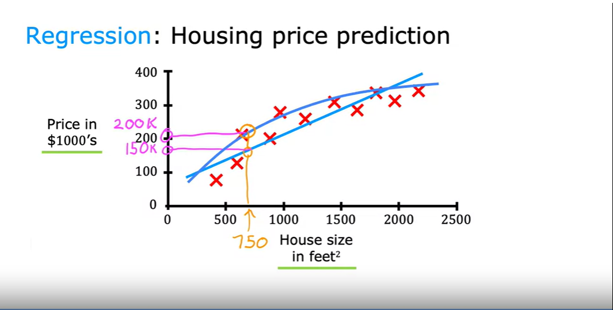
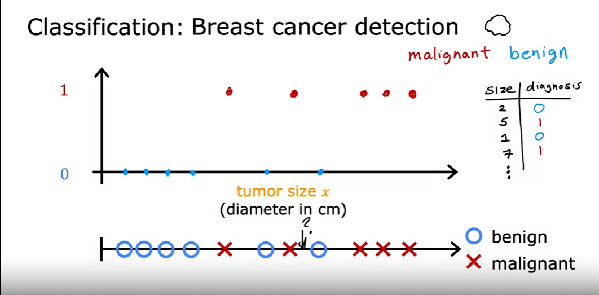
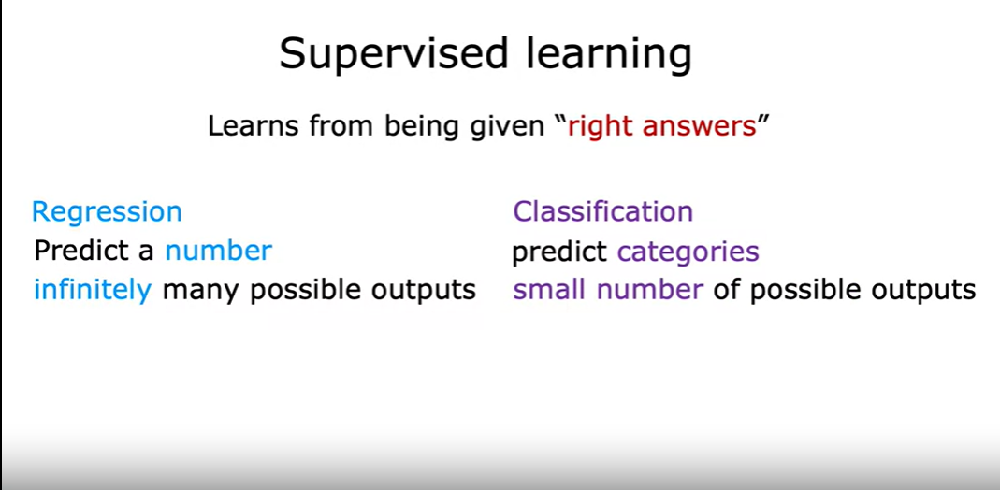
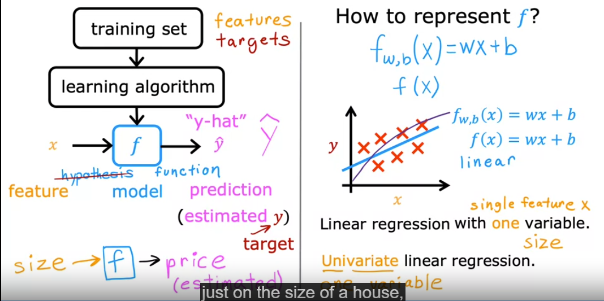
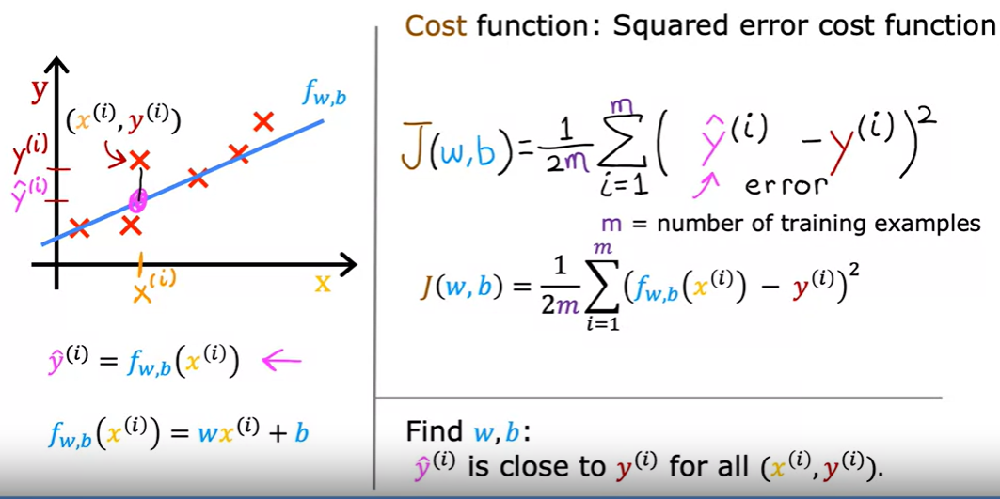
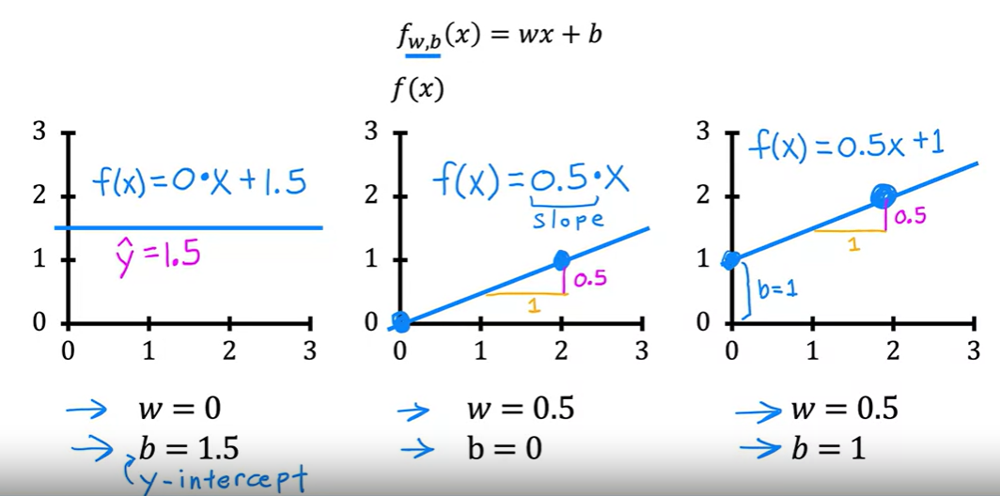
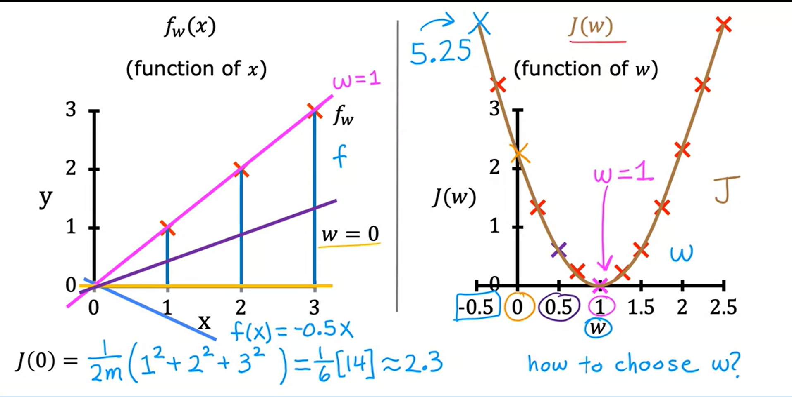
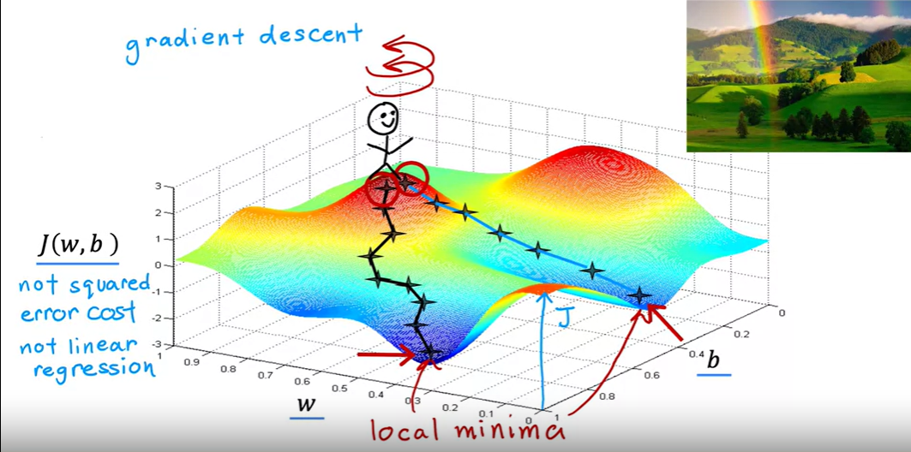
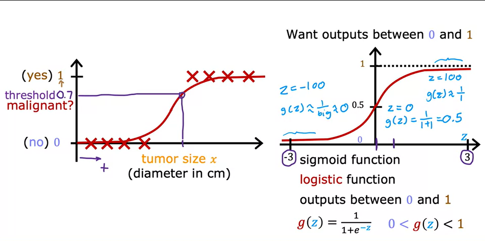

# Supervised Machine Learning: Regression and Classification
## [Course](https://www.coursera.org/learn/machine-learning/) from Coursera [Taught by Andrew Ng](https://www.coursera.org/instructor/andrewng)

## Content
- [Supervised Machine Learning: Regression and Classification](#supervised-machine-learning-regression-and-classification)
  - [Course from Coursera Taught by Andrew Ng](#course-from-coursera-taught-by-andrew-ng)
  - [Content](#content)
- [Week 1](#week-1)
  - [Overview of Machine Learning](#overview-of-machine-learning)
    - [Welcome to Machine Learning](#welcome-to-machine-learning)
    - [Application of Machine Learning](#application-of-machine-learning)
  - [Supervised vs Unsupervised Machine Learning](#supervised-vs-unsupervised-machine-learning)
    - [What is Machine Learning?](#what-is-machine-learning)
    - [Supervised Learning Part 1](#supervised-learning-part-1)
    - [Supervised Learning Part 2](#supervised-learning-part-2)
      - [Supervised Learning: Regression vs. Classification](#supervised-learning-regression-vs-classification)
    - [Unsupervised Learning Part 1](#unsupervised-learning-part-1)
    - [Unsupervised Learning Part 2](#unsupervised-learning-part-2)
      - [Detailed Types of Unsupervised Learning](#detailed-types-of-unsupervised-learning)
    - [Jupyter Notebooks](#jupyter-notebooks)
      - [Setting Up Jupyter Notebook in Visual Studio Code](#setting-up-jupyter-notebook-in-visual-studio-code)
      - [Practical Tips:](#practical-tips)
  - [Regression Model](#regression-model)
    - [Linear Regression Model Part 1](#linear-regression-model-part-1)
      - [Key Concepts and Terminology](#key-concepts-and-terminology)
      - [Practical Application: Estimating House Prices](#practical-application-estimating-house-prices)
      - [Differences Between Regression and Classification Models](#differences-between-regression-and-classification-models)
      - [Visualization and Data Representation](#visualization-and-data-representation)
      - [Understanding Model Training](#understanding-model-training)
    - [Linear Regression Model Part 2](#linear-regression-model-part-2)
      - [Key Elements in Supervised Learning](#key-elements-in-supervised-learning)
      - [Representing the Model Function](#representing-the-model-function)
      - [Types of Linear Regression](#types-of-linear-regression)
      - [Learning and Prediction in Linear Regression](#learning-and-prediction-in-linear-regression)
    - [Cost Function in Linear Regression](#cost-function-in-linear-regression)
      - [Squared Error Cost Function Formula](#squared-error-cost-function-formula)
      - [Purpose of the Cost Function](#purpose-of-the-cost-function)
      - [Visual Explanation](#visual-explanation)
      - [Implementation and Application](#implementation-and-application)
    - [Intuition Behind the Cost Function in Linear Regression](#intuition-behind-the-cost-function-in-linear-regression)
      - [Model and Parameters](#model-and-parameters)
      - [Cost Function](#cost-function)
      - [Visualizing Model Fit](#visualizing-model-fit)
      - [Cost Function Visualization](#cost-function-visualization)
      - [Practical Steps](#practical-steps)
    - [Visualizing the Cost Function in Linear Regression](#visualizing-the-cost-function-in-linear-regression)
      - [Visualization Types](#visualization-types)
      - [Understanding Through Visualization](#understanding-through-visualization)
      - [Practical Implications](#practical-implications)
    - [Exploring the Impact of Parameters on the Cost Function in Linear Regression](#exploring-the-impact-of-parameters-on-the-cost-function-in-linear-regression)
      - [Examples of Parameter Impact](#examples-of-parameter-impact)
      - [Visualization Techniques](#visualization-techniques)
  - [Train The Model With *Gradient Descent*](#train-the-model-with-gradient-descent)
    - [Gradient Descent](#gradient-descent)
      - [Working Mechanism](#working-mechanism)
      - [Challenges](#challenges)
      - [Example - Visualization](#example---visualization)
      - [Key Property](#key-property)
    - [Gradient Descent Algorithm Implementation](#gradient-descent-algorithm-implementation)
      - [Update Rules:](#update-rules)
      - [Key Concepts:](#key-concepts)
      - [Simultaneous Update (Correct Method):](#simultaneous-update-correct-method)
      - [Incorrect Method:](#incorrect-method)
      - [Visual Explanation:](#visual-explanation-1)
    - [Gradient Descent Intuition](#gradient-descent-intuition)
    - [Understanding the Learning Rate ($\\alpha$) in Gradient Descent](#understanding-the-learning-rate-alpha-in-gradient-descent)
      - [**Impact of Learning Rate Size:**](#impact-of-learning-rate-size)
    - [Linear Regression with Gradient Descent](#linear-regression-with-gradient-descent)
- [Week 2](#week-2)
  - [Multiple Linear Regression](#multiple-linear-regression)
    - [Multiple Features](#multiple-features)
      - [Single Feature Model](#single-feature-model)
      - [Multiple Features Model](#multiple-features-model)
      - [Notations](#notations)
      - [Table of Features](#table-of-features)
      - [Model with Multiple Features](#model-with-multiple-features)
      - [Example Model](#example-model)
      - [General Model with $n$ Features](#general-model-with-n-features)
      - [Model Expression](#model-expression)
      - [Vector Representation](#vector-representation)
      - [Compact Notation / Vector Notation](#compact-notation--vector-notation)
    - [Vectorization Part 1](#vectorization-part-1)
      - [Parameters and Features](#parameters-and-features)
      - [Without Vectorization](#without-vectorization)
      - [With Vectorization](#with-vectorization)
      - [Benefits of Vectorization](#benefits-of-vectorization)
    - [Vectorization Part 2](#vectorization-part-2)
      - [How Vectorization Works](#how-vectorization-works)
        - [Without Vectorization](#without-vectorization-1)
        - [With Vectorization](#with-vectorization-1)
        - [Comparison](#comparison)
      - [Gradient Descent with Vectorization](#gradient-descent-with-vectorization)
      - [Parameters and Derivatives](#parameters-and-derivatives)
      - [Without Vectorization](#without-vectorization-2)
      - [With Vectorization](#with-vectorization-2)
    - [Gradient Descent for Multiple Linear Regression](#gradient-descent-for-multiple-linear-regression)
      - [Vector Notation](#vector-notation)
      - [Gradient Descent](#gradient-descent-1)
      - [Implementing Gradient Descent](#implementing-gradient-descent)
        - [One Feature](#one-feature)
        - [Multiple Features](#multiple-features-1)
      - [Gradient Descent Process](#gradient-descent-process)
      - [An Alternative to Gradient Descent: Normal Equation](#an-alternative-to-gradient-descent-normal-equation)
  - [gradient Descent in Practice](#gradient-descent-in-practice)
    - [Feature Scaling Part 1](#feature-scaling-part-1)
      - [Example: Predicting House Prices](#example-predicting-house-prices)
      - [Parameter Values](#parameter-values)
      - [Relationship Between Feature Range and Parameter Size](#relationship-between-feature-range-and-parameter-size)
      - [Scatter Plot and Contour Plot](#scatter-plot-and-contour-plot)
      - [Impact on Gradient Descent](#impact-on-gradient-descent)
      - [Conclusion](#conclusion)
    - [Feature Scaling Part 2](#feature-scaling-part-2)
      - [Min-Max Scaling](#min-max-scaling)
      - [Mean Normalization](#mean-normalization)
      - [Z-score Normalization](#z-score-normalization)
      - [Acceptable Ranges for Feature Scaling](#acceptable-ranges-for-feature-scaling)
      - [Benefits of Feature Scaling](#benefits-of-feature-scaling)
      - [Conclusion](#conclusion-1)
    - [Checking Gradient Descent for Convergence](#checking-gradient-descent-for-convergence)
      - [Recognizing Convergence](#recognizing-convergence)
      - [Learning Curve](#learning-curve)
      - [Automatic Convergence Test](#automatic-convergence-test)
      - [Iterations Needed for Convergence](#iterations-needed-for-convergence)
      - [Practical Tips](#practical-tips-1)
    - [Choosing the Learning Rate](#choosing-the-learning-rate)
      - [Identifying Problems with Gradient Descent](#identifying-problems-with-gradient-descent)
      - [Adjusting the Learning Rate](#adjusting-the-learning-rate)
      - [Debugging with Learning Rate](#debugging-with-learning-rate)
      - [Values of $\\alpha$ to Try](#values-of-alpha-to-try)
      - [Practical Tips](#practical-tips-2)
      - [Conclusion](#conclusion-2)
    - [Feature Engineering](#feature-engineering)
      - [Example: Predicting House Prices](#example-predicting-house-prices-1)
      - [Definition of Feature Engineering](#definition-of-feature-engineering)
      - [Benefits of Feature Engineering](#benefits-of-feature-engineering)
    - [Polynomial Regression](#polynomial-regression)
      - [Example: Housing Data](#example-housing-data)
      - [Fitting Curves](#fitting-curves)
      - [Importance of Feature Scaling](#importance-of-feature-scaling)
      - [Alternative Features](#alternative-features)
      - [Choosing Features](#choosing-features)
      - [Practical Application](#practical-application)
- [Week 3](#week-3)
  - [Classification with Logistic Regression](#classification-with-logistic-regression)
    - [Motivation](#motivation)
      - [Overview of Classification](#overview-of-classification)
      - [Binary Classification](#binary-classification)
      - [Challenges with Linear Regression for Classification](#challenges-with-linear-regression-for-classification)
      - [Introduction to Logistic Regression](#introduction-to-logistic-regression)
      - [Decision Boundary](#decision-boundary)
    - [Understanding Logistic Regression](#understanding-logistic-regression)
      - [Overview of Logistic Regression](#overview-of-logistic-regression)
      - [Sigmoid Function](#sigmoid-function)
      - [Logistic Model Construction](#logistic-model-construction)
      - [Interpreting Logistic Regression Output](#interpreting-logistic-regression-output)
      - [Decision Threshold](#decision-threshold)
      - [Practical Applications](#practical-applications)
      - [Conclusion](#conclusion-3)
    - [Decision Boundary](#decision-boundary-1)
      - [Calculating the Decision Boundary](#calculating-the-decision-boundary)
      - [Sigmoid Function and Threshold](#sigmoid-function-and-threshold)
      - [Visualizing Decision Boundaries](#visualizing-decision-boundaries)
      - [Example: Classifying with Non-linear Boundaries](#example-classifying-with-non-linear-boundaries)
      - [Conclusion](#conclusion-4)
  - [Cost Function for Logistic Regression](#cost-function-for-logistic-regression)
    - [Logistic Regression Cost Function](#logistic-regression-cost-function)
      - [Training Set](#training-set)
      - [Choosing Parameters $\\mathbf{w}$ and $b$](#choosing-parameters-mathbfw-and-b)
      - [Cost Function](#cost-function-1)
        - [Squared Error Cost Function](#squared-error-cost-function)
      - [Logistic Loss Function](#logistic-loss-function)
      - [Why Logistic Loss?](#why-logistic-loss)
      - [Cost Function Formulation](#cost-function-formulation)
      - [Minimizing the Cost Function](#minimizing-the-cost-function)
      - [Conclusion](#conclusion-5)
    - [Simplified Loss and Cost Functions in Logistic Regression](#simplified-loss-and-cost-functions-in-logistic-regression)
      - [Simplified Loss Function](#simplified-loss-function)
      - [Interpretation](#interpretation)
      - [Simplified Cost Function](#simplified-cost-function)
      - [Properties of the Cost Function](#properties-of-the-cost-function)
      - [Benefits of the Simplified Cost Function](#benefits-of-the-simplified-cost-function)
      - [Conclusion](#conclusion-6)
  - [Gradient Descent for Logistic Regression](#gradient-descent-for-logistic-regression)
    - [Gradient Descent Implementation for Logistic Regression](#gradient-descent-implementation-for-logistic-regression)
      - [Mathematical Formulation](#mathematical-formulation)
      - [Loss and Cost Functions](#loss-and-cost-functions)
      - [Gradient Descent](#gradient-descent-2)
      - [Practical Considerations](#practical-considerations)
      - [Libraries and Tools](#libraries-and-tools)
      - [Conclusion](#conclusion-7)
  - [The Problem of Over-fitting](#the-problem-of-over-fitting)
    - [Overfitting and Underfitting in Machine Learning](#overfitting-and-underfitting-in-machine-learning)
      - [Understanding Overfitting and Underfitting](#understanding-overfitting-and-underfitting)
      - [Regression Example](#regression-example)
      - [Classification Example](#classification-example)
      - [Key Concepts](#key-concepts-1)
      - [Recap](#recap)
    - [Addressing Overfitting in Machine Learning](#addressing-overfitting-in-machine-learning)
      - [Strategies to Address Overfitting](#strategies-to-address-overfitting)
    - [Cost function with Regularization](#cost-function-with-regularization)
      - [Regularization Concepts](#regularization-concepts)
      - [Mathematical Illustration](#mathematical-illustration)
      - [Regularization Example](#regularization-example)
      - [Conclusion](#conclusion-8)
    - [Regularized Linear Regression](#regularized-linear-regression)
      - [Regularization Cost Function](#regularization-cost-function)
      - [Gradient Descent for Regularized Linear Regression](#gradient-descent-for-regularized-linear-regression)
      - [Implementing Gradient Descent](#implementing-gradient-descent-1)
      - [Derivation of Derivative Term (Optional)](#derivation-of-derivative-term-optional)
      - [Conclusion](#conclusion-9)
    - [Regularized Logistic Regression](#regularized-logistic-regression)
      - [Regularization in Logistic Regression](#regularization-in-logistic-regression)
      - [Regularized Cost Function](#regularized-cost-function)
      - [Gradient Descent for Regularized Logistic Regression](#gradient-descent-for-regularized-logistic-regression)
      - [Implementing Regularized Logistic Regression](#implementing-regularized-logistic-regression)
      - [Summary and Conclusion](#summary-and-conclusion)


# Week 1
## Overview of Machine Learning

### Welcome to Machine Learning
- **What is machine learning?**
  - Used frequently in daily life without realizing.
  - Examples of machine learning in daily applications:
    - Web search on Google, Bing, or Baidu.
    - Instagram or Snapchat recognizing and tagging friends in pictures.
    - Video streaming services recommending similar movies.
    - Voice to text on phones and voice commands (e.g., "Hey Siri, play a song by Rihanna," "Okay Google, show me Indian restaurants near me").
    - Email services flagging spam messages.

- **Industrial and big company applications:**
  - Optimizing wind turbine power generation to address climate change.
  - Helping doctors make accurate diagnoses in healthcare.
  - Inspecting products for defects in factories using computer vision at Landing AI.

- **Machine learning:**
  - The science of getting computers to learn without explicit programming.
  - The course will teach machine learning concepts and implementation in code.

- **Course background:**
  - Previous versions of the course led to the founding of Coursera.
  - Many learners have built exciting machine learning systems or pursued successful careers in AI.

- **Course introduction:**
  - Welcoming learners and expressing excitement for the journey ahead.


### Application of Machine Learning
- **Course Overview:**
  - Learn and implement key machine learning algorithms used in large tech companies.
  - Gain practical tips and tricks for optimizing algorithm performance.

- **Why is Machine Learning Widely Used Today?**
  - Essential for tasks that can't be explicitly programmed, like web search, speech recognition, disease diagnosis, and self-driving cars.

- **Personal Experience:**
  - Google Brain Team: Speech recognition, computer vision for Google Maps, Street View images, and advertising.
  - Baidu: AI for augmented reality, combating payment fraud, leading a self-driving car team.
  - Landing AI, AI Fund, Stanford University: AI in factories, agriculture, healthcare, e-commerce.

- **Machine Learning Applications:**
  - Impacting nearly every industry.
  - High potential for value creation in retail, travel, transportation, automotive, materials manufacturing.

- **Future of AI and AGI:**
  - Artificial General Intelligence (AGI) is far off but pursued through learning algorithms inspired by the human brain.

- **Economic Impact:**
  - AI and machine learning could create an additional $13 trillion annually by 2030.
  - Significant untapped opportunities across various sectors.

- **Importance of Learning Machine Learning:**
  - High demand for machine learning skills.
  - Learning machine learning is rewarding and offers vast opportunities.

## Supervised vs Unsupervised Machine Learning
### What is Machine Learning?

- **Definition by Arthur Samuel:**
  - Machine learning is the field of study that gives computers the ability to learn without being explicitly programmed.
  - Example: Arthur Samuel's checkers-playing program improved by playing tens of thousands of games against itself, eventually becoming better than Samuel himself.

- **Key Concepts:**
  - The more opportunities a learning algorithm has to learn, the better it performs.
  - Learning algorithms improve with more data and experience.

- **Types of Machine Learning:**
  - **Supervised Learning:**
    - Most commonly used in real-world applications.
    - Focus of the first and second courses in the specialization.
  - **Unsupervised Learning:**
    - Focus of the third course in the specialization.
  - **Recommender Systems and Reinforcement Learning:**
    - Also covered in the third course.

- **Importance of Practical Application:**
  - Learning algorithms are like tools; knowing how to apply them effectively is crucial.
  - The course emphasizes best practices for developing practical, valuable machine learning systems.

- **Real-World Application:**
  - Even experienced teams can struggle with applying machine learning algorithms correctly.
  - The course aims to teach how the most skilled machine learning engineers build systems, helping avoid common pitfalls and inefficiencies.

- **Course Goals:**
  - Equip learners with both the tools and the skills to apply them effectively.
  - Provide insights into best practices and practical advice for machine learning.


### Supervised Learning Part 1

  - Accounts for 99% of the economic value created by machine learning today.
  - Involves learning input (X) to output (Y) mappings.
  - The algorithm is trained with examples of inputs and the correct outputs (labels).
  - Examples of supervised learning applications:
    | Input (X)         | Output (Y)          | Application          |
    |-------------------|---------------------|----------------------|
    | Email             | Spam? (0/1)         | Spam filtering       |
    | Audio             | Text transcripts    | Speech recognition   |
    | English           | Spanish             | Machine translation  |
    | Ad, user info     | Click? (0/1)        | Online advertising   |
    | Image, radar info | Position of cars    | Self-driving car     |
    | Image of phone    | Defect? (0/1)       | Visual inspection    |

- **Regression:**
  - **Regression** is a type of supervised learning where the goal is to predict continuous values.
  - 
  - In the housing price prediction example:
    - **X-axis:** House size in square feet.
    - **Y-axis:** Price of the house in thousands of dollars.
  - A learning algorithm can fit a straight line or a more complex curve to the data points to predict the price of a house based on its size.
  - The algorithm learns from the dataset with known house sizes and prices (input-output pairs) to make predictions for new, unseen data.
  - The example illustrates how a learning algorithm might predict that a 750 square foot house could be sold for around $150,000 with a straight line fit, or closer to $200,000 with a more complex curve.


### Supervised Learning Part 2


**Explanation:**
- **Classification** predicts categories (discrete values).
- Example: Detecting if a tumor is benign or malignant.
  - **X-axis:** Tumor size (diameter in cm).
  - **Y-axis:** Diagnosis (0 for benign, 1 for malignant).
- The algorithm classifies the tumor based on its size, using circles for benign and crosses for malignant.
- **More Complex Classification:**
  - Example includes more than two categories (e.g., benign, malignant type 1, malignant type 2).
  - Uses additional features like patient's age and tumor size to improve prediction accuracy.
  - The learning algorithm finds a boundary that separates different classes (e.g., benign vs. malignant) based on multiple input features.

#### Supervised Learning: Regression vs. Classification



- **Regression:**
  - Predicts a continuous number.
  - Infinitely many possible outputs.
  - Example: Housing price prediction.

- **Classification:**
  - Predicts categories (discrete values).
  - Limited set of possible outputs.
  - Example: Breast cancer detection (benign or malignant).

### Unsupervised Learning Part 1

- Unlike supervised learning, unsupervised learning involves data without explicit labels. The task is to find structure or patterns in unlabeled data.
- Unsupervised learning does not aim to provide a "right answer" for each input but to discover interesting patterns or structures independently.

- **Clustering:** A major method in unsupervised learning where data is grouped into clusters based on similarities.
- **Applications:** Clustering is utilized in various domains, such as organizing news articles and genetic data analysis.

**Examples of Clustering:**

1. **Google News Clustering:**
   - Clusters related news stories based on common keywords without manual guidance.
   - For instance, stories about "pandas," "twins," and "zoos" are grouped together based on these recurring themes.
   - Automated process helps manage the vast amount of daily news articles.

2. **Genetic Data Clustering:**
   - DNA microarray data represents different individuals' genetic activities.
   - Clustering helps categorize individuals into groups based on genetic expression patterns.
   - Example uses: identifying gene-related traits like eye color or food preferences (e.g., disliking broccoli).

3. **Customer Data Clustering:**
   - Companies use clustering to segment customers into different market segments.
   - Deep learning.AI example: Segmented its community to understand motivations for learning AI, such as skill development, career advancement, or staying updated on industry impacts.

**Summary:**
- Clustering, a form of unsupervised learning, helps in the automatic categorization of data without predefined labels.
- Unsupervised learning allows algorithms to independently identify patterns and groupings in data, which is crucial for handling complex and large datasets without clear labels.

### Unsupervised Learning Part 2
Unsupervised learning involves data with inputs $x$ but no output labels $y$. The objective is to identify structures or patterns in the data without predefined labels.

#### Detailed Types of Unsupervised Learning

1. **Clustering**
   - **Function**: Groups similar data points together.
   - **Applications**: Commonly used in various fields to find related items without prior labels.

2. **Anomaly Detection**
   - **Function**: Identifies unusual or suspicious data points.
   - **Applications**: Crucial for fraud detection in financial systems by spotting abnormal transactions.

3. **Dimensionality Reduction**
   - **Function**: Compresses large datasets into smaller, more manageable forms while retaining essential information.
   - **Applications**: Useful in handling big data, enhancing computational efficiency, and simplifying data visualization.


### Jupyter Notebooks

Jupyter Notebook is a powerful tool used widely in data science and machine learning for writing and testing code, visualizing data, and sharing results. It allows users to create and share documents that contain live code, equations, visualizations, and narrative text. Jupyter supports several programming languages, including Python, which is one of the most popular languages in data science.

#### Setting Up Jupyter Notebook in Visual Studio Code

**Step-by-Step Guide:**

1. **Install Python and Visual Studio Code:**
   - Ensure Python is installed on your computer. You can download it from the [official Python website](https://www.python.org/downloads/).
   - Download and install Visual Studio Code (VSCode) from the [official site](https://code.visualstudio.com/).

2. **Install the Python Extension for VSCode:**
   - Open VSCode and navigate to the Extensions view by clicking on the square icon on the sidebar or pressing `Ctrl+Shift+X`.
   - Search for the "Python" extension provided by Microsoft and install it.

3. **Install Jupyter:**
   - Open the VSCode terminal by selecting `Terminal > New Terminal` from the top menu.
   - Install Jupyter by running the following command in the terminal:
     ```
     pip install notebook
     ```

4. **Create a New Jupyter Notebook:**
   - In VSCode, open the command palette (`Ctrl+Shift+P`).
   - Type "Jupyter: Create New Blank Notebook" and select the command. This will open a new tab with a blank notebook.

5. **Using the Jupyter Notebook:**
   - The notebook interface consists of cells that can be either code cells or Markdown cells.
   - **Code Cells:** You can write Python code in these cells and execute the code directly in the notebook.
   - **Markdown Cells:** These are used for adding explanatory text, formatted using Markdown, which helps in documenting the code.

6. **Running Cells:**
   - To run a cell, click on it and press `Shift+Enter`. This will execute the code or render the Markdown text in that cell.
   - The results will appear directly below the code cell.

#### Practical Tips:
- **Editing and Saving:** You can edit any cell by double-clicking on it. Save your notebook regularly to avoid losing work.
- **Experimenting with Code:** Feel free to modify the code in code cells to see how changes affect the output. This is a great way to learn and understand coding and data analysis techniques.
- **Additional Resources:** For more advanced features and troubleshooting, refer to the [Jupyter documentation](https://jupyter.org/documentation).

Jupyter Notebooks offer a versatile environment for interactive coding and learning, making them ideal for experimenting with machine learning concepts and algorithms as discussed in your video course on supervised and unsupervised learning.


## Regression Model
### Linear Regression Model Part 1

Linear regression is a fundamental type of supervised learning algorithm used in machine learning and statistics. It aims to fit a linear model to observed data to predict an outcome. In the context of real estate, linear regression can predict house prices based on variables like house size.

#### Key Concepts and Terminology

1. **Training Set:**
   - **Description**: The dataset used to train the model.
   - **Components**: Consists of input features (e.g., size of the house) and output target (e.g., price of the house).

2. **Notation:**
   - **$x$**: Input variable or feature.
   - **$y$**: Output variable or target variable.
   - **$m$**: Number of training examples.
   - **$(x, y)$**: A single training example.
   - **$(x^{(i)}, y^{(i)})$**: The $i$th training example.

#### Practical Application: Estimating House Prices
- **Scenario**: Predicting the selling price of a house based on its size using data from Portland, Oregon.
- **Process**: Measure the house size, plot it against a trained model (linear relationship), and estimate the selling price.
- **Example**: A house of 1250 square feet could potentially sell for around $220,000 based on the model's prediction.


#### Differences Between Regression and Classification Models
- **Regression Models**: Predict continuous outcomes (e.g., price).
- **Classification Models**: Predict discrete outcomes (e.g., categorizing an email as spam or not spam).

#### Visualization and Data Representation
- Data can be visualized on a plot with house size on the horizontal axis and price on the vertical axis. Each data point represents a house.
- Alternatively, data is structured in a table format with columns for size and price and rows representing individual houses.

#### Understanding Model Training
- **Training Data**: The model learns from a set of examples that include both the features (house size) and the targets (house prices).
- **Goal**: Use the model to predict prices for new data points (houses) not included in the training data.


### Linear Regression Model Part 2

Supervised learning involves inputting a dataset with known inputs (features) and outputs (targets) into a learning algorithm. This algorithm then generates a model function that can predict new outputs for given inputs.


#### Key Elements in Supervised Learning

1. **Training Set:**
   - Contains input *features* (e.g., house size) and output *targets* (e.g., house price).

2. **Learning Algorithm:**
   - Processes the training set to produce a *model function*, denoted as $f$.

3. **Model Function ($f$):**
   - Acts as a predictor or estimator, generating predictions ($\hat{y}$) for new inputs ($x$).
   - Historically referred to as a hypothesis function but simplified to $f$ in modern contexts.

#### Representing the Model Function

- **Function Representation:**
  - The model function in linear regression is represented as $f_{w,b}(x) = wx + b$.
  - Here, $w$ (weight) and $b$ (bias) are parameters that the learning algorithm adjusts to fit the data best.
  - $f(x)$ is a simplification used when the context makes $w$ and $b$ clear.

- **Graphical Representation:**
  - The training data is plotted with house size ($x$) on the horizontal axis and price ($y$) on the vertical axis.
  - The best-fit line, represented by the linear function $f(x) = wx + b$, is drawn through the data points.

#### Types of Linear Regression

- **Univariate Linear Regression:**
  - Also known as single-variable linear regression.
  - Involves only one input feature (e.g., house size) to predict the output (e.g., house price).

- **Multivariate Linear Regression:**
  - Uses multiple features (e.g., house size, number of bedrooms) to predict an output.
  - Discussed in later videos.

#### Learning and Prediction in Linear Regression

- **Learning:**
  - The algorithm learns the values of $w$ and $b$ that minimize the difference between the predicted outputs ($\hat{y}$) and actual outputs ($y$) in the training data.

- **Prediction:**
  - Once trained, the model uses the learned function $f$ to estimate outputs for new inputs, providing an essential tool for tasks like real estate pricing.

This module has laid the groundwork for understanding how linear regression functions within a supervised learning framework, providing a foundation for more complex models and techniques.


### Cost Function in Linear Regression

The cost function is a crucial component in training linear regression models. It quantifies how well the line of best fit approximates the actual data points. By measuring the accuracy of the model’s predictions against actual outcomes, the cost function guides the optimization of the model’s parameters.

#### Squared Error Cost Function Formula
The squared error cost function (also known as mean squared error, MSE) is commonly used in linear regression to measure the difference between the predicted values ($\hat{y}$) and the actual target values ($y$). The formula for the cost function is:

$
J(w, b) = \frac{1}{2m} \sum_{i=1}^m \left( f_{w,b}(x^{(i)}) - y^{(i)} \right)^2
$

where:
- $J(w, b)$ is the cost function.
- $w$ and $b$ are the parameters of the model (slope and y-intercept, respectively).
- $f_{w,b}(x)$ is the prediction from the model for input $x$, which is $wx + b$.
- $m$ is the number of training examples.
- $x^{(i)}$ and $y^{(i)}$ are the features and target values of the $i$-th training example.
- 

#### Purpose of the Cost Function
- **Error Measurement**: Calculates the squared difference between the predicted value and the actual value for each data point, emphasizing larger errors more significantly due to the squaring.
- **Optimization Objective**: Minimizing $J(w, b)$ helps in adjusting $w$ and $b$ so that the model predicts more accurately. This process is usually performed using gradient descent or another optimization algorithm.

#### Visual Explanation
- **Flat Line with No Slope ($w = 0$)**: When $w = 0$ and $b$ is set to a constant like 1.5, the model predicts the same value regardless of $x$. This is usually not ideal unless all target values are nearly the same.
- **Positive Slope ($w > 0$)**: A positive $w$ value indicates that as $x$ increases, the predicted $\hat{y}$ also increases. The slope of the line, $w$, and where it intercepts the y-axis, $b$, are adjusted during training to best fit the data.
- **Fit Quality**: The line's fit quality to the data can be visually assessed in scatter plots by how closely the line follows the trends in the data points.
- 

#### Implementation and Application
- In practice, finding the optimal $w$ and $b$ involves using algorithms like gradient descent, which iteratively adjust $w$ and $b$ to minimize $J(w, b)$.
- Effective minimization of the cost function results in a model that accurately predicts outcomes, which is crucial for applications ranging from predicting house prices to adjusting stock inventories based on historical data.

Understanding and minimizing the cost function is fundamental to developing efficient and accurate predictive models in machine learning, particularly in linear regression scenarios.


### Intuition Behind the Cost Function in Linear Regression

Understanding the cost function in linear regression involves visualizing how different parameter values for the model influence the fit of the predictive line to the data, and consequently, the cost function's output. This understanding is critical for finding the best model parameters that minimize prediction errors.

#### Model and Parameters
- **Model**: The linear regression model is represented as $f_{w,b}(x) = wx + b$, where:
  - $w$ is the weight (slope).
  - $b$ is the bias (y-intercept).
- **Simplified Model**: For illustration, sometimes the bias $b$ is set to zero to focus on the effect of $w$ alone, simplifying the model to $f_w(x) = wx$.

#### Cost Function
- **Definition**: The cost function $J(w, b)$ measures how well the model fits the training data. It is defined as:
  $
  J(w, b) = \frac{1}{2m} \sum_{i=1}^m \left( f_{w,b}(x^{(i)}) - y^{(i)} \right)^2
  $
  where $m$ is the number of training examples.
- **Purpose**: The cost function quantifies the prediction error of the model, with the goal of minimizing this error across all training examples.

#### Visualizing Model Fit
- 
- **Graphs**: By plotting $f_w(x)$ against a dataset, you can visually assess how changes in $w$ affect the model’s predictions.
  - **Low $w$**: A lower value may lead to an underfitting line that does not capture the trends in the data.
  - **High $w$**: A higher value may lead to an overfitting line that also does not generalize well.
- **Optimal $w$**: The ideal value of $w$ results in a line that best approximates the real data points, reflected by a minimum in the cost function $J(w)$.

#### Cost Function Visualization
- **Function of $w$**: $J(w)$ is plotted against $w$ to illustrate how different slopes impact the overall prediction error.
- **Minimizing $J(w)$**: The objective is to find the value of $w$ that minimizes $J(w)$, which corresponds to the best-fit line through the data.

#### Practical Steps
1. **Adjust $w$**: Start with an initial guess for $w$ and calculate $J(w)$.
2. **Plot Results**: Visually or computationally examine how $J(w)$ changes with different values of $w$.
3. **Optimization**: Use techniques such as gradient descent to iteratively adjust $w$ toward the value that minimizes $J(w)$.

This process underlies the fundamental principle of linear regression: optimizing model parameters to reduce the difference between predicted and actual outcomes, thereby improving model accuracy. The cost function serves as a guide, quantifying how 'good' or 'bad' a model is, depending on the parameter values chosen.


### Visualizing the Cost Function in Linear Regression

In linear regression, visualizing the cost function is crucial for understanding how different parameter values (weights $w$ and biases $b$) impact the model's performance. This visualization helps in intuitively grasping why and how the minimization of the cost function leads to the best-fitting model for the given data.

- **Model Equation**: $f_{w,b}(x) = wx + b$
- **Cost Function**: $J(w, b) = \frac{1}{2m} \sum_{i=1}^m \left( f_{w,b}(x^{(i)}) - y^{(i)} \right)^2$
- **Goal**: Minimize $J(w, b)$ over $w$ and $b$

#### Visualization Types
1. **3D Surface Plot**:
   - Represents the cost function as a three-dimensional surface.
   - Axes are the parameters $w$ and $b$, and the vertical axis represents the cost $J$.
   - The shape is typically a bowl or parabolic surface, illustrating that there is a single minimum point, the global minimum, where the cost is lowest.

2. **Contour Plot**:
   - A 2D representation that uses contours to show levels of the cost function.
   - Each contour line represents all the points where the cost function has the same value.
   - The goal is to find the center of these contours, where the cost is minimized.

#### Understanding Through Visualization
- **Choosing Parameters**:
  - Different values for $w$ and $b$ lead to different lines of fit on the data, each with a corresponding point on the surface or contour plot.
  - Visualizing these allows you to see how altering $w$ and $b$ affects both the line of fit and the cost.

- **Optimization**:
  - The lowest point on the surface plot or the innermost circle on the contour plot represents the optimal parameters that minimize the cost.
  - Optimization algorithms like gradient descent are used to find this point efficiently.

#### Practical Implications
- **Better Fit**:
  - By minimizing the cost function, the model achieves the best possible fit to the data, predicting outputs with the least error.
  - This process is fundamental in machine learning for ensuring models are accurate and reliable.

- **Model Evaluation**:
  - Visual tools such as surface and contour plots not only aid in understanding but also in evaluating different models.
  - They provide a clear graphical representation of how changes in parameters affect model performance, guiding the selection of the best model.

Visualizing the cost function in linear regression using 3D surface and contour plots provides deep insights into the dynamics of model training. It illustrates the impact of model parameters on the fit and highlights the importance of optimization in achieving the best predictions. This intuitive understanding is essential for effectively applying linear regression in real-world scenarios.

### Exploring the Impact of Parameters on the Cost Function in Linear Regression

The cost function, $J(w, b)$, in linear regression quantifies how well the model, defined by parameters $w$ and $b$, fits the training data. By visualizing this relationship, we can intuitively grasp the effects of different parameter values on model performance.

#### Examples of Parameter Impact

1. **Example 1: Poor Fit**
   - **Parameters**: $w = -0.15$, $b = 800$
   - **Model Function**: $f(x) = -0.15x + 800$
   - **Observation**: This line significantly underestimates the housing prices, leading to a high cost on the cost function graph, indicating a poor fit.

2. **Example 2: Flat Line**
   - **Parameters**: $w = 0$, $b = 360$
   - **Model Function**: $f(x) = 360$
   - **Observation**: Represents a constant prediction regardless of $x$, slightly better than the first example but still a poor model as it does not adjust with changes in $x$.

3. **Example 3: Slightly Better Fit**
   - **Parameters**: Varying between previous values
   - **Model Function**: A line with different slope and intercept from previous examples
   - **Observation**: Still not the best fit, as indicated by its distance from the minimum in the cost function plot.

4. **Example 4: Good Fit**
   - **Parameters**: Close to the optimal values that minimize $J(w, b)$
   - **Model Function**: Closely aligns with the trend in the training data
   - **Observation**: The associated cost is near the minimum of the cost function, indicating a strong fit.

#### Visualization Techniques
- **3D Surface Plots**: Show the cost $J$ as a function of both $w$ and $b$, highlighting how changes in these parameters elevate or reduce the cost.
- **Contour Plots**: Provide a top-down view of the cost surface, showing lines of equal cost. These plots help identify the lowest cost areas quickly and intuitively.


Through visual and interactive tools, we see how different choices of $w$ and $b$ affect the linear regression model's ability to predict accurately, reflected directly in the cost function's value. This visualization aids in understanding why certain models perform better and sets the stage for learning about gradient descent, a foundational algorithm for training most machine learning models.


## Train The Model With *Gradient Descent*
### Gradient Descent
- **Purpose**: To find the values of parameters $w$ and $b$ that minimize the cost function $J(w, b)$.
- **Applicability**: Used in various machine learning models, not limited to linear regression but also in advanced neural networks.

#### Working Mechanism
1. **Starting Point**: Begin with initial guesses for $w$ and $b$ (commonly set to 0).
2. **Process**: Continuously adjust $w$ and $b$ to decrease $J(w, b)$ until the function reaches or approaches a minimum.

#### Challenges
- **Multiple Minima**: For complex functions, there could be multiple local minima. The outcome of gradient descent depends on the starting point.
- **Cost Function Shape**: Unlike linear regression's quadratic cost function, other models may produce different shapes affecting the descent path.

#### Example - Visualization
- The function $J(w, b)$ is visualized as a surface where different values of $w$ and $b$ correspond to different points (height represents the cost).
- 
- Imagine descending a hilly terrain:
  - Identify the direction that leads downhill most steeply (steepest descent).
  - Proceed iteratively to reach the local minimum.

#### Key Property
- **Dependence on Initial Values**: The final position after running gradient descent can vary significantly with different initial settings of $w$ and $b$.

Here are the detailed notes on implementing the gradient descent algorithm, including explanations and the mathematical formulae:

### Gradient Descent Algorithm Implementation

#### Update Rules:
- **Weights (w)**: $w = w - \alpha \frac{\partial J}{\partial w}$
- **Bias (b)**: $b = b - \alpha \frac{\partial J}{\partial b}$

#### Key Concepts:
1. **Learning Rate ($\alpha$)**:
   - Role: Controls the step size during the learning process.
   - Typically a small value between 0 and 1.

2. **Derivatives**:
   - Represent the direction and rate of fastest increase of the function.
   - Used to determine the direction to adjust the parameters to minimize the cost function.

#### Simultaneous Update (Correct Method):
- Calculate updates for $w$ and $b$ without applying them immediately.
- Use temporary variables `temp_w` and `temp_b` to store intermediate values:
  - $\text{temp\_w} = w - \alpha \frac{\partial J}{\partial w}$
  - $\text{temp\_b} = b - \alpha \frac{\partial J}{\partial b}$
- Assign the updates simultaneously:
  - $w = \text{temp\_w}$
  - $b = \text{temp\_b}$

#### Incorrect Method:
- Update $w$ first and then compute $b$ using the new $w$, leading to discrepancies.

#### Visual Explanation:
The update steps in the gradient descent are depicted in the formulae, illustrating the concept of stepping towards the minimum of the cost function by adjusting the weights and bias based on their gradients. The visualization emphasizes the importance of simultaneous updates for both parameters to avoid any bias in the descent path caused by the order of updates.

### Gradient Descent Intuition
- Gradient Descent is used to minimize a cost function $J(w)$, where $w$ represents the parameters of a model.
- The algorithm involves updating the parameter $w$ using the derivative of $J$ with respect to $w$, denoted as $\frac{\partial J}{\partial w}$.

**Key Components:**
- **Learning Rate ($\alpha$)**: Determines the size of the steps taken towards minimizing $J$. It must be a positive number.
- **Derivative ($\frac{\partial J}{\partial w}$)**: Indicates the slope of the cost function at a given point $w$, guiding the direction of the updates.

**Mathematical Explanation:**
1. **Positive Slope Scenario**: If $\frac{\partial J}{\partial w} > 0$ (slope is positive), then the update rule $w = w - \alpha \times (\text{positive number})$ results in decreasing $w$. This is because subtracting a positive number from $w$ moves the parameter leftward on the graph, decreasing $J(w)$.
   
2. **Negative Slope Scenario**: If $\frac{\partial J}{\partial w} < 0$ (slope is negative), then the update rule $w = w - \alpha \times (\text{negative number})$ results in increasing $w$. This occurs because subtracting a negative number (effectively adding) moves the parameter rightward, also aimed at reducing $J(w)$.
   
**Visual Intuition:**
- The direction of the parameter update (left or right) depends on the sign of the derivative. The goal is always to move towards the minimum of $J$, which is visually represented as the lowest point on the plotted curve.

### Understanding the Learning Rate ($\alpha$) in Gradient Descent

The learning rate, $\alpha$, is a crucial parameter in the gradient descent algorithm that controls the size of the steps taken towards minimizing the cost function $J(w)$. The choice of $\alpha$ significantly affects the efficiency and success of the algorithm.

#### **Impact of Learning Rate Size:**
1. **Too Small ($\alpha$):**
   - **Effect:** Leads to very small updates to the parameter $w$, resulting in slow progress toward the minimum.
   - **Outcome:** The algorithm progresses incredibly slowly, requiring many iterations to reach the minimum, increasing computational cost and time.

2. **Too Large ($\alpha$):**
   - **Effect:** Causes overly large updates that can overshoot the minimum, potentially causing the algorithm to diverge rather than converge.
   - **Outcome:** The cost $J(w)$ may actually increase or fluctuate drastically, failing to settle at the minimum.

**Visual Illustration:**
- A graph demonstrating gradient descent with a small $\alpha$ shows tiny, incremental steps towards the minimum.
- Another graph with a large $\alpha$ illustrates how the parameter $w$ can overshoot the minimum, moving from one side of the curve to the other without stabilizing.

**Behavior at a Local Minimum:**
- **Scenario:** When $w$ is at a local minimum, the derivative of $J$ with respect to $w$, $\frac{\partial J}{\partial w}$, equals zero.
- **Gradient Descent Update:** $w = w - \alpha \times 0 = w$
- **Implication:** If $w$ is already at a local minimum, gradient descent does not alter its value, effectively keeping the solution stable at the minimum.

**Dynamic Step Size as $w$ Approaches Minimum:**
- As $w$ gets closer to the minimum, the slope of $J$ at $w$ decreases, leading to a smaller derivative.
- Even if $\alpha$ remains constant, the magnitude of updates to $w$ decreases as the slope flattens, allowing finer adjustments as the minimum is approached.

**Summary:**
- The learning rate $\alpha$ should be chosen carefully to balance the speed of convergence and the risk of overshooting the minimum.
- A well-tuned $\alpha$ ensures that gradient descent can effectively minimize the cost function without excessive computation or risk of divergence.


### Linear Regression with Gradient Descent

**Linear Regression Model and Cost Function:**
- **Model:** $f_{w,b}(x) = wx + b$
- **Cost Function (Squared Error):** $J(w,b) = \frac{1}{2m} \sum_{i=1}^m (f_{w,b}(x^{(i)}) - y^{(i)})^2$
  - This function measures the mean squared error between the predicted outputs and actual outputs over $m$ data points.

**Gradient Descent Algorithm:**
- **Weight Update:** $w = w - \alpha \frac{\partial J}{\partial w}$
- **Bias Update:** $b = b - \alpha \frac{\partial J}{\partial b}$
- **Convergence:** The algorithm repeats these updates until convergence, indicating no significant change in $w$ and $b$.

**Derivatives for Gradient Descent:**
- **Derivative with Respect to $w$:** 
  $\frac{\partial J}{\partial w} = \frac{1}{m} \sum_{i=1}^m (f_{w,b}(x^{(i)}) - y^{(i)})x^{(i)}$
- **Derivative with Respect to $b$:**
  $\frac{\partial J}{\partial b} = \frac{1}{m} \sum_{i=1}^m (f_{w,b}(x^{(i)}) - y^{(i)})$


**Properties of the Cost Function in Linear Regression:**
- **Convexity:** The squared error cost function is convex, implying it has a single global minimum.
- This ensures that gradient descent, if configured with an appropriate learning rate, will always converge to the global minimum, providing the best possible model parameters for linear regression.


# Week 2
## Multiple Linear Regression
### Multiple Features

Welcome back. In this week, we'll learn to make linear regression much faster and much more powerful, and by the end of this week, you'll be two-thirds of the way to finishing this first course. Let's start by looking at the version of linear regression that considers multiple features.

#### Single Feature Model

Previously, linear regression used a single feature (e.g., size of the house) to predict the target (e.g., price of the house).

- **Model**: $f_{wb}(x) = wx + b$

#### Multiple Features Model

Now, we consider multiple features like size, number of bedrooms, number of floors, and age of the house.

- **New features**: $X_1, X_2, X_3, X_4$
- **Total number of features**: $n = 4$

#### Notations

- **Feature Representation**: $X_j$ represents the list of features where $j$ ranges from 1 to 4.
- **Training Example**: $X^{(i)}$ denotes the $i$-th training example, which is a vector of features.
- **Specific Feature in Example**: $X^{(i)}_j$ denotes the value of the $j$-th feature in the $i$-th training example.

#### Table of Features

| Size in feet² ($X_1$) | Number of bedrooms ($X_2$) | Number of floors ($X_3$) | Age of home in years ($X_4$) | Price (\$) in $1000's |
|--------------------------|-------------------------------|-----------------------------|-------------------------------|-----------------------|
| 2104                     | 5                             | 1                           | 45                            | 460                   |
| 1416                     | 3                             | 2                           | 40                            | 232                   |
| 1534                     | 3                             | 2                           | 30                            | 315                   |
| 852                      | 2                             | 1                           | 36                            | 178                   |

- $j = 1, \ldots, 4$
- $n = 4$
- $\vec{X}^{(i)} = \text{features of the } i\text{th training example}$
- $X^{(i)}_j = \text{value of feature } j \text{ in } i\text{th training example}$

#### Model with Multiple Features

- **Old Model**: $f_{wb}(x) = wx + b$
- **New Model**: $f_{wb}(X) = w_1X_1 + w_2X_2 + w_3X_3 + w_4X_4 + b$

#### Example Model

$f_{wb}(X) = 0.1X_1 + 4X_2 + 10X_3 - 2X_4 + 80 $

- **Interpreting Parameters**:
  - $b = 80$: Base price of $80,000.
  - $0.1$ for size: Each additional square foot increases the price by $100.
  - $4$ for bedrooms: Each additional bedroom increases the price by $4,000.
  - $10$ for floors: Each additional floor increases the price by $10,000.
  - $-2$ for age: Each additional year decreases the price by $2,000.

#### General Model with $n$ Features

#### Model Expression

$f_{wb}(X) = w_1X_1 + w_2X_2 + \ldots + w_nX_n + b$

#### Vector Representation

- **Vector Notation**:
  - $W$: List of parameters $[w_1, w_2, \ldots, w_n]$
  - $X$: List of features $[X_1, X_2, \ldots, X_n]$

#### Compact Notation / Vector Notation

- $W$ and $X$ are vectors.
- **Model**: $f_{wb}(X) = W \cdot X + b$
- **Dot Product**: $W \cdot X = w_1X_1 + w_2X_2 + \ldots + w_nX_n$

- **Definition**: This model is known as multiple linear regression, in contrast to univariate regression with a single feature.
- **Clarification**: Not to be confused with multivariate regression.


### Vectorization Part 1

In this video, you see a very useful idea called vectorization. When you're implementing a learning algorithm, using vectorization will both make your code shorter and also make it run much more efficiently. Learning how to write vectorized code will allow you to also take advantage of modern numerical linear algebra libraries, as well as maybe even GPU hardware that stands for graphics processing unit. This is hardware objectively designed to speed up computer graphics in your computer, but turns out can be used when you write vectorized code to also help you execute your code much more quickly.

#### Parameters and Features

Here's an example with parameters $w$ and $b$, where $w$ is a vector with three numbers, and you also have a vector of features $x$ with also three numbers. Here $n$ is equal to 3.

- **Linear Algebra Notation**:
  - $\vec{w} = [w_1, w_2, w_3]$
  - $b$ is a number
  - $\vec{x} = [x_1, x_2, x_3]$
- **NumPy Implementation**:
  - $w = \text{np.array([1.0, 2.5, -3.3])}$
  - $b = 4$
  - $x = \text{np.array([10, 20, 30])}$

#### Without Vectorization

For computing the model's prediction without vectorization, you can use a for loop.

- **Math Expression**:
  $
  f_{wb}(X) = \sum_{j=1}^{n} w_j x_j + b
  $

- **Python Code**:
  ```python
  f = 0
  for j in range(0, n):
      f += w[j] * x[j]
  f += b
  ```

#### With Vectorization

Using vectorization, the model's prediction can be computed in a single line of code.

- **Math Expression**:
  $
  f_{wb}(X) = \vec{w} \cdot \vec{x} + b
  $

- **Python Code**:
  ```python
  f = np.dot(w, x) + b
  ```

#### Benefits of Vectorization

- **Shorter Code**: Makes your code more concise and easier to read.
- **Efficiency**: Utilizes parallel hardware in your computer, making the code run much faster, especially when $n$ is large.


### Vectorization Part 2

I remember when I first learned about vectorization, I spent many hours on my computer taking an unvectorized version of an algorithm running it, see how long it ran, and then running a vectorized version of the code and seeing how much faster that ran, and I just spent hours playing with that. It frankly blew my mind that the same algorithm vectorized would run so much faster. It felt almost like a magic trick to me.

#### How Vectorization Works

Let's take a deeper look at how a vectorized implementation may work on your computer behind the scenes. 

##### Without Vectorization

A for loop runs without vectorization, performing operations one after another. 

- **For Loop Example**:
  ```python
  for j in range(0, 16):
      f = f + w[j] * x[j]
  ```

- **Step-by-Step Calculation**:
  - $t_0$: $f + w[0] \times x[0]$
  - $t_1$: $f + w[1] \times x[1]$
  - $\ldots$
  - $t_{15}$: $f + w[15] \times x[15]$

##### With Vectorization

Vectorization allows the computer to get all values of the vectors $w$ and $x$, and in a single step, multiply each pair of $w$ and $x$ with each other all at the same time in parallel.

- **Vectorization Example**:
  ```python
  f = np.dot(w, x)
  ```

- **Efficient Calculation**:
  - Parallel processing of $w$ and $x$ values.
  - Specialized hardware for efficient addition of results.

##### Comparison

- **Without Vectorization**:
  - Sequential calculations.
  - Inefficient for large $n$.

- **With Vectorization**:
  - Parallel processing.
  - Efficient for large $n$.

#### Gradient Descent with Vectorization

#### Parameters and Derivatives

- **Parameters**:
  - $\vec{w} = [w_1, w_2, \ldots, w_{16}]$
  - $\vec{d} = [d_1, d_2, \ldots, d_{16}]$
- **NumPy Implementation**:
  - $w = \text{np.array([0.5, 1.3, \ldots, 3.4])}$
  - $d = \text{np.array([0.3, 0.2, \ldots, 0.4])}$
  - Learning rate $\alpha = 0.1$

#### Without Vectorization

Updating weights without vectorization involves looping through each parameter.

- **Math Expression**:
  $
  w_j = w_j - 0.1d_j \quad \text{for } j = 1, \ldots, 16
  $

- **Python Code**:
  ```python
  for j in range(0, 16):
      w[j] = w[j] - 0.1 * d[j]
  ```

#### With Vectorization

Vectorization allows simultaneous updates of all parameters.

- **Math Expression**:
  $
  \vec{w} = \vec{w} - 0.1 \vec{d}
  $

- **Python Code**:
  ```python
  w = w - 0.1 * d
  ```

- **Efficient Calculation**:
  - Parallel processing of $\vec{w}$ and $\vec{d}$.
  - Faster implementation for large datasets.


### Gradient Descent for Multiple Linear Regression

Using our previous notation, let's see how you can write it more succinctly using vector notation. We have parameters $w_1$ to $w_n$ as well as $b$. Instead of thinking of $w_1$ to $w_n$ as separate numbers, let's collect all of the $w$'s into a vector $\vec{w}$ so that now $\vec{w}$ is a vector of length $n$. The parameters of this model are $\vec{w}$ and $b$, where $b$ is still a number.

#### Vector Notation

- **Model**:
  $
  f_{w, b}(x) = \vec{w} \cdot \vec{x} + b
  $

- **Cost Function**:
  $
  J(\vec{w}, b)
  $

#### Gradient Descent

- **Update Rule**:
  $
  w_j = w_j - \alpha \frac{\partial}{\partial w_j} J(\vec{w}, b)
  $
  $
  b = b - \alpha \frac{\partial}{\partial b} J(\vec{w}, b)
  $

#### Implementing Gradient Descent

Let's see what this looks like when you implement gradient descent. The derivative term makes gradient descent slightly different with multiple features compared to just one feature.

##### One Feature

- **Update Rule for $w$**:
  $
  w = w - \alpha \frac{1}{m} \sum_{i=1}^{m} (f_{w, b}(x^{(i)}) - y^{(i)}) x^{(i)}
  $

- **Update Rule for $b$**:
  $
  b = b - \alpha \frac{1}{m} \sum_{i=1}^{m} (f_{w, b}(x^{(i)}) - y^{(i)})
  $

##### Multiple Features

- **Update Rule for $w_j$**:
  $
  w_j = w_j - \alpha \frac{1}{m} \sum_{i=1}^{m} (f_{w, b}(x^{(i)}) - y^{(i)}) x_j^{(i)}
  $
  for $j = 1, \ldots, n$

- **Update Rule for $b$**:
  $
  b = b - \alpha \frac{1}{m} \sum_{i=1}^{m} (f_{w, b}(x^{(i)}) - y^{(i)})
  $

#### Gradient Descent Process

- **Simultaneous Updates**:
  - Update $w_1, w_2, \ldots, w_n$ and $b$ simultaneously.
  - Gradient descent for multiple linear regression involves updating each parameter using the formulas above.

#### An Alternative to Gradient Descent: Normal Equation

- **Normal Equation**:
  - Only for linear regression.
  - Solves for $w$ and $b$ without iterations.

- **Disadvantages**:
  - Doesn't generalize to other learning algorithms.
  - Slow when the number of features is large ($> 10,000$).

- **Important Points**:
  - Gradient descent is the recommended method for finding parameters $w$ and $b$.
  - Normal equation might be used by some machine learning libraries in the backend.


## gradient Descent in Practice
### Feature Scaling Part 1

- Feature scaling is a technique that enables gradient descent to run much faster.
- It involves scaling the features so that they take on comparable ranges of values.

#### Example: Predicting House Prices

- Two features:
  - $x_1$: Size of the house (square feet) [Range: 300 to 2000]
  - $x_2$: Number of bedrooms [Range: 0 to 5]
- Example data:
  - House size: 2000 sq ft
  - Number of bedrooms: 5
  - Price: $500,000 (500k)

#### Parameter Values

- Let's explore two sets of parameter values for $w_1$ and $w_2$:

  **Set 1:**
  - $w_1 = 50$
  - $w_2 = 0.1$
  - $b = 50$

  - Estimated price = $50 \times 2000 + 0.1 \times 5 + 50$
  - Calculation: $100,000k + 0.5k + 50k = 100,050.5k$ (Unrealistic, very far from $500k)

  **Set 2:**
  - $w_1 = 0.1$
  - $w_2 = 50$
  - $b = 50$

  - Estimated price = $0.1 \times 2000 + 50 \times 5 + 50$
  - Calculation: $200k + 250k + 50k = 500k$ (Realistic, matches actual price)

#### Relationship Between Feature Range and Parameter Size

- Large feature range (e.g., house size): Small parameter value (e.g., $w_1 = 0.1$)
- Small feature range (e.g., number of bedrooms): Large parameter value (e.g., $w_2 = 50$)

#### Scatter Plot and Contour Plot

- Scatter Plot:
  - Horizontal axis ($x_1$): Size in square feet (large range)
  - Vertical axis ($x_2$): Number of bedrooms (small range)

- Contour Plot:
  - Horizontal axis: $w_1$ (small range)
  - Vertical axis: $w_2$ (large range)
  - The contours form tall and skinny ellipses due to the disparity in feature ranges.

#### Impact on Gradient Descent

- Without feature scaling:
  - Gradient descent may bounce back and forth due to the tall and skinny contours.
  - Takes longer to find the global minimum.

- With feature scaling:
  - Transform features so $x_1$ and $x_2$ range from 0 to 1.
  - Contours become more circular.
  - Gradient descent can find a more direct path to the global minimum.

#### Conclusion

- Different features taking on very different ranges can cause gradient descent to run slowly.
- Rescaling features so they all take on comparable ranges can significantly speed up gradient descent.


### Feature Scaling Part 2

- Feature scaling helps in transforming features to have comparable ranges of values.
- Two common methods: 
  - **Min-Max Scaling**
  - **Mean Normalization**

#### Min-Max Scaling

- **Formula:**
  $
  x_{1,\text{scaled}} = \frac{x_1}{2000} \quad \text{and} \quad x_{2,\text{scaled}} = \frac{x_2}{5}
  $

- **Example:**
  - $x_1$: 300 ≤ $x_1$ ≤ 2000, $x_{1,\text{scaled}}$: 0.15 ≤ $x_{1,\text{scaled}}$ ≤ 1
  - $x_2$: 0 ≤ $x_2$ ≤ 5, $x_{2,\text{scaled}}$: 0 ≤ $x_{2,\text{scaled}}$ ≤ 1

#### Mean Normalization

- **Formula:**
  $
  x_{1} = \frac{x_1 - \mu_1}{\max - \min} \quad \text{and} \quad x_{2} = \frac{x_2 - \mu_2}{\max - \min}
  $

- **Example:**
  - $\mu_1$ = 600, $x_1$: 300 ≤ $x_1$ ≤ 2000, $x_{1,\text{normalized}}$: -0.18 ≤ $x_{1,\text{normalized}}$ ≤ 0.82
  - $\mu_2$ = 2.3, $x_2$: 0 ≤ $x_2$ ≤ 5, $x_{2,\text{normalized}}$: -0.46 ≤ $x_{2,\text{normalized}}$ ≤ 0.54

#### Z-score Normalization

- **Formula:**
  $
  x_{1} = \frac{x_1 - \mu_1}{\sigma_1} \quad \text{and} \quad x_{2} = \frac{x_2 - \mu_2}{\sigma_2}
  $

- **Example:**
  - $\mu_1$ = 600, $\sigma_1$ = 450, $x_1$: 300 ≤ $x_1$ ≤ 2000, $x_{1,\text{normalized}}$: -0.67 ≤ $x_{1,\text{normalized}}$ ≤ 3.1
  - $\mu_2$ = 2.3, $\sigma_2$ = 1.4, $x_2$: 0 ≤ $x_2$ ≤ 5, $x_{2,\text{normalized}}$: -1.6 ≤ $x_{2,\text{normalized}}$ ≤ 1.9

#### Acceptable Ranges for Feature Scaling

- Aim for: 
  - -1 ≤ $x_j$ ≤ 1 for each feature $x_j$
  - -3 ≤ $x_j$ ≤ 3 is also acceptable
  - -0.3 ≤ $x_j$ ≤ 0.3 is acceptable too
- Rescale if ranges are:
  - Too large (e.g., -100 ≤ $x_3$ ≤ 100)
  - Too small (e.g., -0.001 ≤ $x_4$ ≤ 0.001)
  - Different ranges compared to others (e.g., 98.6 ≤ $x_5$ ≤ 105)

#### Benefits of Feature Scaling

- Speeds up gradient descent.
- Ensures features take on comparable ranges, allowing gradient descent to converge more quickly and efficiently.

#### Conclusion

- Feature scaling is crucial for efficient gradient descent.
- Different methods (Min-Max, Mean Normalization, Z-score Normalization) serve different purposes.
- When in doubt, apply feature scaling to ensure better model performance.

### Checking Gradient Descent for Convergence

#### Recognizing Convergence

- **Objective:** Minimize $J(\mathbf{w}, b)$
- $J(\mathbf{w}, b)$ should decrease after every iteration if gradient descent is working correctly.
- Plot the cost function $J$ against the number of iterations to observe the learning curve.
- The horizontal axis represents the number of iterations.
- The vertical axis represents the cost $J$.

#### Learning Curve

- **Example:**
  - After 100 iterations: $J(\mathbf{w}, b)$ is calculated for the learned values of $\mathbf{w}$ and $b$.
  - After 200 iterations: $J(\mathbf{w}, b)$ is recalculated.
  - By 300 iterations: $J(\mathbf{w}, b)$ starts leveling off.
  - By 400 iterations: The curve has flattened, indicating convergence.

#### Automatic Convergence Test

- **Epsilon ($\epsilon$):** A small number, e.g., $0.001$ or $10^{-3}$.
- If $J(\mathbf{w}, b)$ decreases by less than $\epsilon$ in one iteration, declare convergence.
- Convergence indicates that parameters $\mathbf{w}$ and $b$ are close to the global minimum of $J$.

#### Iterations Needed for Convergence

- The number of iterations needed varies widely between different applications.
  - Can be as few as 30 or as many as 100,000 iterations.
- Creating a learning curve graph helps to determine when to stop training.

#### Practical Tips

- Monitor the learning curve to ensure gradient descent is decreasing $J$.
- If $J$ increases, it may indicate:
  - Learning rate ($\alpha$) is too large.
  - There might be a bug in the code.
- Use visual inspection of the learning curve over relying solely on automatic convergence tests.

### Choosing the Learning Rate

#### Identifying Problems with Gradient Descent

- **Signs of Issues:**
  - If the cost function $J(\mathbf{w}, b)$ sometimes goes up and sometimes goes down, this indicates an issue.
  - Possible causes:
    - Bug in the code.
    - Learning rate ($\alpha$) is too large.

#### Adjusting the Learning Rate

- **If $\alpha$ is too large:**
  - Updates may overshoot the minimum, causing the cost to increase.
  - Use a smaller $\alpha$.

- **Example of Adjustment:**
  - Incorrect update: $w_1 = w_1 + \alpha d_1$
  - Correct update: $w_1 = w_1 - \alpha d_1$

- **With a small enough $\alpha$:**
  - $J(\mathbf{w}, b)$ should decrease on every iteration.

#### Debugging with Learning Rate

- **Set $\alpha$ to a very small number:**
  - If $J$ still doesn't decrease consistently, there may be a bug in the code.

- **Trade-off:**
  - Too small $\alpha$ will make gradient descent run very slowly.
  - Finding the optimal $\alpha$ is crucial for efficiency.

#### Values of $\alpha$ to Try

- **Incremental Testing:**
  - Start with a small $\alpha$: 0.001
  - Gradually increase: 0.003, 0.01, 0.03, 0.1, 0.3, 1, etc.
  - Each value is roughly three times larger than the previous one.

- **Observations:**
  - Plot the cost function $J$ against the number of iterations.
  - Choose the $\alpha$ that decreases the cost rapidly and consistently.

#### Practical Tips

- **Choosing the Largest Reasonable $\alpha$:**
  - Try a range of values to find one that is too small and one that is too large.
  - Select the largest possible learning rate or slightly smaller than the largest reasonable value.

#### Conclusion

- **Importance of Learning Rate:**
  - Choosing the correct learning rate ($\alpha$) is crucial for efficient gradient descent.
  - Understanding and adjusting $\alpha$ ensures better model performance.

### Feature Engineering

- Choosing the right features is crucial for the performance of your learning algorithm.
- Feature engineering involves designing new features by transforming or combining original features to improve model performance.

#### Example: Predicting House Prices

- **Features:**
  - $x_1$: Frontage (width of the lot)
  - $x_2$: Depth (depth of the lot)

- **Initial Model:**
  $
  f_{\mathbf{w}, b}(\mathbf{x}) = w_1 x_1 + w_2 x_2 + b
  $

- **Alternative Approach:**
  - Calculate the area of the land as a new feature.
  $
  \text{area} = \text{frontage} \times \text{depth}
  $
  - Define a new feature $x_3$:
  $
  x_3 = x_1 \times x_2
  $

- **Enhanced Model:**
  $
  f_{\mathbf{w}, b}(\mathbf{x}) = w_1 x_1 + w_2 x_2 + w_3 x_3 + b
  $

- The model can now choose parameters $w_1$, $w_2$, and $w_3$ based on the data to determine which feature (frontage, depth, or area) is most important for predicting the house price.

#### Definition of Feature Engineering

- Feature engineering uses knowledge or intuition about the problem to design new features.
- It often involves transforming or combining original features to make accurate predictions easier for the learning algorithm.

#### Benefits of Feature Engineering

- By defining new features, you can potentially create a much better model than by using the original features alone.
- Feature engineering allows the fitting of not just straight lines but also curves and non-linear functions to the data.

### Polynomial Regression

- Polynomial regression extends linear regression by fitting curves (non-linear functions) to data.
- Useful when a straight line does not fit the data well.

#### Example: Housing Data

- **Feature $x$**: Size in square feet
- **Observation**: A straight line may not fit the data well.

#### Fitting Curves

- **Quadratic Function**: Includes $x$ and $x^2$
  - Can fit a curve, but a quadratic function eventually comes back down, which may not make sense for housing prices.

- **Cubic Function**: Includes $x$, $x^2$, and $x^3$
  - Provides a better fit as it allows for prices to increase with size consistently.

- **Polynomial Regression**: Raising the feature $x$ to various powers (e.g., $x^2$, $x^3$, etc.)
  - **Features**:
    - First feature: $x$ (size)
    - Second feature: $x^2$ (size squared)
    - Third feature: $x^3$ (size cubed)

#### Importance of Feature Scaling

- When using polynomial features, feature scaling becomes crucial.
- Example:
  - If the size ranges from 1 to 1,000 square feet:
    - $x^2$ ranges from 1 to 1,000,000.
    - $x^3$ ranges from 1 to 1,000,000,000.
  - These features take on very different ranges of values, making feature scaling necessary.

#### Alternative Features

- **Square Root Function**: 
  $
  w_1 \times x + w_2 \times \sqrt{x} + b
  $
  - Provides a less steep curve as $x$ increases, and it never completely flattens out.

#### Choosing Features

- Deciding on features involves intuition and experimentation.
- Future courses will discuss methods to choose and evaluate different features and models.

#### Practical Application

- **Polynomial Regression**:
  - Implement using features like $x$, $x^2$, and $x^3$.
  - Explore in the optional lab following this video.
- **Scikit-learn**:
  - A widely used open-source machine learning library.
  - Essential for practical machine learning applications.
  - Understanding how to implement algorithms yourself is crucial, but using libraries like Scikit-learn is also important.


# Week 3
## Classification with Logistic Regression
### Motivation

#### Overview of Classification
Classification problems aim to categorize input data into discrete classes. In binary classification, the output variable $y$ can only take one of two possible values, representing two categories or classes. These types of problems are common in various applications, such as:
- Email spam detection (Spam or Not Spam)
- Online transaction fraud detection (Fraudulent or Not Fraudulent)
- Medical diagnosis (Malignant Tumor or Benign Tumor)

#### Binary Classification
Binary classification involves two possible outcomes, often represented as:
- **Negative class (0)**: Indicates the absence or negative outcome (e.g., non-spam, legitimate transaction, benign tumor).
- **Positive class (1)**: Indicates the presence or positive outcome (e.g., spam, fraudulent transaction, malignant tumor).

The terms "negative" and "positive" do not imply moral judgments but are used to indicate the absence or presence of a particular characteristic.

#### Challenges with Linear Regression for Classification
Linear regression, typically used for predicting numerical values, is not suitable for classification because:
- It predicts values that can extend beyond 0 and 1, which are not meaningful in binary classification.
- The model can be significantly influenced by outliers, leading to poor classification boundaries.

#### Introduction to Logistic Regression
To address the limitations of linear regression in classification tasks, logistic regression is used. This method is specifically designed for binary classification and ensures that the output values are confined between 0 and 1, representing probabilities. Logistic regression introduces a decision boundary that effectively separates the two classes based on the probability threshold (commonly set at 0.5).

#### Decision Boundary
The decision boundary is a threshold value that divides the space into regions of different classifications. It helps in making predictions such as:
- If the predicted probability is less than 0.5, the outcome is classified as 0 (Negative class).
- If the predicted probability is equal to or greater than 0.5, the outcome is classified as 1 (Positive class).


### Understanding Logistic Regression

#### Overview of Logistic Regression
Logistic regression is a fundamental classification technique used extensively across various fields for binary classification tasks. It differs from linear regression by providing a probability score that an instance belongs to a particular class, rather than predicting continuous values.

#### Sigmoid Function
The core of logistic regression is the sigmoid function, which is an S-shaped curve defined mathematically as:
$g(z) = \frac{1}{1 + e^{-z}} $
This function maps any real-valued number into the $0, 1$ interval, making it suitable for modeling probability scores in binary classification.

- **Properties of the Sigmoid Function**:
  - As $z$ approaches infinity, $g(z)$ approaches 1.
  - As $z$ approaches negative infinity, $g(z)$ approaches 0.
  - At $z=0$, $g(z)=0.5$.
  - 

#### Logistic Model Construction
The logistic regression model combines linear regression with the sigmoid function:
$f_{w,b}(x) = g(w \cdot x + b) $
where:
- $w$ represents the weights,
- $b$ is the bias,
- $x$ is the input features,
- $g(\cdot)$ is the sigmoid function.

#### Interpreting Logistic Regression Output
The output of the logistic regression model, $f_{w,b}(x)$, is interpreted as the probability that the target variable $y$ is 1 given the inputs $x$:
$P(y = 1 | x) = f_{w,b}(x) $
For example, if $f_{w,b}(x) = 0.7$, it suggests a 70% probability that $y = 1$.

#### Decision Threshold
To make a classification decision, a threshold is set, typically at 0.5:
- If $f_{w,b}(x) \geq 0.5$, $y$ is predicted as 1.
- If $f_{w,b}(x) < 0.5$, $y$ is predicted as 0.

This threshold can be adjusted based on specific requirements such as sensitivity to false positives or negatives.

#### Practical Applications
Logistic regression's ability to provide probabilistic interpretations makes it invaluable in fields like medicine (predicting disease presence), finance (detecting fraudulent transactions), and more.

#### Conclusion
Logistic regression is a powerful tool for binary classification, providing both a probability score and a classification decision. It is robust, easy to implement, and provides interpretable results, making it a popular choice among data scientists.

### Decision Boundary

The decision boundary in logistic regression is a crucial concept that separates the classes within a dataset. It is determined by the set of points where the logistic regression model outputs a probability of 0.5, making it a threshold between classifying an input as 0 or 1.

#### Calculating the Decision Boundary
The decision boundary is defined by the equation:
$z = w \cdot x + b = 0 $
Where:
- $z$ is the input to the sigmoid function.
- $w$ represents the weights.
- $b$ is the bias term.
- $x$ are the input features.

For a simple model with one feature, this translates to a line on a two-dimensional plot. For models with two or more features, the decision boundary can become a plane or a more complex hyperplane in higher dimensions.

#### Sigmoid Function and Threshold
The sigmoid function, $g(z)$, defined as:
$g(z) = \frac{1}{1 + e^{-z}} $
outputs values between 0 and 1. The decision to classify an input into one of two categories (0 or 1) is based on whether $g(z)$ is above or below the threshold of 0.5. Specifically:
- If $g(z) \geq 0.5$, predict $\hat{y} = 1$.
- If $g(z) < 0.5$, predict $\hat{y} = 0$.

This means that the actual decision boundary in the input feature space is determined where $z = 0$.

#### Visualizing Decision Boundaries
Decision boundaries can be linear or non-linear, depending on the model complexity:
- **Linear Decision Boundaries:** For a logistic regression model with linear features, the decision boundary is a straight line or hyperplane.
- **Non-linear Decision Boundaries:** By introducing polynomial features or using kernel methods, logistic regression can model more complex boundaries, such as circles, ellipses, or more irregular shapes.

#### Example: Classifying with Non-linear Boundaries
In more complex scenarios, where the relationship between features and classes is not linear, introducing polynomial features (e.g., $x_1^2, x_2^2, x_1x_2$) can allow logistic regression to create circular, elliptical, or even more complex decision boundaries.

For instance, if the decision boundary equation is:
$z = x_1^2 + x_2^2 - 1 = 0$
This represents a circle of radius 1 centered at the origin, where:
- Inside the circle $x_1^2 + x_2^2 < 1$, predict $\hat{y} = 0$.
- Outside the circle $x_1^2 + x_2^2 \geq 1$, predict $\hat{y} = 1$.

#### Conclusion
Understanding and visualizing decision boundaries are essential for interpreting logistic regression models. It helps in understanding how different features contribute to the prediction and how changes in feature values affect the classification.


## Cost Function for Logistic Regression
### Logistic Regression Cost Function
Logistic regression predicts the probability of a binary outcome based on input features. It uses the sigmoid function to output probabilities, where the outcome $y$ is either 0 or 1.

#### Training Set
The training set consists of several features (e.g., tumor size, patient's age) and a target variable $y$ indicating the outcome (0 for benign, 1 for malignant).

#### Choosing Parameters $\mathbf{w}$ and $b$
To find the optimal parameters $\mathbf{w}$ and $b$ that best fit the logistic regression model to the training data, we need a method to measure how well the model's predictions match the actual outcomes.

#### Cost Function
The cost function in logistic regression, different from linear regression, needs to be designed to handle the binary nature of the outcomes efficiently.

##### Squared Error Cost Function
In linear regression, the squared error cost function is used:
$J(\mathbf{w},b) = \frac{1}{m} \sum_{i=1}^m \frac{1}{2} \left(f_{\mathbf{w},b}(\mathbf{x}^{(i)}) - y^{(i)}\right)^2 $
However, this is not suitable for logistic regression due to its non-convex nature when combined with the sigmoid function, leading to multiple local minima.

#### Logistic Loss Function
Instead, logistic regression uses a logistic loss function, defined as:
$L(f_{\mathbf{w},b}(\mathbf{x}), y) = 
  \begin{cases} 
   -\log(f_{\mathbf{w},b}(\mathbf{x})) & \text{if } y = 1 \\
   -\log(1 - f_{\mathbf{w},b}(\mathbf{x})) & \text{if } y = 0 
  \end{cases}
$
This function penalizes predictions that diverge from the actual class labels, with the penalty increasing sharply as the predicted probability diverges from the true label.

#### Why Logistic Loss?
- **When $y = 1$**: The loss $-\log(f_{\mathbf{w},b}(\mathbf{x}))$ becomes large as $f_{\mathbf{w},b}(\mathbf{x})$ approaches 0, incentivizing the model to increase the probability estimate for the positive class.
- **When $y = 0$**: The loss $-\log(1 - f_{\mathbf{w},b}(\mathbf{x}))$ penalizes the model as $f_{\mathbf{w},b}(\mathbf{x})$ nears 1, pushing the model to lower the probability estimate for the positive class.

#### Cost Function Formulation
The overall cost function is the average of the logistic losses over all training examples:
$J(\mathbf{w},b) = \frac{1}{m} \sum_{i=1}^m L(f_{\mathbf{w},b}(\mathbf{x}^{(i)}), y^{(i)})$

#### Minimizing the Cost Function
Gradient descent or other optimization methods are used to minimize $J(\mathbf{w},b)$, adjusting $\mathbf{w}$ and $b$ iteratively to reduce the cost.

#### Conclusion
The logistic loss function is crucial for effectively training logistic regression models, ensuring the cost function is convex and thus suitable for gradient descent, leading to a global minimum where the model's parameters best fit the training data. This process is fundamental in developing robust models for binary classification tasks such as predicting medical conditions, customer behavior, or market trends.

### Simplified Loss and Cost Functions in Logistic Regression

#### Simplified Loss Function
The loss function for logistic regression, which previously seemed complex, can be unified into a single formula:
$L(f_{\mathbf{w},b}(\mathbf{x}^{(i)}), y^{(i)}) = -y^{(i)} \log(f_{\mathbf{w},b}(\mathbf{x}^{(i)})) - (1 - y^{(i)}) \log(1 - f_{\mathbf{w},b}(\mathbf{x}^{(i)})) $
This function elegantly captures both conditions for the binary classification:
- **If $y^{(i)} = 1$**: The loss simplifies to $-\log(f_{\mathbf{w},b}(\mathbf{x}^{(i)}))$, emphasizing that the predicted probability should be close to 1.
- **If $y^{(i)} = 0$**: The loss turns into $-\log(1 - f_{\mathbf{w},b}(\mathbf{x}^{(i)}))$, stressing that the predicted probability should be close to 0.

#### Interpretation
- The function $-\log(p)$ grows rapidly as $p$ approaches 0, heavily penalizing predictions that are confidently incorrect.
- This formulation helps ensure that the predictions are driven towards 0 or 1, which aligns perfectly with the needs of a binary classifier.

#### Simplified Cost Function
Using the simplified loss function, the cost function $J(\mathbf{w}, b)$ for the entire dataset is:
$J(\mathbf{w}, b) = -\frac{1}{m} \sum_{i=1}^m \left[ y^{(i)} \log(f_{\mathbf{w},b}(\mathbf{x}^{(i)})) + (1 - y^{(i)}) \log(1 - f_{\mathbf{w},b}(\mathbf{x}^{(i)})) \right] $
Where:
- $m$ is the number of training examples.
- $\mathbf{x}^{(i)}$ and $y^{(i)}$ are the features and label of the $i$-th training example.

#### Properties of the Cost Function
- **Convexity**: The cost function is convex in terms of the parameters $\mathbf{w}$ and $b$, allowing for gradient descent to find the global minimum efficiently.
- **Gradient Descent**: The parameters $\mathbf{w}$ and $b$ are updated by moving in the direction that most steeply reduces $J(\mathbf{w}, b)$.

#### Benefits of the Simplified Cost Function
- **Unified expression**: Handles both cases of the target variable $y$ within a single formula, simplifying the implementation.
- **Analytical Gradient**: Provides an explicit formula for the gradient, facilitating straightforward computation during optimization.
- **Suitability for Gradient Descent**: Ensures that each step of gradient descent is productive in terms of reducing the overall prediction error on the training set.

#### Conclusion
The simplification of the loss and cost functions for logistic regression not only clarifies the mathematical underpinnings of the model but also streamlines the computational aspects of training. By penalizing incorrect predictions heavily, it aligns closely with the probabilistic interpretation of logistic regression, effectively guiding the learning algorithm towards accurate binary classification.


## Gradient Descent for Logistic Regression
### Gradient Descent Implementation for Logistic Regression 

Logistic regression is a machine learning algorithm used for binary classification tasks, where the outcome $y$ can only be one of two possible categories—usually denoted as 0 and 1. It's particularly well-suited for problems like email spam detection, fraud identification, or disease diagnosis.

#### Mathematical Formulation
- **Logistic Function (Sigmoid)**: The logistic regression model employs a logistic function to map predicted values to probabilities. The function is defined as:
  $
  f(z) = \frac{1}{1 + e^{-z}}
  $
  where $z = w \cdot x + b$ is the linear combination of features $x$, weights $w$, and bias $b$.

- **Decision Boundary**: The decision boundary in logistic regression is set where the output of the sigmoid function is 0.5. This translates to a threshold on $z$ of 0, i.e., $w \cdot x + b = 0$.

#### Loss and Cost Functions
- **Loss Function**: The loss for each training example is calculated using:
  - If $y = 1$: $\text{loss} = -\log(f(x))$
  - If $y = 0$: $\text{loss} = -\log(1 - f(x))$

- **Cost Function**: The overall cost function $J$ for logistic regression, which is the average loss across all training examples, is defined as:
  $
  J(w, b) = -\frac{1}{m} \sum_{i=1}^m \left[ y^{(i)} \log(f(x^{(i)})) + (1 - y^{(i)}) \log(1 - f(x^{(i)})) \right]
  $
  where $m$ is the number of training examples.

#### Gradient Descent
To minimize the cost function, logistic regression commonly uses gradient descent:
- **Update Rule**: The parameters $w$ and $b$ are updated iteratively using:
  $
  w_j := w_j - \alpha \frac{\partial J}{\partial w_j}, \quad b := b - \alpha \frac{\partial J}{\partial b}
  $
  where $\alpha$ is the learning rate, and the derivatives are computed as:
  $
  \frac{\partial J}{\partial w_j} = \frac{1}{m} \sum_{i=1}^m (f(x^{(i)}) - y^{(i)}) x_j^{(i)}, \quad \frac{\partial J}{\partial b} = \frac{1}{m} \sum_{i=1}^m (f(x^{(i)}) - y^{(i)})
  $

#### Practical Considerations
- **Feature Scaling**: Important for ensuring that gradient descent converges quickly. Standardizing or normalizing the features so they have a similar range of values can significantly speed up learning.
- **Vectorization**: Implementation in code should be vectorized to make the computation efficient, especially when dealing with large datasets.

#### Libraries and Tools
- **Scikit-learn**: A popular library for implementing logistic regression and other machine learning algorithms. It provides built-in functions for model fitting, prediction, and evaluation.

#### Conclusion
Understanding and implementing logistic regression is crucial for solving various classification problems in machine learning. With its ability to provide probabilities and classify new instances, it's a powerful tool for binary classification tasks.


## The Problem of Over-fitting

### Overfitting and Underfitting in Machine Learning

#### Understanding Overfitting and Underfitting

- **Overfitting**: When a model learns the details and noise in the training data to the extent that it negatively impacts the performance of the model on new data. High variance.
- **Underfitting**: When a model is too simple to capture the underlying pattern of the data. High bias.

#### Regression Example
1. **Underfit Model**:
   - **Equation**: $w_1 x + b$
   - **Characteristics**:
     - Does not fit the training set well.
     - High bias.
   - **Visualization**: The model predicts a straight line that does not capture the data's trend.
   - **Implication**: Poor model performance on both training and new data.

2. **Just Right Model**:
   - **Equation**: $w_1 x + w_2 x^2 + b$
   - **Characteristics**:
     - Fits the training set pretty well.
     - Generalization.
   - **Visualization**: The model fits the data with a quadratic function that captures the trend well.
   - **Implication**: Good model performance on both training and new data.

3. **Overfit Model**:
   - **Equation**: $w_1 x + w_2 x^2 + w_3 x^3 + w_4 x^4 + b$
   - **Characteristics**:
     - Fits the training set extremely well.
     - High variance.
   - **Visualization**: The model fits a wiggly curve that passes through all training points.
   - **Implication**: Poor model performance on new data due to capturing noise in the training set.

#### Classification Example
1. **Underfit Model**:
   - **Equation**: $z = w_1 x_1 + w_2 x_2 + b$
   - **Characteristics**:
     - High bias.
   - **Visualization**: The model uses a straight line to separate classes, missing the data's pattern.
   - **Implication**: Poor classification performance.

2. **Just Right Model**:
   - **Equation**: $z = w_1 x_1 + w_2 x_2 + w_3 x_1^2 + w_4 x_2^2 + w_5 x_1 x_2 + b$
   - **Characteristics**:
     - Good fit to the data.
   - **Visualization**: The model uses an elliptical boundary to separate classes, capturing the data's trend.
   - **Implication**: Good classification performance.

3. **Overfit Model**:
   - **Equation**: $z = w_1 x_1 + w_2 x_2 + w_3 x_1^2 + w_4 x_2^2 + w_5 x_1 x_2 + w_6 x_1^2 x_2 + \ldots + b$
   - **Characteristics**:
     - High variance.
   - **Visualization**: The model uses a complex boundary that fits the training data perfectly but fails to generalize.
   - **Implication**: Poor classification performance on new data.

#### Key Concepts
- **Bias**: The error due to overly simplistic assumptions in the learning algorithm. High bias can cause the model to miss relevant relations between features and target outputs (underfitting).
- **Variance**: The error due to too much complexity in the learning algorithm. High variance can cause the model to model the random noise in the training data rather than the intended outputs (overfitting).
- **Generalization**: The ability of the model to perform well on new, unseen data.

#### Recap
- Models need to find a balance between bias and variance to perform well on both training and new data.
- Using regularization techniques can help address overfitting problems and improve model generalization.


### Addressing Overfitting in Machine Learning
Overfitting occurs when a model captures noise in the training data, leading to poor generalization to new data. This video discusses strategies to address overfitting, including gathering more data, feature selection, and regularization.

#### Strategies to Address Overfitting
1. **Collect More Data**
   - **Description**: Increasing the size of the training dataset can help the model generalize better by reducing variance.
   - **Benefits**: With more data, the learning algorithm can fit a smoother function, even with a high-order polynomial or complex features.
   - **Limitations**: Sometimes, additional data is unavailable due to practical constraints (e.g., limited data availability).

2. **Feature Selection**
   - **Description**: Using a smaller subset of relevant features can prevent the model from fitting noise in the training data.
   - **Approach**:
     - Use intuition to select the most relevant features for the prediction task.
     - Consider factors like size, number of bedrooms, and age of the house when predicting prices.
   - **Trade-offs**: 
     - Discarding features might lead to loss of potentially valuable information.
     - Automatic feature selection algorithms will be discussed later in the course.

3. **Regularization**
   - **Description**: Regularization reduces the magnitude of model parameters, thereby minimizing the impact of less important features.
   - **Mechanism**: Encourages smaller parameter values ($w_1, w_2, \ldots, w_n$) without eliminating features entirely.
   - **Implementation**:
     - Typically, regularize the weights ($w$) but not the bias ($b$).
     - Regularization is especially effective for neural networks and complex models.
   - **Benefits**:
     - Allows the model to keep all features while mitigating overfitting.
     - Commonly used in practice for various algorithms.


### Cost function with Regularization

Regularization is a technique used in machine learning to prevent overfitting by penalizing large parameter values, thus encouraging simpler models. This helps the model generalize better to unseen data.

#### Regularization Concepts

1. **Objective Function Modification**
   - **Regularization Term**: Added to the cost function to penalize large weights.
   - **Cost Function**:
     $
     J(\mathbf{w}, b) = \frac{1}{2m} \left( \sum_{i=1}^{m} (f_{\mathbf{w}, b}(\mathbf{x}^{(i)}) - y^{(i)})^2 \right) + \frac{\lambda}{2m} \sum_{j=1}^{n} w_j^2
     $
   - **Parameters**:
     - $m$: Number of training examples.
     - $n$: Number of features.
     - $\lambda$: Regularization parameter controlling the trade-off between fitting the training data and keeping the model simple.

2. **Impact of Regularization**
   - **Small $\lambda$**:
     - Little to no regularization.
     - The model may overfit, capturing noise in the data.
   - **Large $\lambda$**:
     - Strong regularization.
     - The model may underfit, failing to capture underlying patterns.
   - **Optimal $\lambda$**:
     - Balances fitting the training data and keeping model complexity in check.

3. **Regularization Benefits**
   - Reduces overfitting by discouraging overly complex models.
   - Encourages the learning algorithm to find a balance between fitting the training data and maintaining small parameter values.

#### Mathematical Illustration
1. **Parameter Influence**
   - Large parameters can lead to complex models that overfit the data.
   - Regularization encourages smaller parameter values, simplifying the model.

2. **Regularization Implementation**
   - Penalizes all parameters $w_j$ (except bias $b$, which is often not regularized).
   - Adds a regularization term $\lambda \sum_{j=1}^{n} w_j^2$ to the cost function.

#### Regularization Example
- **Feature Set**: 100 features including size, bedrooms, floors, age, average income, etc.
- **Model Parameters**: $\mathbf{w} = [w_1, w_2, \ldots, w_{100}]$, $b$
- **Objective**: Minimize the cost function while keeping parameter values small.

1. **Cost Function with Regularization**
   - Mean squared error (MSE) minimized alongside a regularization term.
   - Encourages small parameter values ($w_j$) to reduce overfitting.

2. **Regularization Term**
   $
   \frac{\lambda}{2m} \sum_{j=1}^{n} w_j^2
   $
   - Helps to keep $w_j$ values small, thus simplifying the model.
   - $\lambda$ controls the strength of regularization.

3. **Choosing $\lambda$**
   - **$\lambda = 0$**: No regularization, potential overfitting.
   - **$\lambda \to \infty$**: Strong regularization, potential underfitting.
   - **Optimal $\lambda$**: Balances between fitting data and model simplicity.

#### Conclusion
Regularization is a powerful technique in machine learning for preventing overfitting by penalizing large model parameters. By adjusting the regularization parameter $\lambda$, you can control the complexity of the model and improve its ability to generalize to new data.


### Regularized Linear Regression

Regularization is a technique to prevent overfitting in machine learning models by penalizing large coefficients in the model. This helps in controlling the model's complexity and enhances its generalization to unseen data.

#### Regularization Cost Function
- **Regularized Cost Function**:
  $
  J(\mathbf{w}, b) = \frac{1}{2m} \sum_{i=1}^{m} \left( f_{\mathbf{w}, b}(\mathbf{x}^{(i)}) - y^{(i)} \right)^2 + \frac{\lambda}{2m} \sum_{j=1}^{n} w_j^2
  $

- **Components**:
  - **First Term**: Mean squared error (MSE) over the training data.
  - **Second Term**: Regularization term, $\frac{\lambda}{2m} \sum_{j=1}^{n} w_j^2$, penalizing large weights.
  - $\lambda$: Regularization parameter, controls the trade-off between the fit of the model to the training data and the magnitude of the model weights.

#### Gradient Descent for Regularized Linear Regression
- **Gradient Descent Update Rules**:
  - **Weights Update**:
    $
    w_j = w_j - \alpha \left( \frac{1}{m} \sum_{i=1}^{m} \left( f_{\mathbf{w}, b}(\mathbf{x}^{(i)}) - y^{(i)} \right) x_j^{(i)} + \frac{\lambda}{m} w_j \right)
    $

  - **Bias Update**:
    $
    b = b - \alpha \left( \frac{1}{m} \sum_{i=1}^{m} \left( f_{\mathbf{w}, b}(\mathbf{x}^{(i)}) - y^{(i)} \right) \right)
    $

  - **Learning Rate** ($\alpha$): A small positive number that determines the step size of the update.

#### Implementing Gradient Descent
- **Simultaneous Update**: Update all parameters simultaneously to ensure consistent updates during each iteration.

- **Parameter Shrinking**: Regularization effectively shrinks parameters ($w_j$) by a small factor in each iteration, preventing them from growing too large.
  $
  w_j = w_j \times \left(1 - \frac{\alpha \lambda}{m}\right) - \alpha \times \left(\text{usual update term}\right)
  $

- **Effect of $\lambda$**:
  - **Small $\lambda$**: Less regularization, model may overfit.
  - **Large $\lambda$**: Strong regularization, model may underfit.
  - **Optimal $\lambda$**: Balances fit and model complexity.

#### Derivation of Derivative Term (Optional)
- **Derivative Calculation**:
  - **Objective**: Compute $\frac{\partial}{\partial w_j} J(\mathbf{w}, b)$
  - **Calculation**:
    $
    \frac{\partial}{\partial w_j} J(\mathbf{w}, b) = \frac{1}{m} \sum_{i=1}^{m} \left( (f_{\mathbf{w}, b}(\mathbf{x}^{(i)}) - y^{(i)}) x_j^{(i)} \right) + \frac{\lambda}{m} w_j
    $

#### Conclusion
Regularization is a crucial technique in machine learning for controlling model complexity and improving generalization. By implementing gradient descent with regularization, we can reduce overfitting in linear regression, especially when dealing with a small dataset and many features. In the next video, we will apply regularization to logistic regression to enhance its performance and avoid overfitting.


### Regularized Logistic Regression

Regularization is crucial in logistic regression to prevent overfitting, especially when dealing with complex models or datasets with many features. By penalizing large coefficients, regularization helps in maintaining a balance between fitting the training data and generalizing to new data.

#### Regularization in Logistic Regression
- **Logistic Regression Hypothesis**:
  $
  f_{\mathbf{w}, b}(\mathbf{x}) = \frac{1}{1 + e^{-z}}
  $
  where
  $
  z = w_1x_1 + w_2x_2 + w_3x_1^2x_2 + w_4x_2^2 + \ldots + b
  $

- **Decision Boundary**:
  - Without regularization, a high-order polynomial can lead to a complex decision boundary, potentially overfitting the training data.
  - Regularization helps achieve a more generalizable boundary.

#### Regularized Cost Function
- **Cost Function**:
  $
  J(\mathbf{w}, b) = -\frac{1}{m} \sum_{i=1}^{m} \left[ y^{(i)} \log(f_{\mathbf{w}, b}(\mathbf{x}^{(i)})) + (1-y^{(i)}) \log(1-f_{\mathbf{w}, b}(\mathbf{x}^{(i)})) \right] + \frac{\lambda}{2m} \sum_{j=1}^{n} w_j^2
  $

- **Components**:
  - **First Term**: Standard logistic regression cost function (cross-entropy loss).
  - **Second Term**: Regularization term penalizing large weights.
  - **$\lambda$**: Regularization parameter controlling the trade-off between fitting data and maintaining model simplicity.

#### Gradient Descent for Regularized Logistic Regression
- **Gradient Descent Update Rules**:
  - **Weights Update**:
    $
    w_j = w_j - \alpha \left( \frac{1}{m} \sum_{i=1}^{m} \left( f_{\mathbf{w}, b}(\mathbf{x}^{(i)}) - y^{(i)} \right) x_j^{(i)} + \frac{\lambda}{m} w_j \right)
    $

  - **Bias Update**:
    $
    b = b - \alpha \left( \frac{1}{m} \sum_{i=1}^{m} \left( f_{\mathbf{w}, b}(\mathbf{x}^{(i)}) - y^{(i)} \right) \right)
    $

  - **Learning Rate ($\alpha$)**: Controls the step size of the update.
- **Key Points**:
  - **Simultaneous Update**: All parameters should be updated simultaneously.
  - **Regularization Term**: Only affects weights $w_j$, not the bias $b$.

#### Implementing Regularized Logistic Regression
- **Implementation Steps**:
  1. Define the cost function with the regularization term.
  2. Use gradient descent to update weights and bias.
  3. Adjust $\lambda$ to balance between fitting and regularizing.

#### Summary and Conclusion

- **Benefits of Regularization**:
  - Helps control model complexity.
  - Improves generalization to new data.
  - Provides a more robust decision boundary.

- **Key Takeaways**:
  - Regularization is essential for logistic regression, especially with many features.
  - Proper tuning of $$\lambda$$ is crucial for optimal performance.


<center>The end of this readme</center>